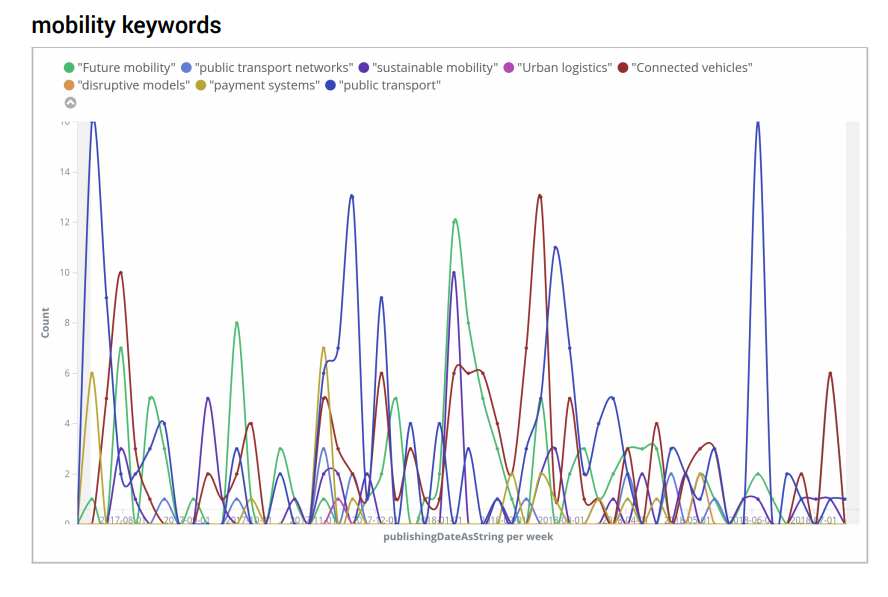

```{r setup, include=FALSE}
knitr::opts_chunk$set(
	echo = FALSE,
	message = FALSE,
	warning = FALSE
)

library(wordcloud)
library(ggplot2)
library(dplyr)
library(readr)
library(tidyverse)
library(tidytext)
library(stopwords)
library(tm)
library(cluster)
library(SnowballC)
require(plotly)
require(readxl)

```

# ANÁLISIS DE LAS CONFERENCIAS

## _Digital Transformation_

<br>

##### Las charlas dedicadas a 'Digital Transformation' fueron cuatro con la siguiente temática:

<br>

##### 1. 'Data Drive Cities: Rethinking Urban Infraestructures in the Digital Age'

##### 2. 'Safe Cities: Securing the Digital City: Cyber threats and Responses'

##### 3. 'Safe Cities: Strategies to Protect Critical Infraestructures and Assets'

##### 4. 'Data Driven Cities: Rethinking Urban Infraestructures in the Digital Age'

<br>

##### Las subtemáticas representativas de cada charla son las siguientes:

<br>

```{r echo=FALSE, message=FALSE, warning=FALSE, paged.print=FALSE}

texto1 <- read_lines('./DIGITAL TRANSFORMATION/DIG1_TXT.txt') #Leemos txt
texto1 <- wordStem(paste(texto1, collapse = " "), language = "en")  

texto_df1 <- data_frame(fila = 1:1403, texto = texto1) #Conversión a df
tokens <- texto_df1 %>% 
  unnest_tokens(word, texto, token="ngrams", n=1) %>% 
  anti_join(stop_words) #separación en columnas

my_stopwords <- data_frame(word = c(as.character(1:23), 
                                    "NA", "de", "la", "los", "en", "e", 
                                    "una", "las", "es", "para", "como",
                                    "de", "da","con","se","nos","lo",
                                    "por","gonna", "el", "del","tenemos", "yeah"))

dig1 <- tokens %>% count(word, sort = TRUE) %>% 
  anti_join(my_stopwords)

#KEYWORDS

cloud <- c('modern communication infrastructure', 'saas', 'software as a service', 
           'paas', 'platform a service', 'iaas', 'infrastructure as a service','oaas', 'operations as a service',
           'data centers', 'private cloud', 'public cloud', 'hybrid cloud', 'security', 'trust', 'community cloud', 
           'scalability', 'risk', 'broadband', 'data centres security', 'data portability', 'elasticity', 'flexibility',
           'data storage')

cloud<- wordStem(cloud, language = "en")

artificialIntelligence <- c('augmented reality', 'advanced analytics', 'algorithm', 'bots', 'cognitive science', 'data mining',
                            'self-driving car', 'deep learning', 'machine learning', 'natural language processing', 'nls',
                            'semantic analysis', 'content automation', 'unsurpervised learning', 'intelligent traffic systems', 
                            'traffic patterns', 'smart traffic lights', 'smart cameras', 'autonomous vehicles', 'competitiveness',
                             'data storage')

artificialIntelligence<- wordStem(artificialIntelligence, language = "en")

dataDrivenCities <- c('telcities', 'information city', 'digital city', 'intelligent traffic systems',	'traffic patterns',	
                      'smart traffic lights',	'smart cameras',	'autonomous vehicles',	'competitiveness'	,'smart cities'	,'digital 
                      urbanism',	'big data',	'open data platforms',	'modern cities',	'ddc'	,'metadata'	,'technology solutions',	
                      'urban management',	'modelling',	'transport flows',	'traffic optimisation',	'transport applications',	
                      'data storage',	'vehicular traffic data')

dataDrivenCities <- wordStem(dataDrivenCities, language = "en")

blockchain <- c ('bitcoin', 'ledger', 'genesis block', 'multi signature', 'node', 'p2p', 'smartcontract', 'security', 'security networks',	
                 'efficient resources', 'collaboration', 'citizens', 'smart device', 'transaction', 'smart applications','crypto-currency',
                 'no intermediary','block','peer to peer')

blockchain<- wordStem(blockchain, language = "en")

cincoG <- c ( 'wireless',	'big data',	'fifth generation',	'machine to machine communications'	, 'm2m', 'communications', 'IoT', 'internet of things',	
              'vehicular traffic data', 'traffic congestion', 'communication system','connectivity providers', 'technology providers', 
              'capacity','smart cell', 'enhance mobile broadband','emb', 'mission critical services', 'mcs', 'massive internet of things', 'miot',
              'smart traffic','smart lighting','smart parking', 'broadbandvideo','air quality sensors')

cincoG <-  wordStem(cincoG, language = "en")

internetOfThings <- c ('internet of everything', 'ioe', 'connected devices', 'smart devices', 'machine to machine', 'm2m communications',
                     'machine to machine communications', 'm2m', 'wearables', 'smart wearables', 'sensor', 'information and communication technologies',
                     'ict', 'smart cell', 'enhance mobile broadband', 'emb', 'mission critical services', 'mcs', 'massive internet of things', 'miot',
                     'smart traffic','smart lighting','smart parking', 'broadbandvideo','air quality sensors')

internetOfThings <- wordStem(internetOfThings, language = "en")

safeCities <- c ('safety', 'urban safety', 'crime prevention', 'safe city program', 'real-time systems', 'mobile computing', 'emergency services',
                 'wireless monitoring services', '5g', 'safe mobile units', 'temperature', 'gas detectors', 'vehicle safety', 'computerized monitoring', 
                 'mobile computing', 'security')

safeCities <- wordStem(safeCities, language = "en")

#MATCHES KEYWORDS texto1

matchesCloud <- str_count(paste(texto1, collapse = " "), paste(cloud, collapse = "|"))
matchesArtificialIntelligence <- str_count(paste(texto1, collapse = " "), paste(artificialIntelligence, collapse = "|"))
matchesDataDrivenCities <- str_count(paste(texto1, collapse = " "), paste(dataDrivenCities, collapse = "|"))
matchesBlockchain <- str_count(paste(texto1, collapse = " "), paste(blockchain, collapse = "|"))
matchesCincoG <- str_count(paste(texto1, collapse = " "), paste(cincoG, collapse = "|"))
matchesIOT<- str_count(paste(texto1, collapse = " "), paste(internetOfThings, collapse = "|"))
matchesSafeCities <- str_count(paste(texto1, collapse = " "), paste(safeCities, collapse = "|"))


texto2 <- read_lines('./DIGITAL TRANSFORMATION/DIG2.txt') #Leemos txt
texto2 <- wordStem(paste(texto2, collapse = " "), language = "en")  
texto_df2 <- data_frame(fila = 1:1409, texto = texto2) #Conversión a df
tokens2 <- texto_df2 %>% 
  unnest_tokens(word, texto, token="ngrams", n=1) %>% 
  anti_join(stop_words) #separación en columnas

my_stopwords <- data_frame(word = c(as.character(1:23), 
                                    "NA", "de", "la", "los", "en", "e", 
                                    "una", "las", "es", "para", "como",
                                    "de", "da","con","se","nos","lo",
                                    "por","gonna", "el", "del","tenemos", "yeah"))

dig2 <- tokens2 %>% count(word, sort = TRUE) %>% anti_join(my_stopwords)


#MATCHES

matchesCloud_texto2 <- str_count(paste(texto2, collapse = " "), paste(cloud, collapse = "|"))
matchesArtificialIntelligence_texto2 <- str_count(paste(texto2, collapse = " "), paste(artificialIntelligence, collapse = "|"))
matchesDataDrivenCities_texto2 <- str_count(paste(texto2, collapse = " "), paste(dataDrivenCities, collapse = "|"))
matchesBlockchain_texto2 <- str_count(paste(texto2, collapse = " "), paste(blockchain, collapse = "|"))
matchesCincoG_texto2 <- str_count(paste(texto2, collapse = " "), paste(cincoG, collapse = "|"))
matchesIOT_texto2<- str_count(paste(texto2, collapse = " "), paste(internetOfThings, collapse = "|"))
matchesSafeCities_texto2 <- str_count(paste(texto2, collapse = " "), paste(safeCities, collapse = "|"))

texto3 <- read_lines('./DIGITAL TRANSFORMATION/DIG3.txt') #Leemos txt
texto3 <- wordStem(paste(texto3, collapse = " "), language = "en")  
texto_df3 <- data_frame(fila = 1:1264, texto = texto3) #Conversión a df
tokens3 <- texto_df3 %>% 
  unnest_tokens(word, texto, token="ngrams", n=1) %>% 
  anti_join(stop_words) #separación en columnas

my_stopwords <- data_frame(word = c(as.character(1:23), 
                                    "NA", "de", "la", "los", "en", "e", 
                                    "una", "las", "es", "para", "como",
                                    "de", "da","con","se","nos","lo",
                                    "por","gonna", "el", "del","tenemos", "yeah"))

dig3 <- tokens3 %>% count(word, sort = TRUE) %>% 
  anti_join(my_stopwords)


#MATCHES

matchesCloud_texto3 <- str_count(paste(texto3, collapse = " "), paste(cloud, collapse = "|"))
matchesArtificialIntelligence_texto3 <- str_count(paste(texto3, collapse = " "), paste(artificialIntelligence, collapse = "|"))
matchesDataDrivenCities_texto3 <- str_count(paste(texto3, collapse = " "), paste(dataDrivenCities, collapse = "|"))
matchesBlockchain_texto3 <- str_count(paste(texto3, collapse = " "), paste(blockchain, collapse = "|"))
matchesCincoG_texto3 <- str_count(paste(texto3, collapse = " "), paste(cincoG, collapse = "|"))
matchesIOT_texto3<- str_count(paste(texto3, collapse = " "), paste(internetOfThings, collapse = "|"))
matchesSafeCities_texto3 <- str_count(paste(texto3, collapse = " "), paste(safeCities, collapse = "|"))

texto4 <- read_lines('./DIGITAL TRANSFORMATION/DIG4.txt') #Leemos txt
texto4 <- wordStem(paste(texto4, collapse = " "), language = "en")  
texto_df4 <- data_frame(fila = 1:1122, texto = texto4) #Conversión a df
tokens4 <- texto_df4 %>% 
  unnest_tokens(word, texto, token="ngrams", n=1) %>% 
  anti_join(stop_words) #separación en columnas

my_stopwords <- data_frame(word = c(as.character(1:23), 
                                    "NA", "de", "la", "los", "en", "e", 
                                    "una", "las", "es", "para", "como",
                                    "de", "da","con","se","nos","lo",
                                    "por","gonna", "el", "del","tenemos", "yeah"))

dig4 <- tokens4 %>% count(word, sort = TRUE) %>% 
  anti_join(my_stopwords)


#MATCHES

matchesCloud_texto4 <- str_count(paste(texto4, collapse = " "), paste(cloud, collapse = "|"))
matchesArtificialIntelligence_texto4 <- str_count(paste(texto4, collapse = " "), paste(artificialIntelligence, collapse = "|"))
matchesDataDrivenCities_texto4 <- str_count(paste(texto4, collapse = " "), paste(dataDrivenCities, collapse = "|"))
matchesBlockchain_texto4 <- str_count(paste(texto4, collapse = " "), paste(blockchain, collapse = "|"))
matchesCincoG_texto4 <- str_count(paste(texto4, collapse = " "), paste(cincoG, collapse = "|"))
matchesIOT_texto4<- str_count(paste(texto4, collapse = " "), paste(internetOfThings, collapse = "|"))
matchesSafeCities_texto4 <- str_count(paste(texto4, collapse = " "), paste(safeCities, collapse = "|"))

conference <- c("Text Data Drive Cities 1", "Text Safe Cities 2 ", "Text Safe Cities 3 ", "Text Data Drive Cities 4")
nWordsConference <- c(str_count(texto1), length(texto2), length(texto3), length(texto4))
nCloud <- c((matchesCloud), (matchesCloud_texto2), (matchesCloud_texto3), (matchesCloud_texto4))
nAI <- c((matchesArtificialIntelligence), (matchesArtificialIntelligence_texto2), (matchesArtificialIntelligence_texto3),(matchesArtificialIntelligence_texto4))
nDataDrivenCities <- c((matchesDataDrivenCities), (matchesDataDrivenCities_texto2), (matchesDataDrivenCities_texto3), (matchesDataDrivenCities_texto4))
nBlockChain <- c((matchesBlockchain), (matchesBlockchain_texto2), (matchesBlockchain_texto3), (matchesBlockchain_texto4))
n5G <- c((matchesCincoG), (matchesCincoG_texto2), (matchesCincoG_texto3), (matchesCincoG_texto4))
nIOT <- c((matchesIOT), (matchesIOT_texto2), (matchesIOT_texto3), (matchesIOT_texto4))
nSafeCities <- c((matchesSafeCities), (matchesSafeCities_texto2), (matchesSafeCities_texto3), (matchesSafeCities_texto4))


digitalTransformation <- data.frame (conference, nWordsConference, nCloud, nAI, nDataDrivenCities, nBlockChain, n5G, nIOT, nSafeCities)
transformation <- digitalTransformation %>% as.tibble() %>% mutate(conference = row.names(digitalTransformation))
newtransformation <- gather (transformation, key = typeKeyword, value = nWordsConference, nCloud, nAI, nDataDrivenCities,
                             nBlockChain, n5G, nIOT, nSafeCities)

ggplot(newtransformation, aes(x = newtransformation$conference, y =newtransformation$nWordsConference, fill = newtransformation$typeKeyword )) + 
  geom_bar(stat="identity", position="fill") + 
  #geom_text(aes(hjust = 1.3, label = newtemp$numberWordsConference))+
  coord_flip()+
  labs(title = "Categorías por discursos en Digital Transformation", x = "Texto", y = "% keywords", fill = "Tipo Keyword")

 

```

<br> 

#####  El total de las cuatro charlas sobre 'Digital Transformation' estuvo compuesto de las siguientes temáticas:

<br>

```{r echo=FALSE, message=FALSE, warning=FALSE, paged.print=FALSE}
plot_ly(newtransformation, labels = ~newtransformation$typeKeyword, values = ~newtransformation$nWordsConference, type = 'pie',
             textposition = 'inside',
             textinfo = 'label+percent',
             insidetextfont = list(color = '#FFFFFF'),
             hoverinfo = 'text',
             marker = list(colors = colors,
                           line = list(color = '#FFFFFF', width = 1)),
             #The 'pull' attribute can also be used to create space between the sectors
             showlegend = FALSE) 
```

<br>

#####  Las ídea predominante entre las cuatro charlas mediante el análisis por Keywords está centrada en la **seguridad** de los ciudadanos por medio de la tecnología (sensores, 5G)

<br>

```{r pressure, echo=FALSE, message=FALSE, warning=FALSE, paged.print=FALSE}
#TEXTO1_ 
extractCloud <- str_extract_all(paste(texto1, collapse = " "), paste(cloud, collapse = "|"))
extractArtificialIntelligence <- str_extract_all(paste(texto1, collapse = " "), paste(artificialIntelligence, collapse = "|"))
extractDataDrivenCities <- str_extract_all(paste(texto1, collapse = " "), paste(dataDrivenCities, collapse = "|"))
extractsBlockchain <- str_extract_all(paste(texto1, collapse = " "), paste(blockchain, collapse = "|"))
extractCincoG <- str_extract_all(paste(texto1, collapse = " "), paste(cincoG, collapse = "|"))
extractIOT<- str_extract_all(paste(texto1, collapse = " "), paste(internetOfThings, collapse = "|"))
extractSafeCities <- str_extract_all(paste(texto1, collapse = " "), paste(safeCities, collapse = "|"))
#__

lenTexto1 <- sapply(strsplit(texto1, " "), length)


#CLOUD
eCloud <-  data.frame(extractCloud) 
names(eCloud)[1]<-"new_name"
eCloud <- eCloud %>% group_by(new_name) %>% count(new_name, sort=TRUE)
freqCloud <- eCloud$n / lenTexto1
cloudDig1 <- data.frame ("texto1", eCloud, freqCloud)
cloudDig1$category <- "cloud"
names(cloudDig1)[4] <- "freq"


#AI
eAI <- data.frame(extractArtificialIntelligence) 

names(eAI)[1]<-"new_name"

eAI <- eAI %>% group_by(new_name) %>% count(new_name, sort=TRUE)

freqAI <- eAI$n / lenTexto1

aIDig1 <- data.frame ("texto1", eAI, freqAI)
aIDig1$category <- "AI"
names(aIDig1)[4] <- "freq"

#DATA DRIVEN CITIES
eDDC <- data.frame(extractDataDrivenCities) 

names(eDDC)[1]<-"new_name"

eDDC <- eDDC %>% group_by(new_name) %>% count(new_name, sort=TRUE)

freqDDC <- eDDC$n / lenTexto1

ddcDig1 <- data.frame ("texto1", eDDC, freqDDC)
ddcDig1$category <- "Data Driven Cities"
names(ddcDig1)[4] <- "freq"


#BLOCKCHAIN
eBlock <- data.frame(extractsBlockchain) 

names(eBlock)[1]<-"new_name"

eBlock <- eBlock %>% group_by(new_name) %>% count(new_name, sort=TRUE)

freqBlock <- eBlock$n / lenTexto1

blockDig1 <- data.frame ("texto1", eBlock, freqBlock)
blockDig1$category <- "BlockChain"
names(blockDig1)[4] <- "freq"


#CINCOG

e5G <- data.frame(extractCincoG) 

names(e5G)[1]<-"new_name"

e5G <- e5G %>% group_by(new_name) %>% count(new_name, sort=TRUE)

freq5G <- e5G$n / lenTexto1

CincoGDig1 <- data.frame ("texto1", e5G, freq5G)
CincoGDig1$category <- "5G"
names(CincoGDig1)[4] <- "freq"


#IOT

eIOT <- data.frame(extractIOT) 

names(eIOT)[1]<-"new_name"

eIOT <- eIOT %>% group_by(new_name) %>% count(new_name, sort=TRUE)

freqIOT<- eIOT$n / lenTexto1

iotDig1 <- data.frame ("texto1", eIOT, freqIOT)
iotDig1$category <- "IOT"
names(iotDig1)[4] <- "freq"


#SAFECITIES

eSafeCities <- data.frame(extractSafeCities) 

names(eSafeCities)[1]<-"new_name"

eSafeCities <- eSafeCities %>% group_by(new_name) %>% count(new_name, sort=TRUE)

freqSafeCities<- eSafeCities$n / lenTexto1

safecitiesDig1 <- data.frame ("texto1", eSafeCities, freqSafeCities)

safecitiesDig1$category <- "Safe Cities"
names(safecitiesDig1)[4] <- "freq"


KeywordsDig1 <- rbind(cloudDig1,aIDig1,ddcDig1, blockDig1, CincoGDig1, iotDig1, safecitiesDig1)

#TEXTO2_ 
extractCloud_text2 <- str_extract_all(paste(texto2, collapse = " "), paste(cloud, collapse = "|"))
extractArtificialIntelligence_text2 <- str_extract_all(paste(texto2, collapse = " "), paste(artificialIntelligence, collapse = "|"))
extractDataDrivenCities_text2 <- str_extract_all(paste(texto2, collapse = " "), paste(dataDrivenCities, collapse = "|"))
extractsBlockchain_text2 <- str_extract_all(paste(texto2, collapse = " "), paste(blockchain, collapse = "|"))
extractCincoG_text2 <- str_extract_all(paste(texto2, collapse = " "), paste(cincoG, collapse = "|"))
extractIOT_text2<- str_extract_all(paste(texto2, collapse = " "), paste(internetOfThings, collapse = "|"))
extractSafeCities_text2 <- str_extract_all(paste(texto2, collapse = " "), paste(safeCities, collapse = "|"))
#__

lenTexto2 <- sapply(strsplit(texto2, " "), length)


#CLOUD
eCloud_text2 <-  data.frame(extractCloud_text2) 

names(eCloud_text2)[1]<-"new_name"

eCloud_text2 <- eCloud_text2 %>% group_by(new_name) %>% count(new_name, sort=TRUE)

freqCloud_text2 <- eCloud_text2$n / lenTexto2

cloudDig2 <- data.frame ("texto2", eCloud_text2, freqCloud_text2)
cloudDig2$category <- "cloud"
names(cloudDig2)[4] <- "freq"

#AI
eAI_text2 <- data.frame(extractArtificialIntelligence_text2) 

names(eAI_text2)[1]<-"new_name"

eAI_text2 <- eAI_text2 %>% group_by(new_name) %>% count(new_name, sort=TRUE)

freqAI_text2 <- eAI_text2$n / lenTexto2

aIDig2 <- data.frame ("texto2", eAI_text2, freqAI_text2)

aIDig2$category <- "AI"
names(aIDig2)[4] <- "freq"

#DATA DRIVEN CITIES
eDDC_text2 <- data.frame(extractDataDrivenCities_text2) 

names(eDDC_text2)[1]<-"new_name"

eDDC_text2 <- eDDC_text2 %>% group_by(new_name) %>% count(new_name, sort=TRUE)

freqDDC_text2 <- eDDC_text2$n / lenTexto2

ddcDig2 <- data.frame ("texto2", eDDC_text2, freqDDC_text2)
ddcDig2$category <- "Data Driven Cities"
names(ddcDig2)[4] <- "freq"


#BLOCKCHAIN
eBlock_text2 <- data.frame(extractsBlockchain_text2) 

names(eBlock_text2)[1]<-"new_name"

eBlock_text2 <- eBlock_text2 %>% group_by(new_name) %>% count(new_name, sort=TRUE)

freqBlock_text2 <- eBlock_text2$n / lenTexto2

blockDig2 <- data.frame ("texto2", eBlock_text2, freqBlock_text2)
blockDig2$category <- "BlockChain"
names(blockDig2)[4] <- "freq"

#CINCOG

e5G_text2 <- data.frame(extractCincoG_text2) 

names(e5G_text2)[1]<-"new_name"

e5G_text2 <- e5G_text2 %>% group_by(new_name) %>% count(new_name, sort=TRUE)

freq5G_text2 <- e5G_text2$n / lenTexto2

CincoGDig2 <- data.frame ("texto2", e5G_text2, freq5G_text2)
CincoGDig2$category <- "5G"
names(CincoGDig2)[4] <- "freq"

#IOT

eIOT_text2 <- data.frame(extractIOT_text2) 

names(eIOT_text2)[1]<-"new_name"

eIOT_text2 <- eIOT_text2 %>% group_by(new_name) %>% count(new_name, sort=TRUE)

freqIOT_text2<- eIOT_text2$n / lenTexto2

iotDig2 <- data.frame ("texto2", eIOT_text2, freqIOT_text2)
iotDig2$category <- "IOT"
names(iotDig2)[4] <- "freq"

#SAFECITIES

eSafeCities_text2 <- data.frame(extractSafeCities_text2) 

names(eSafeCities_text2)[1]<-"new_name"

eSafeCities_text2 <- eSafeCities_text2 %>% group_by(new_name) %>% count(new_name, sort=TRUE)

freqSafeCities_text2<- eSafeCities_text2$n / lenTexto2

safecitiesDig2 <- data.frame ("texto2", eSafeCities_text2, freqSafeCities_text2)
safecitiesDig2$category <- "Safe Cities"
names(safecitiesDig2)[4] <- "freq"


KeywordsDig2 <- rbind(cloudDig2,aIDig2,ddcDig2, blockDig2, CincoGDig2, iotDig2, safecitiesDig2)
#TEXTO3_ 
extractCloud_text3 <- str_extract_all(paste(texto3, collapse = " "), paste(cloud, collapse = "|"))
extractArtificialIntelligence_text3 <- str_extract_all(paste(texto3, collapse = " "), paste(artificialIntelligence, collapse = "|"))
extractDataDrivenCities_text3 <- str_extract_all(paste(texto3, collapse = " "), paste(dataDrivenCities, collapse = "|"))
extractsBlockchain_text3<- str_extract_all(paste(texto3, collapse = " "), paste(blockchain, collapse = "|"))
extractCincoG_text3 <- str_extract_all(paste(texto3, collapse = " "), paste(cincoG, collapse = "|"))
extractIOT_text3<- str_extract_all(paste(texto3, collapse = " "), paste(internetOfThings, collapse = "|"))
extractSafeCities_text3 <- str_extract_all(paste(texto3, collapse = " "), paste(safeCities, collapse = "|"))
#__

lenTexto3 <- sapply(strsplit(texto3, " "), length)


#CLOUD
eCloud_text3 <-  data.frame(extractCloud_text3) 

names(eCloud_text3)[1]<-"new_name"

eCloud_text3 <- eCloud_text3 %>% group_by(new_name) %>% count(new_name, sort=TRUE)

freqCloud_text3 <- eCloud_text3$n / lenTexto3 

cloudDig3 <- data.frame ("texto3", eCloud_text3, freqCloud_text3)

cloudDig3$category <- "cloud"
names(cloudDig3)[4] <- "freq"

#AI
eAI_text3 <- data.frame(extractArtificialIntelligence_text3) 

names(eAI_text3)[1]<-"new_name"

eAI_text3 <- eAI_text3 %>% group_by(new_name) %>% count(new_name, sort=TRUE)

freqAI_text3 <- eAI_text3$n / lenTexto3

aIDig3 <- data.frame ("texto3", eAI_text3, freqAI_text3)
aIDig3$category <- "AI"
names(aIDig3)[4] <- "freq"

#DATA DRIVEN CITIES
eDDC_text3 <- data.frame(extractDataDrivenCities_text3) 

names(eDDC_text3)[1]<-"new_name"

eDDC_text3 <- eDDC_text3 %>% group_by(new_name) %>% count(new_name, sort=TRUE)

freqDDC_text3 <- eDDC_text3$n / lenTexto3

ddcDig3 <- data.frame ("texto3", eDDC_text3, freqDDC_text3)

ddcDig3$category <- "Data Driven Cities"
names(ddcDig3)[4] <- "freq"


#BLOCKCHAIN
eBlock_text3 <- data.frame(extractsBlockchain_text3) 

names(eBlock_text3)[1]<-"new_name"

eBlock_text3 <- eBlock_text3 %>% group_by(new_name) %>% count(new_name, sort=TRUE)

freqBlock_text3 <- eBlock_text3$n / lenTexto3

blockDig3 <- data.frame ("texto3", eBlock_text3, freqBlock_text3)
blockDig3$category <- "BlockChain"
names(blockDig3)[4] <- "freq"

#CINCOG

e5G_text3 <- data.frame(extractCincoG_text3) 

names(e5G_text3)[1]<-"new_name"

e5G_text3 <- e5G_text3 %>% group_by(new_name) %>% count(new_name, sort=TRUE)

freq5G_text3 <- e5G_text3$n / lenTexto3

CincoGDig3 <- data.frame ("texto3", e5G_text3, freq5G_text3)
CincoGDig3$category <- "5G"
names(CincoGDig3)[4] <- "freq"

#IOT

eIOT_text3 <- data.frame(extractIOT_text3) 

names(eIOT_text3)[1]<-"new_name"

eIOT_text3 <- eIOT_text3 %>% group_by(new_name) %>% count(new_name, sort=TRUE)

freqIOT_text3<- eIOT_text3$n / lenTexto3

iotDig3 <- data.frame ("texto3", eIOT_text3, freqIOT_text3)

iotDig3$category <- "IOT"
names(iotDig3)[4] <- "freq"

#SAFECITIES

eSafeCities_text3 <- data.frame(extractSafeCities_text3) 

names(eSafeCities_text3)[1]<-"new_name"

eSafeCities_text3 <- eSafeCities_text3 %>% group_by(new_name) %>% count(new_name, sort=TRUE)

freqSafeCities_text3<- eSafeCities_text3$n / lenTexto3

safecitiesDig3 <- data.frame ("texto3", eSafeCities_text3, freqSafeCities_text3)
safecitiesDig3$category <- "Safe Cities"
names(safecitiesDig3)[4] <- "freq"


KeywordsDig3 <- rbind(cloudDig3,aIDig3,ddcDig3, blockDig3, CincoGDig3, iotDig3, safecitiesDig3)

#TEXTO4_ 
extractCloud_text4 <- str_extract_all(paste(texto4, collapse = " "), paste(cloud, collapse = "|"))
extractArtificialIntelligence_text4 <- str_extract_all(paste(texto4, collapse = " "), paste(artificialIntelligence, collapse = "|"))
extractDataDrivenCities_text4 <- str_extract_all(paste(texto4, collapse = " "), paste(dataDrivenCities, collapse = "|"))
extractsBlockchain_text4<- str_extract_all(paste(texto4, collapse = " "), paste(blockchain, collapse = "|"))
extractCincoG_text4 <- str_extract_all(paste(texto4, collapse = " "), paste(cincoG, collapse = "|"))
extractIOT_text4<- str_extract_all(paste(texto4, collapse = " "), paste(internetOfThings, collapse = "|"))
extractSafeCities_text4 <- str_extract_all(paste(texto4, collapse = " "), paste(safeCities, collapse = "|"))
#__

lenTexto4 <- sapply(strsplit(texto4, " "), length)


#CLOUD
eCloud_text4 <-  data.frame(extractCloud_text4) 

names(eCloud_text4)[1]<-"new_name"

eCloud_text4 <- eCloud_text4 %>% group_by(new_name) %>% count(new_name, sort = TRUE)

freqCloud_text4 <- eCloud_text4$n / lenTexto4

cloudDig4 <- data.frame ("texto4", eCloud_text4, freqCloud_text4)

cloudDig4$category <- "cloud"
names(cloudDig4)[4] <- "freq"

#AI
eAI_text4 <- data.frame(extractArtificialIntelligence_text4) 

names(eAI_text4)[1]<-"new_name"

eAI_text4 <- eAI_text4 %>% group_by(new_name) %>% count(new_name, sort=TRUE)

freqAI_text4 <- eAI_text4$n / lenTexto4

aIDig4 <- data.frame ("texto4", eAI_text4, freqAI_text4)
aIDig4$category <- "AI"
names(aIDig4)[4] <- "freq"

#DATA DRIVEN CITIES
eDDC_text4 <- data.frame(extractDataDrivenCities_text4) 

names(eDDC_text4)[1]<-"new_name"

eDDC_text4 <- eDDC_text4 %>% group_by(new_name) %>% count(new_name, sort=TRUE)

freqDDC_text4 <- eDDC_text4$n / lenTexto4

ddcDig4 <- data.frame ("texto4", eDDC_text4, freqDDC_text4)

ddcDig4$category <- "Data Driven Cities"
names(ddcDig4)[4] <- "freq"


#BLOCKCHAIN
eBlock_text4 <- data.frame(extractsBlockchain_text4) 

names(eBlock_text4)[1]<-"new_name"

eBlock_text4 <- eBlock_text4 %>% group_by(new_name) %>% count(new_name, sort=TRUE)

freqBlock_text4 <- eBlock_text4$n / lenTexto4

blockDig4 <- data.frame ("texto4", eBlock_text4, freqBlock_text4)
blockDig4$category <- "BlockChain"
names(blockDig4)[4] <- "freq"

#CINCOG

e5G_text4 <- data.frame(extractCincoG_text4) 

names(e5G_text4)[1]<-"new_name"

e5G_text4 <- e5G_text4 %>% group_by(new_name) %>% count(new_name, sort=TRUE)

freq5G_text4 <- e5G_text4$n / lenTexto4

CincoGDig4 <- data.frame ("texto4", e5G_text4, freq5G_text4)
CincoGDig4$category <- "5G"
names(CincoGDig4)[4] <- "freq"

#IOT

eIOT_text4 <- data.frame(extractIOT_text4) 

names(eIOT_text4)[1]<-"new_name"

eIOT_text4 <- eIOT_text4 %>% group_by(new_name) %>% count(new_name, sort=TRUE)

freqIOT_text4<- eIOT_text4$n / lenTexto4

iotDig4 <- data.frame ("texto4", eIOT_text4, freqIOT_text4)

iotDig4$category <- "IOT"
names(iotDig4)[4] <- "freq"

#SAFECITIES

eSafeCities_text4 <- data.frame(extractSafeCities_text4) 

names(eSafeCities_text4)[1]<-"new_name"

eSafeCities_text4 <- eSafeCities_text4 %>% group_by(new_name) %>% count(new_name, sort=TRUE)

freqSafeCities_text4<- eSafeCities_text4$n / lenTexto4

safecitiesDig4 <- data.frame ("texto4", eSafeCities_text4, freqSafeCities_text4)
safecitiesDig4$category <- "Safe Cities"
names(safecitiesDig4)[4] <- "freq"


KeywordsDig4 <- rbind(cloudDig4,aIDig4,ddcDig4, blockDig4, CincoGDig4, iotDig4, safecitiesDig4)

names(KeywordsDig1)[1] <- "texto"
names(KeywordsDig2)[1] <- "texto"
names(KeywordsDig3)[1] <- "texto"
names(KeywordsDig4)[1] <- "texto"


KeywordsTotal <- rbind(KeywordsDig1,KeywordsDig2, KeywordsDig3, KeywordsDig4)


#wordcloud(words = KeywordsTotal$new_name, freq = KeywordsTotal$freq, min.freq = 5,
         #max.words=200, random.order=FALSE, rot.per=0.35, 
          #colors=brewer.pal(8, "Dark2")[factor(KeywordsTotal$category)])


KeywordsTotal%>%
    mutate(word = reorder(KeywordsTotal$new_name , desc(KeywordsTotal$freq))) %>%
    ggplot(aes(word, KeywordsTotal$freq, fill = KeywordsTotal$texto)) +
    geom_bar(stat="identity", position="stack") +
    #geom_text(aes(hjust = 1.3, label = round(perc, 2))) + 
    coord_flip() +
    labs(title = "Solapamiento Textos Digital Transformartion", x = "Palabras", y = "% respecto del texto", fill = "texto")


  

```

<br>

##### Los autores de estas ponencias tuvieron en el último año las siguientes referencias en los medios de todo el mundo:

<br>

```{r echo=FALSE, message=FALSE, warning=FALSE, paged.print=FALSE}
authorsDig1 <- read_excel("./DIGITAL TRANSFORMATION/Authors_DT.xlsx")
authorsDig1 %>%
    mutate(subject = reorder(authorsDig1$Subject, desc(authorsDig1$Mentions))) %>% 
    ggplot(aes(authorsDig1$Author, authorsDig1$Mentions, group = subject)) +
    geom_col(aes(fill = subject)) +
    #geom_text(aes(label =  authorsDig1$PublisherName), position = position_stack(vjust = 0.7))+
    coord_flip()+
    labs(title = "Temática artículos en medios por autor en el último año", x = "Autor", y = " Número de artículos", fill = "Temática")

authorsDig1 %>%
    mutate(subject = reorder(authorsDig1$Subject, desc(authorsDig1$Mentions))) %>% 
    ggplot(aes(authorsDig1$PublisherName, authorsDig1$Mentions, group =authorsDig1$Author)) +
    geom_col(aes(fill = authorsDig1$Author)) +
    #geom_text(aes(label =  authorsDig1$PublisherName), position = position_stack(vjust = 0.7))+
    coord_flip()+
    labs(title = " Medios en los que han aparecido los autores en el último año", x = "Medio", y = " Número de artículos", fill = "Autor")

```

<br>

##### Las temáticas generalistas de las que se componen las charlas de 'Digital Transformation' tuvieron las siguientes menciones en medios durante el último año.
##### Estas temáticas sufren un repunte de menciones en medios durante el mes de noviembre de 2017, fecha en la que tuvo lugar el Smart City Expo World Congress 2017.

<br>


<br>

## _Urban Environment_

<br>

##### Las charlas dedicadas a 'Urban Environment' fueron nueve con la siguiente temática:

<br>

##### 1. 'Energy: Transforming Today's Cities into Low-carbon Settlements'

##### 2. 'Sustainability: Collective Efforts to Tackle Global Urban Challenges'

##### 4. 'Uban Planning: Rethinking Strategies for Integrated Urban and Regional Development'

##### 5. 'Public Space: The art of Placemaking: Inclusive Public Spaces and Green Areas'

##### 6. 'Uban Planning: Strategic Alliance to Ensure a Green and Sustainable Urban Future

##### 7. 'Resilient Cities: Affordable Housing and Sustainable Living'

##### 8. 'Resilient Cities: Bend not break: preparing our cities to respond to emergencies and disasters'

##### 9. 'Resilient Cities: From Fragile to Resilient Cities'

##### 10. 'Resilient Cities: Making Safer, Smarter and Healthier Cities'

<br>

##### Las subtemáticas representativas de cada charla son las siguientes:

<br>

```{r echo=FALSE, message=FALSE, warning=FALSE, paged.print=FALSE}

texto2_1 <- read_lines('./URBAN ENVIRONMENT/URB1.txt') #Leemos txt
texto2_1 <- wordStem(paste(texto2_1, collapse = " "), language = "en")  

texto_df2_1 <- data_frame(fila = 1:1, texto = texto2_1) #Conversión a df
tokens2_1 <- texto_df2_1 %>% 
  unnest_tokens(word, texto, token="ngrams", n=1) %>% 
  anti_join(stop_words) #separación en columnas

my_stopwords <- data_frame(word = c(as.character(1:23), 
                                    "NA", "de", "la", "los", "en", "e", 
                                    "una", "las", "es", "para", "como",
                                    "de", "da","con","se","nos","lo",
                                    "por","gonna", "el", "del","tenemos", "yeah"))

dig2_1 <- tokens2_1 %>% count(word, sort = TRUE) %>% 
  anti_join(my_stopwords)


#KEYWORDS URBAN ENVIRONMENT

energy_cleanTech <- c('clean energy',	'renewable energies',	'smart energy',	'what is renowable energy',	'how to save energy',	'community based energy development',	'c-bed', 
'conservation improvement program',	'cip', 'cooperative electric association or utility',	'energy conservation',	'energy efficiency','greenhouse gases',	'neg','nem',
'net energy metering',	'net energy generation',	'pace',	'property assessed clean energy', 'real time pricing','renewable resources','solar','renewable energy','global warming',
'recycling','green','air pollution',	'solar power',	'climate change',	'wind power',	'environement',	'greenhouse effect',	'natural resources'	,'sustainability'	,'free energy',	
'public lighting',	'natural resources',	'water management',	'green resources' ,	'clean energy',	'green energies',	'energy efficiency', 'automotive',	'carbon Nanomaterials',	'electronics',
'renewal energy',	'sensors  controls',	'wireless',	'devices',	'energy storages battery' ,	'lighting solar', 'solar power',	'biomass',	'environemental impact', 'international cooperation',
'hydropower','biofuels',	'information technology',	'green transportation',	'electric motors'	,'greywater', 'environemental finance','urban planning', 	'pollution',	'smart energy grids',	'iot',
'air quality', 'waste management', 'green resources', 'clean energy', 'decarbonization')

energy_cleanTech <- wordStem(energy_cleanTech, language = "en")

publicSpace_urbanPlanning <-  c('urban planning', 'urban design', 'streetscaping',	'shrinking city',	'placemaking',	'landscape',	'common space',
'private space',	'ownership',	'accessibility'	,'community', 'social interaction',	'leisure activities',	'park',
'landscape architecture', 'housing quality',	'smart city architecture',	'improving quality of living',	'entrepreneurial' ,'led', 'urbanization',	
'green urban planning', 'policy making',	'cohesion',	'smart planning',	'long term vision',	'urban develpoment',	'smart growth',
'urban sprawl',	'power system planning'	,'town planning',	'urban space',	'electric vehicles',	'smart microgrids',	'recharging',
'recharge',	'electromobility'	,'mobility patterns',	'data models',	'analytical models',	'big data',	'city planning', 'urban system',
'information systems')

publicSpace_urbanPlanning <- wordStem(publicSpace_urbanPlanning, language = "en")


climateChange_resilientCities <- c ('disaster risk reduction','urban hardiness','resilience','emergency','daunting challenges',	'challenges','disaster preparedness',	'disaster prepared', 
'cities vulnerability',	'crises',	'vulnerability',	'pertinacity',	'urban resilience', 'adaptation',	'adaptative capacity'	,'climate change',
'environmental hazard','man-made hazard',	'security',	'secure',	'mitigation',	'public health','health','potential adaptative'	,'iot',	'fire hazard',
'alert', 'response' ,'protocol' ,'detection sensor', 'challenge',	'emission',	'emission target','greenhouse gas',	'ghc',	'renewable energy',	'air quality',
'decarbonization','climate change resilience', 'climate effects', 'energy balance', 'vulnerability','vulnerable','risk assessing','risk management','mitigation',
'health','city peak','green infraestructure','grey infraestructure','meteorology','green products', 'air pollution','potential adaptative','response','protocol',
'detection sensor','predictive','predictve models')	

climateChange_resilientCities <- wordStem(climateChange_resilientCities, language = "en")


#MATCHES TEXTO2_1

matchesEnergy_cleanTech <- str_count(paste(texto2_1, collapse = " "), paste(energy_cleanTech, collapse = "|"))
matchesPublicSpace_urbanPlanning <- str_count(paste(texto2_1, collapse = " "), paste(publicSpace_urbanPlanning, collapse = "|"))
matchesClimateChange_resilientCities <- str_count(paste(texto2_1, collapse = " "), paste(climateChange_resilientCities, collapse = "|"))


#MATCHES PALABRAS TEXTO 2_1

#TEXTO2_1 
extractEnergy_cleanTech <- str_extract_all(paste(texto2_1, collapse = " "), paste(energy_cleanTech, collapse = "|"))
extractPublicSpace_urbanPlanning <- str_extract_all(paste(texto2_1, collapse = " "), paste(publicSpace_urbanPlanning, collapse = "|"))
extractClimateChange_resilientCities <- str_extract_all(paste(texto2_1, collapse = " "), paste(climateChange_resilientCities, collapse = "|"))

lenTexto2_1 <- sapply(strsplit(texto2_1, " "), length)
#__


#energy_cleanTech

eEnergy_cleanTech <-  data.frame(extractEnergy_cleanTech) 
names(eEnergy_cleanTech)[1]<-"new_name"
eEnergy_cleanTech <- eEnergy_cleanTech %>% group_by(new_name) %>% count(new_name, sort=TRUE)
freqEnergy_cleanTech <- eEnergy_cleanTech$n / lenTexto2_1
energy_cleanTechDig2_1 <- data.frame ("Text energy 1", eEnergy_cleanTech, freqEnergy_cleanTech)
energy_cleanTechDig2_1$category <- "energy_cleanTech"
names(energy_cleanTechDig2_1)[4] <- "freq"

#publicSpace_urbanPlanning

ePublicSpace_urbanPlanning <-  data.frame(publicSpace_urbanPlanning) 
names(ePublicSpace_urbanPlanning)[1]<-"new_name"
ePublicSpace_urbanPlanning <- ePublicSpace_urbanPlanning %>% group_by(new_name) %>% count(new_name, sort=TRUE)
freqPublicSpace_urbanPlanning <- ePublicSpace_urbanPlanning$n / lenTexto2_1
publicSpace_urbanPlanningDig2_1 <- data.frame ("Text energy 1", ePublicSpace_urbanPlanning, freqPublicSpace_urbanPlanning)
publicSpace_urbanPlanningDig2_1$category <- "publicSpace_urbanPlanning"
names(publicSpace_urbanPlanningDig2_1)[4] <- "freq"

#climateChange_resilientCities

eClimateChange_resilientCities <-  data.frame(climateChange_resilientCities) 
names(eClimateChange_resilientCities)[1]<-"new_name"
eClimateChange_resilientCities <- eClimateChange_resilientCities %>% group_by(new_name) %>% count(new_name, sort=TRUE)
freqeClimateChange_resilientCities <- eClimateChange_resilientCities$n / lenTexto2_1
ClimateChange_resilientCitiesDig2_1 <- data.frame ("Text energy 1", eClimateChange_resilientCities, freqeClimateChange_resilientCities)
ClimateChange_resilientCitiesDig2_1$category <- "climateChange_resilientCities"
names(ClimateChange_resilientCitiesDig2_1)[4] <- "freq"


KeywordsDig2_1 <- rbind(energy_cleanTechDig2_1,publicSpace_urbanPlanningDig2_1,ClimateChange_resilientCitiesDig2_1)
names(KeywordsDig2_1)[1] <- "texto"


texto2_2 <- read_lines('./URBAN ENVIRONMENT/URB2.txt') #Leemos txt
texto2_2 <- wordStem(paste(texto2_2, collapse = " "), language = "en")  

texto_df2_2 <- data_frame(fila = 1:1, texto = texto2_2) #Conversión a df
tokens2_2 <- texto_df2_2 %>% 
  unnest_tokens(word, texto, token="ngrams", n=1) %>% 
  anti_join(stop_words) #separación en columnas

my_stopwords <- data_frame(word = c(as.character(1:23), 
                                    "NA", "de", "la", "los", "en", "e", 
                                    "una", "las", "es", "para", "como",
                                    "de", "da","con","se","nos","lo",
                                    "por","gonna", "el", "del","tenemos", "yeah"))

dig2_2 <- tokens2_2 %>% count(word, sort = TRUE) %>% 
  anti_join(my_stopwords)


#MATCHES TEXTO2_2

matchesEnergy_cleanTech_text2 <- str_count(paste(texto2_2, collapse = " "), paste(energy_cleanTech, collapse = "|"))
matchesPublicSpace_urbanPlanning_text2 <- str_count(paste(texto2_2, collapse = " "), paste(publicSpace_urbanPlanning, collapse = "|"))
matchesClimateChange_resilientCities_text2 <- str_count(paste(texto2_2, collapse = " "), paste(climateChange_resilientCities, collapse = "|"))


#MATCHES PALABRAS TEXTO 2_2

#TEXTO2_2
extractEnergy_cleanTech_text2 <- str_extract_all(paste(texto2_2, collapse = " "), paste(energy_cleanTech, collapse = "|"))
extractPublicSpace_urbanPlanning_text2 <- str_extract_all(paste(texto2_2, collapse = " "), paste(publicSpace_urbanPlanning, collapse = "|"))
extractClimateChange_resilientCities_text2 <- str_extract_all(paste(texto2_2, collapse = " "), paste(climateChange_resilientCities, collapse = "|"))

lenTexto2_2 <- sapply(strsplit(texto2_2, " "), length)
#__


#energy_cleanTech

eEnergy_cleanTech_text2 <-  data.frame(extractEnergy_cleanTech_text2) 
names(eEnergy_cleanTech_text2)[1]<-"new_name"
eEnergy_cleanTech_text2 <- eEnergy_cleanTech_text2 %>% group_by(new_name) %>% count(new_name, sort=TRUE)
freqEnergy_cleanTech_text2 <- eEnergy_cleanTech_text2$n / lenTexto2_2
energy_cleanTechDig2_2 <- data.frame ("Text Urban Planning 2", eEnergy_cleanTech_text2, freqEnergy_cleanTech_text2)
energy_cleanTechDig2_2$category <- "energy_cleanTech"
names(energy_cleanTechDig2_2)[4] <- "freq"

#publicSpace_urbanPlanning

ePublicSpace_urbanPlanning_text2 <-  data.frame(extractPublicSpace_urbanPlanning_text2) 
names(ePublicSpace_urbanPlanning_text2)[1]<-"new_name"
ePublicSpace_urbanPlanning_text2 <- ePublicSpace_urbanPlanning_text2 %>% group_by(new_name) %>% count(new_name, sort=TRUE)
freqPublicSpace_urbanPlanning_text2 <- ePublicSpace_urbanPlanning_text2$n / lenTexto2_2
publicSpace_urbanPlanningDig2_2 <- data.frame ("Text Urban Planning 2", ePublicSpace_urbanPlanning_text2, freqPublicSpace_urbanPlanning_text2)
publicSpace_urbanPlanningDig2_2$category <- "publicSpace_urbanPlanning"
names(publicSpace_urbanPlanningDig2_2)[4] <- "freq"

#climateChange_resilientCities

eClimateChange_resilientCities_text2<-  data.frame(extractClimateChange_resilientCities_text2) 
names(eClimateChange_resilientCities_text2)[1]<-"new_name"
eClimateChange_resilientCities_text2 <- eClimateChange_resilientCities_text2 %>% group_by(new_name) %>% count(new_name, sort=TRUE)
freqeClimateChange_resilientCities_text2 <- eClimateChange_resilientCities_text2$n / lenTexto2_2
ClimateChange_resilientCitiesDig2_2 <- data.frame ("Text Urban Planning 2", eClimateChange_resilientCities_text2, freqeClimateChange_resilientCities_text2)
ClimateChange_resilientCitiesDig2_2$category <- "climateChange_resilientCities"
names(ClimateChange_resilientCitiesDig2_2)[4] <- "freq"

KeywordsDig2_2 <- rbind(energy_cleanTechDig2_2,publicSpace_urbanPlanningDig2_2,ClimateChange_resilientCitiesDig2_2)
names(KeywordsDig2_2)[1] <- "texto"

texto2_4 <- read_lines('./URBAN ENVIRONMENT/URB4.txt') #Leemos txt
texto2_4 <- wordStem(paste(texto2_4, collapse = " "), language = "en")  

texto_df2_4 <- data_frame(fila = 1:1, texto = texto2_4) #Conversión a df
tokens2_4 <- texto_df2_4 %>% 
  unnest_tokens(word, texto, token="ngrams", n=1) %>% 
  anti_join(stop_words) #separación en columnas

my_stopwords <- data_frame(word = c(as.character(1:23), 
                                    "NA", "de", "la", "los", "en", "e", 
                                    "una", "las", "es", "para", "como",
                                    "de", "da","con","se","nos","lo",
                                    "por","gonna", "el", "del","tenemos", "yeah"))

dig2_4 <- tokens2_4 %>% count(word, sort = TRUE) %>% 
  anti_join(my_stopwords)


#MATCHES TEXTO2_4

matchesEnergy_cleanTech_text4 <- str_count(paste(texto2_4, collapse = " "), paste(energy_cleanTech, collapse = "|"))
matchesPublicSpace_urbanPlanning_text4 <- str_count(paste(texto2_4, collapse = " "), paste(publicSpace_urbanPlanning, collapse = "|"))
matchesClimateChange_resilientCities_text4 <- str_count(paste(texto2_4, collapse = " "), paste(climateChange_resilientCities, collapse = "|"))

#MATCHES PALABRAS TEXTO 2_4

#TEXTO2_4
extractEnergy_cleanTech_text4 <- str_extract_all(paste(texto2_4, collapse = " "), paste(energy_cleanTech, collapse = "|"))
extractPublicSpace_urbanPlanning_text4 <- str_extract_all(paste(texto2_4, collapse = " "), paste(publicSpace_urbanPlanning, collapse = "|"))
extractClimateChange_resilientCities_text4 <- str_extract_all(paste(texto2_4, collapse = " "), paste(climateChange_resilientCities, collapse = "|"))

lenTexto2_4 <- sapply(strsplit(texto2_4, " "), length)
#__


#energy_cleanTech

eEnergy_cleanTech_text4 <-  data.frame(extractEnergy_cleanTech_text4) 
names(eEnergy_cleanTech_text4)[1]<-"new_name"
eEnergy_cleanTech_text4 <- eEnergy_cleanTech_text4 %>% group_by(new_name) %>% count(new_name, sort=TRUE)
freqEnergy_cleanTech_text4 <- eEnergy_cleanTech_text4$n / lenTexto2_4
energy_cleanTechDig2_4 <- data.frame ("Text Urban Planning 4", eEnergy_cleanTech_text4, freqEnergy_cleanTech_text4)
energy_cleanTechDig2_4$category <- "energy_cleanTech"
names(energy_cleanTechDig2_4)[4] <- "freq"

#publicSpace_urbanPlanning

ePublicSpace_urbanPlanning_text4 <-  data.frame(extractPublicSpace_urbanPlanning_text4) 
names(ePublicSpace_urbanPlanning_text4)[1]<-"new_name"
ePublicSpace_urbanPlanning_text4 <- ePublicSpace_urbanPlanning_text4 %>% group_by(new_name) %>% count(new_name, sort=TRUE)
freqPublicSpace_urbanPlanning_text4 <- ePublicSpace_urbanPlanning_text4$n / lenTexto2_4
publicSpace_urbanPlanningDig2_4 <- data.frame ("Text Urban Planning 4", ePublicSpace_urbanPlanning_text4, freqPublicSpace_urbanPlanning_text4)
publicSpace_urbanPlanningDig2_4$category <- "publicSpace_urbanPlanning"
names(publicSpace_urbanPlanningDig2_4)[4] <- "freq"

#climateChange_resilientCities

eClimateChange_resilientCities_text4<-  data.frame(extractClimateChange_resilientCities_text4) 
names(eClimateChange_resilientCities_text4)[1]<-"new_name"
eClimateChange_resilientCities_text4<- eClimateChange_resilientCities_text4 %>% group_by(new_name) %>% count(new_name, sort=TRUE)
freqeClimateChange_resilientCities_text4 <- eClimateChange_resilientCities_text4$n / lenTexto2_4
ClimateChange_resilientCitiesDig2_4 <- data.frame ("Text Urban Planning 4", eClimateChange_resilientCities_text4, freqeClimateChange_resilientCities_text4)
ClimateChange_resilientCitiesDig2_4$category <- "climateChange_resilientCities"
names(ClimateChange_resilientCitiesDig2_4)[4] <- "freq"

KeywordsDig2_4 <- rbind(energy_cleanTechDig2_4,publicSpace_urbanPlanningDig2_4,ClimateChange_resilientCitiesDig2_4)
names(KeywordsDig2_4)[1] <- "texto"

texto2_5 <- read_lines('./URBAN ENVIRONMENT/URB5.txt') #Leemos txt
texto2_5 <- wordStem(paste(texto2_5, collapse = " "), language = "en")  

texto_df2_5 <- data_frame(fila = 1:1, texto = texto2_5) #Conversión a df
tokens2_5 <- texto_df2_5 %>% 
  unnest_tokens(word, texto, token="ngrams", n=1) %>% 
  anti_join(stop_words) #separación en columnas

my_stopwords <- data_frame(word = c(as.character(1:23), 
                                    "NA", "de", "la", "los", "en", "e", 
                                    "una", "las", "es", "para", "como",
                                    "de", "da","con","se","nos","lo",
                                    "por","gonna", "el", "del","tenemos", "yeah"))

dig2_5<- tokens2_5 %>% count(word, sort = TRUE) %>% 
  anti_join(my_stopwords)


#MATCHES TEXTO2_5

matchesEnergy_cleanTech_text5 <- str_count(paste(texto2_5, collapse = " "), paste(energy_cleanTech, collapse = "|"))
matchesPublicSpace_urbanPlanning_text5 <- str_count(paste(texto2_5, collapse = " "), paste(publicSpace_urbanPlanning, collapse = "|"))
matchesClimateChange_resilientCities_text5 <- str_count(paste(texto2_5, collapse = " "), paste(climateChange_resilientCities, collapse = "|"))

KeywordsDig2_2 <- rbind(energy_cleanTechDig2_1,publicSpace_urbanPlanningDig2_1,ClimateChange_resilientCitiesDig2_1)
names(KeywordsDig2_1)[1] <- "texto"

#MATCHES PALABRAS TEXTO 2_5

#TEXTO2_5
extractEnergy_cleanTech_text5 <- str_extract_all(paste(texto2_5, collapse = " "), paste(energy_cleanTech, collapse = "|"))
extractPublicSpace_urbanPlanning_text5 <- str_extract_all(paste(texto2_5, collapse = " "), paste(publicSpace_urbanPlanning, collapse = "|"))
extractClimateChange_resilientCities_text5 <- str_extract_all(paste(texto2_5, collapse = " "), paste(climateChange_resilientCities, collapse = "|"))

lenTexto2_5 <- sapply(strsplit(texto2_5, " "), length)
#__


#energy_cleanTech

eEnergy_cleanTech_text5 <-  data.frame(extractEnergy_cleanTech_text5) 
names(eEnergy_cleanTech_text5)[1]<-"new_name"
eEnergy_cleanTech_text5 <- eEnergy_cleanTech_text5 %>% group_by(new_name) %>% count(new_name, sort=TRUE)
freqEnergy_cleanTech_text5 <- eEnergy_cleanTech_text5$n / lenTexto2_5
energy_cleanTechDig2_5 <- data.frame ("Text Public Space 5", eEnergy_cleanTech_text5, freqEnergy_cleanTech_text5)
energy_cleanTechDig2_5$category <- "energy_cleanTech"
names(energy_cleanTechDig2_5)[4] <- "freq"

#publicSpace_urbanPlanning

ePublicSpace_urbanPlanning_text5 <-  data.frame(extractPublicSpace_urbanPlanning_text5) 
names(ePublicSpace_urbanPlanning_text5)[1]<-"new_name"
ePublicSpace_urbanPlanning_text5 <- ePublicSpace_urbanPlanning_text5 %>% group_by(new_name) %>% count(new_name, sort=TRUE)
freqPublicSpace_urbanPlanning_text5 <- ePublicSpace_urbanPlanning_text5$n / lenTexto2_5
publicSpace_urbanPlanningDig2_5 <- data.frame ("Text Public Space 5", ePublicSpace_urbanPlanning_text5, freqPublicSpace_urbanPlanning_text5)
publicSpace_urbanPlanningDig2_5$category <- "publicSpace_urbanPlanning"
names(publicSpace_urbanPlanningDig2_5)[4] <- "freq"

#climateChange_resilientCities

eClimateChange_resilientCities_text5<-  data.frame(extractClimateChange_resilientCities_text5) 
names(eClimateChange_resilientCities_text5)[1]<-"new_name"
eClimateChange_resilientCities_text5<- eClimateChange_resilientCities_text5 %>% group_by(new_name) %>% count(new_name, sort=TRUE)
freqeClimateChange_resilientCities_text5 <- eClimateChange_resilientCities_text5$n / lenTexto2_5
ClimateChange_resilientCitiesDig2_5 <- data.frame ("Text Public Space 5", eClimateChange_resilientCities_text5, freqeClimateChange_resilientCities_text5)
ClimateChange_resilientCitiesDig2_5$category <- "climateChange_resilientCities"
names(ClimateChange_resilientCitiesDig2_5)[4] <- "freq"

KeywordsDig2_5 <- rbind(energy_cleanTechDig2_5,publicSpace_urbanPlanningDig2_5,ClimateChange_resilientCitiesDig2_5)
names(KeywordsDig2_5)[1] <- "texto"

texto2_6 <- read_lines('./URBAN ENVIRONMENT/URB6.txt') #Leemos txt
texto2_6 <- wordStem(paste(texto2_6, collapse = " "), language = "en")  

texto_df2_6 <- data_frame(fila = 1:1, texto = texto2_6) #Conversión a df
tokens2_6 <- texto_df2_6 %>% 
  unnest_tokens(word, texto, token="ngrams", n=1) %>% 
  anti_join(stop_words) #separación en columnas

my_stopwords <- data_frame(word = c(as.character(1:23), 
                                    "NA", "de", "la", "los", "en", "e", 
                                    "una", "las", "es", "para", "como",
                                    "de", "da","con","se","nos","lo",
                                    "por","gonna", "el", "del","tenemos", "yeah"))

dig2_6<- tokens2_6 %>% count(word, sort = TRUE) %>% 
  anti_join(my_stopwords)


#MATCHES TEXTO2_6

matchesEnergy_cleanTech_text6 <- str_count(paste(texto2_6, collapse = " "), paste(energy_cleanTech, collapse = "|"))
matchesPublicSpace_urbanPlanning_text6 <- str_count(paste(texto2_6, collapse = " "), paste(publicSpace_urbanPlanning, collapse = "|"))
matchesClimateChange_resilientCities_text6 <- str_count(paste(texto2_6, collapse = " "), paste(climateChange_resilientCities, collapse = "|"))

#MATCHES PALABRAS TEXTO 2_6

#TEXTO2_6
extractEnergy_cleanTech_text6 <- str_extract_all(paste(texto2_6, collapse = " "), paste(energy_cleanTech, collapse = "|"))
extractPublicSpace_urbanPlanning_text6 <- str_extract_all(paste(texto2_6, collapse = " "), paste(publicSpace_urbanPlanning, collapse = "|"))
extractClimateChange_resilientCities_text6 <- str_extract_all(paste(texto2_6, collapse = " "), paste(climateChange_resilientCities, collapse = "|"))

lenTexto2_6 <- sapply(strsplit(texto2_6, " "), length)
#__


#energy_cleanTech

eEnergy_cleanTech_text6 <-  data.frame(extractEnergy_cleanTech_text6) 
names(eEnergy_cleanTech_text6)[1]<-"new_name"
eEnergy_cleanTech_text6 <- eEnergy_cleanTech_text6 %>% group_by(new_name) %>% count(new_name, sort=TRUE)
freqEnergy_cleanTech_text6 <- eEnergy_cleanTech_text6$n / lenTexto2_6
energy_cleanTechDig2_6 <- data.frame ("Text Urban Planning 6", eEnergy_cleanTech_text6, freqEnergy_cleanTech_text6)
energy_cleanTechDig2_6$category <- "energy_cleanTech"
names(energy_cleanTechDig2_6)[4] <- "freq"

#publicSpace_urbanPlanning

ePublicSpace_urbanPlanning_text6 <-  data.frame(extractPublicSpace_urbanPlanning_text6) 
names(ePublicSpace_urbanPlanning_text6)[1]<-"new_name"
ePublicSpace_urbanPlanning_text6 <- ePublicSpace_urbanPlanning_text6 %>% group_by(new_name) %>% count(new_name, sort=TRUE)
freqPublicSpace_urbanPlanning_text6 <- ePublicSpace_urbanPlanning_text6$n / lenTexto2_6
publicSpace_urbanPlanningDig2_6 <- data.frame ("Text Urban Planning 6", ePublicSpace_urbanPlanning_text6, freqPublicSpace_urbanPlanning_text6)
publicSpace_urbanPlanningDig2_6$category <- "publicSpace_urbanPlanning"
names(publicSpace_urbanPlanningDig2_6)[4] <- "freq"

#climateChange_resilientCities

eClimateChange_resilientCities_text6<-  data.frame(extractClimateChange_resilientCities_text6) 
names(eClimateChange_resilientCities_text6)[1]<-"new_name"
eClimateChange_resilientCities_text6<- eClimateChange_resilientCities_text6 %>% group_by(new_name) %>% count(new_name, sort=TRUE)
freqeClimateChange_resilientCities_text6 <- eClimateChange_resilientCities_text6$n / lenTexto2_6
ClimateChange_resilientCitiesDig2_6 <- data.frame ("Text Urban Planning 6", eClimateChange_resilientCities_text6, freqeClimateChange_resilientCities_text6)
ClimateChange_resilientCitiesDig2_6$category <- "climateChange_resilientCities"
names(ClimateChange_resilientCitiesDig2_6)[4] <- "freq"

KeywordsDig2_6 <- rbind(energy_cleanTechDig2_6,publicSpace_urbanPlanningDig2_6,ClimateChange_resilientCitiesDig2_6)
names(KeywordsDig2_6)[1] <- "texto"


texto2_7 <- read_lines('./URBAN ENVIRONMENT/URB7.txt') #Leemos txt
texto2_7 <- wordStem(paste(texto2_7, collapse = " "), language = "en")  

texto_df2_7 <- data_frame(fila = 1:1, texto = texto2_7) #Conversión a df
tokens2_7 <- texto_df2_7 %>% 
  unnest_tokens(word, texto, token="ngrams", n=1) %>% 
  anti_join(stop_words) #separación en columnas

my_stopwords <- data_frame(word = c(as.character(1:23), 
                                    "NA", "de", "la", "los", "en", "e", 
                                    "una", "las", "es", "para", "como",
                                    "de", "da","con","se","nos","lo",
                                    "por","gonna", "el", "del","tenemos", "yeah"))

dig2_7<- tokens2_7 %>% count(word, sort = TRUE) %>% 
  anti_join(my_stopwords)


#MATCHES TEXTO2_7

matchesEnergy_cleanTech_text7 <- str_count(paste(texto2_7, collapse = " "), paste(energy_cleanTech, collapse = "|"))
matchesPublicSpace_urbanPlanning_text7 <- str_count(paste(texto2_7, collapse = " "), paste(publicSpace_urbanPlanning, collapse = "|"))
matchesClimateChange_resilientCities_text7 <- str_count(paste(texto2_7, collapse = " "), paste(climateChange_resilientCities, collapse = "|"))

#MATCHES PALABRAS TEXTO 2_7

#TEXTO2_7
extractEnergy_cleanTech_text7 <- str_extract_all(paste(texto2_7, collapse = " "), paste(energy_cleanTech, collapse = "|"))
extractPublicSpace_urbanPlanning_text7 <- str_extract_all(paste(texto2_7, collapse = " "), paste(publicSpace_urbanPlanning, collapse = "|"))
extractClimateChange_resilientCities_text7 <- str_extract_all(paste(texto2_7, collapse = " "), paste(climateChange_resilientCities, collapse = "|"))

lenTexto2_7 <- sapply(strsplit(texto2_7, " "), length)
#__


#energy_cleanTech

eEnergy_cleanTech_text7 <-  data.frame(extractEnergy_cleanTech_text7) 
names(eEnergy_cleanTech_text7)[1]<-"new_name"
eEnergy_cleanTech_text7 <- eEnergy_cleanTech_text7 %>% group_by(new_name) %>% count(new_name, sort=TRUE)
freqEnergy_cleanTech_text7 <- eEnergy_cleanTech_text7$n / lenTexto2_7
energy_cleanTechDig2_7 <- data.frame ("Text Resilient Cities 7", eEnergy_cleanTech_text7, freqEnergy_cleanTech_text7)
energy_cleanTechDig2_7$category <- "energy_cleanTech"
names(energy_cleanTechDig2_7)[4] <- "freq"

#publicSpace_urbanPlanning

ePublicSpace_urbanPlanning_text7 <-  data.frame(extractPublicSpace_urbanPlanning_text7) 
names(ePublicSpace_urbanPlanning_text7)[1]<-"new_name"
ePublicSpace_urbanPlanning_text7 <- ePublicSpace_urbanPlanning_text7 %>% group_by(new_name) %>% count(new_name, sort=TRUE)
freqPublicSpace_urbanPlanning_text7 <- ePublicSpace_urbanPlanning_text7$n / lenTexto2_7
publicSpace_urbanPlanningDig2_7 <- data.frame ("Text Resilient Cities 7", ePublicSpace_urbanPlanning_text7, freqPublicSpace_urbanPlanning_text7)
publicSpace_urbanPlanningDig2_7$category <- "publicSpace_urbanPlanning"
names(publicSpace_urbanPlanningDig2_7)[4] <- "freq"

#climateChange_resilientCities

eClimateChange_resilientCities_text7<-  data.frame(extractClimateChange_resilientCities_text7) 
names(eClimateChange_resilientCities_text7)[1]<-"new_name"
eClimateChange_resilientCities_text7<- eClimateChange_resilientCities_text7 %>% group_by(new_name) %>% count(new_name, sort=TRUE)
freqeClimateChange_resilientCities_text7 <- eClimateChange_resilientCities_text7$n / lenTexto2_7
ClimateChange_resilientCitiesDig2_7 <- data.frame ("Text Resilient Cities 7", eClimateChange_resilientCities_text7, freqeClimateChange_resilientCities_text7)
ClimateChange_resilientCitiesDig2_7$category <- "climateChange_resilientCities"
names(ClimateChange_resilientCitiesDig2_7)[4] <- "freq"

KeywordsDig2_7 <- rbind(energy_cleanTechDig2_7,publicSpace_urbanPlanningDig2_7,ClimateChange_resilientCitiesDig2_7)
names(KeywordsDig2_7)[1] <- "texto"


texto2_8 <- read_lines('./URBAN ENVIRONMENT/URB8.txt') #Leemos txt
texto2_8 <- wordStem(paste(texto2_8, collapse = " "), language = "en")  

texto_df2_8 <- data_frame(fila = 1:1, texto = texto2_8) #Conversión a df
tokens2_8 <- texto_df2_8 %>% 
  unnest_tokens(word, texto, token="ngrams", n=1) %>% 
  anti_join(stop_words) #separación en columnas

my_stopwords <- data_frame(word = c(as.character(1:23), 
                                    "NA", "de", "la", "los", "en", "e", 
                                    "una", "las", "es", "para", "como",
                                    "de", "da","con","se","nos","lo",
                                    "por","gonna", "el", "del","tenemos", "yeah"))

dig2_8<- tokens2_8 %>% count(word, sort = TRUE) %>% 
  anti_join(my_stopwords)


#MATCHES TEXTO2_8

matchesEnergy_cleanTech_text8 <- str_count(paste(texto2_8, collapse = " "), paste(energy_cleanTech, collapse = "|"))
matchesPublicSpace_urbanPlanning_text8 <- str_count(paste(texto2_8, collapse = " "), paste(publicSpace_urbanPlanning, collapse = "|"))
matchesClimateChange_resilientCities_text8 <- str_count(paste(texto2_8, collapse = " "), paste(climateChange_resilientCities, collapse = "|"))

#MATCHES PALABRAS TEXTO 2_8

#TEXTO2_7
extractEnergy_cleanTech_text8 <- str_extract_all(paste(texto2_8, collapse = " "), paste(energy_cleanTech, collapse = "|"))
extractPublicSpace_urbanPlanning_text8 <- str_extract_all(paste(texto2_8, collapse = " "), paste(publicSpace_urbanPlanning, collapse = "|"))
extractClimateChange_resilientCities_text8 <- str_extract_all(paste(texto2_8, collapse = " "), paste(climateChange_resilientCities, collapse = "|"))

lenTexto2_8 <- sapply(strsplit(texto2_8, " "), length)
#__

#energy_cleanTech

eEnergy_cleanTech_text8 <-  data.frame(extractEnergy_cleanTech_text8) 
names(eEnergy_cleanTech_text8)[1]<-"new_name"
eEnergy_cleanTech_text8 <- eEnergy_cleanTech_text8 %>% group_by(new_name) %>% count(new_name, sort=TRUE)
freqEnergy_cleanTech_text8 <- eEnergy_cleanTech_text8$n / lenTexto2_8
energy_cleanTechDig2_8 <- data.frame ("Text Resilient Cities 8", eEnergy_cleanTech_text8, freqEnergy_cleanTech_text8)
energy_cleanTechDig2_8$category <- "energy_cleanTech"
names(energy_cleanTechDig2_8)[4] <- "freq"

#publicSpace_urbanPlanning

ePublicSpace_urbanPlanning_text8 <-  data.frame(extractPublicSpace_urbanPlanning_text8) 
names(ePublicSpace_urbanPlanning_text8)[1]<-"new_name"
ePublicSpace_urbanPlanning_text8 <- ePublicSpace_urbanPlanning_text8 %>% group_by(new_name) %>% count(new_name, sort=TRUE)
freqPublicSpace_urbanPlanning_text8 <- ePublicSpace_urbanPlanning_text8$n / lenTexto2_8
publicSpace_urbanPlanningDig2_8 <- data.frame ("Text Resilient Cities 8", ePublicSpace_urbanPlanning_text8, freqPublicSpace_urbanPlanning_text8)
publicSpace_urbanPlanningDig2_8$category <- "publicSpace_urbanPlanning"
names(publicSpace_urbanPlanningDig2_8)[4] <- "freq"

#climateChange_resilientCities

eClimateChange_resilientCities_text8<-  data.frame(extractClimateChange_resilientCities_text8) 
names(eClimateChange_resilientCities_text8)[1]<-"new_name"
eClimateChange_resilientCities_text8<- eClimateChange_resilientCities_text8 %>% group_by(new_name) %>% count(new_name, sort=TRUE)
freqeClimateChange_resilientCities_text8 <- eClimateChange_resilientCities_text8$n / lenTexto2_8
ClimateChange_resilientCitiesDig2_8 <- data.frame ("Text Resilient Cities 8", eClimateChange_resilientCities_text8, freqeClimateChange_resilientCities_text8)
ClimateChange_resilientCitiesDig2_8$category <- "climateChange_resilientCities"
names(ClimateChange_resilientCitiesDig2_8)[4] <- "freq"

KeywordsDig2_8 <- rbind(energy_cleanTechDig2_8,publicSpace_urbanPlanningDig2_8,ClimateChange_resilientCitiesDig2_8)
names(KeywordsDig2_8)[1] <- "texto"

texto2_9 <- read_lines('./URBAN ENVIRONMENT/URB9.txt') #Leemos txt
texto2_9 <- wordStem(paste(texto2_9, collapse = " "), language = "en")  

texto_df2_9 <- data_frame(fila = 1:1, texto = texto2_9) #Conversión a df
tokens2_9 <- texto_df2_9 %>% 
  unnest_tokens(word, texto, token="ngrams", n=1) %>% 
  anti_join(stop_words) #separación en columnas

my_stopwords <- data_frame(word = c(as.character(1:23), 
                                    "NA", "de", "la", "los", "en", "e", 
                                    "una", "las", "es", "para", "como",
                                    "de", "da","con","se","nos","lo",
                                    "por","gonna", "el", "del","tenemos", "yeah"))

dig2_9<- tokens2_9 %>% count(word, sort = TRUE) %>% 
  anti_join(my_stopwords)


#MATCHES TEXTO2_9

matchesEnergy_cleanTech_text9 <- str_count(paste(texto2_9, collapse = " "), paste(energy_cleanTech, collapse = "|"))
matchesPublicSpace_urbanPlanning_text9 <- str_count(paste(texto2_9, collapse = " "), paste(publicSpace_urbanPlanning, collapse = "|"))
matchesClimateChange_resilientCities_text9 <- str_count(paste(texto2_9, collapse = " "), paste(climateChange_resilientCities, collapse = "|"))

#MATCHES PALABRAS TEXTO 2_9

#TEXTO2_9
extractEnergy_cleanTech_text9 <- str_extract_all(paste(texto2_9, collapse = " "), paste(energy_cleanTech, collapse = "|"))
extractPublicSpace_urbanPlanning_text9 <- str_extract_all(paste(texto2_9, collapse = " "), paste(publicSpace_urbanPlanning, collapse = "|"))
extractClimateChange_resilientCities_text9 <- str_extract_all(paste(texto2_9, collapse = " "), paste(climateChange_resilientCities, collapse = "|"))

lenTexto2_9 <- sapply(strsplit(texto2_9, " "), length)
#__


#energy_cleanTech

eEnergy_cleanTech_text9 <-  data.frame(extractEnergy_cleanTech_text9) 
names(eEnergy_cleanTech_text9)[1]<-"new_name"
eEnergy_cleanTech_text9 <- eEnergy_cleanTech_text9 %>% group_by(new_name) %>% count(new_name, sort=TRUE)
freqEnergy_cleanTech_text9 <- eEnergy_cleanTech_text9$n / lenTexto2_9
energy_cleanTechDig2_9 <- data.frame ("Text Resilient Cities 9", eEnergy_cleanTech_text9, freqEnergy_cleanTech_text9)
energy_cleanTechDig2_9$category <- "energy_cleanTech"
names(energy_cleanTechDig2_9)[4] <- "freq"

#publicSpace_urbanPlanning

ePublicSpace_urbanPlanning_text9 <-  data.frame(extractPublicSpace_urbanPlanning_text9) 
names(ePublicSpace_urbanPlanning_text9)[1]<-"new_name"
ePublicSpace_urbanPlanning_text9 <- ePublicSpace_urbanPlanning_text9 %>% group_by(new_name) %>% count(new_name, sort=TRUE)
freqPublicSpace_urbanPlanning_text9 <- ePublicSpace_urbanPlanning_text9$n / lenTexto2_9
publicSpace_urbanPlanningDig2_9 <- data.frame ("Text Resilient Cities 9", ePublicSpace_urbanPlanning_text9, freqPublicSpace_urbanPlanning_text9)
publicSpace_urbanPlanningDig2_9$category <- "publicSpace_urbanPlanning"
names(publicSpace_urbanPlanningDig2_9)[4] <- "freq"

#climateChange_resilientCities

eClimateChange_resilientCities_text9<-  data.frame(extractClimateChange_resilientCities_text9) 
names(eClimateChange_resilientCities_text9)[1]<-"new_name"
eClimateChange_resilientCities_text9<- eClimateChange_resilientCities_text9 %>% group_by(new_name) %>% count(new_name, sort=TRUE)
freqeClimateChange_resilientCities_text9 <- eClimateChange_resilientCities_text9$n / lenTexto2_9
ClimateChange_resilientCitiesDig2_9 <- data.frame ("Text Resilient Cities 9", eClimateChange_resilientCities_text9, freqeClimateChange_resilientCities_text9)
ClimateChange_resilientCitiesDig2_9$category <- "climateChange_resilientCities"
names(ClimateChange_resilientCitiesDig2_9)[4] <- "freq"

KeywordsDig2_9 <- rbind(energy_cleanTechDig2_9,publicSpace_urbanPlanningDig2_9,ClimateChange_resilientCitiesDig2_9)
names(KeywordsDig2_9)[1] <- "texto"

texto2_10 <- read_lines('./URBAN ENVIRONMENT/URB10.txt') #Leemos txt
texto2_10<- wordStem(paste(texto2_10, collapse = " "), language = "en")  

texto_df2_10 <- data_frame(fila = 1:1, texto = texto2_10) #Conversión a df
tokens2_10 <- texto_df2_10 %>% 
  unnest_tokens(word, texto, token="ngrams", n=1) %>% 
  anti_join(stop_words) #separación en columnas

my_stopwords <- data_frame(word = c(as.character(1:23), 
                                    "NA", "de", "la", "los", "en", "e", 
                                    "una", "las", "es", "para", "como",
                                    "de", "da","con","se","nos","lo",
                                    "por","gonna", "el", "del","tenemos", "yeah"))

dig2_10<- tokens2_10 %>% count(word, sort = TRUE) %>% 
  anti_join(my_stopwords)


#MATCHES TEXTO2_10

matchesEnergy_cleanTech_text10 <- str_count(paste(texto2_10, collapse = " "), paste(energy_cleanTech, collapse = "|"))
matchesPublicSpace_urbanPlanning_text10 <- str_count(paste(texto2_10, collapse = " "), paste(publicSpace_urbanPlanning, collapse = "|"))
matchesClimateChange_resilientCities_text10 <- str_count(paste(texto2_10, collapse = " "), paste(climateChange_resilientCities, collapse = "|"))

#MATCHES PALABRAS TEXTO 2_10

#TEXTO2_10
extractEnergy_cleanTech_text10 <- str_extract_all(paste(texto2_10, collapse = " "), paste(energy_cleanTech, collapse = "|"))
extractPublicSpace_urbanPlanning_text10 <- str_extract_all(paste(texto2_10, collapse = " "), paste(publicSpace_urbanPlanning, collapse = "|"))
extractClimateChange_resilientCities_text10 <- str_extract_all(paste(texto2_10, collapse = " "), paste(climateChange_resilientCities, collapse = "|"))

lenTexto2_10 <- sapply(strsplit(texto2_10, " "), length)
#__


#energy_cleanTech

eEnergy_cleanTech_text10 <-  data.frame(extractEnergy_cleanTech_text10) 
names(eEnergy_cleanTech_text10)[1]<-"new_name"
eEnergy_cleanTech_text10 <- eEnergy_cleanTech_text10 %>% group_by(new_name) %>% count(new_name, sort=TRUE)
freqEnergy_cleanTech_text10 <- eEnergy_cleanTech_text10$n / lenTexto2_10
energy_cleanTechDig2_10 <- data.frame ("Text Resilient Cities 10", eEnergy_cleanTech_text10, freqEnergy_cleanTech_text10)
energy_cleanTechDig2_10$category <- "energy_cleanTech"
names(energy_cleanTechDig2_10)[4] <- "freq"

#publicSpace_urbanPlanning

ePublicSpace_urbanPlanning_text10 <-  data.frame(extractPublicSpace_urbanPlanning_text10) 
names(ePublicSpace_urbanPlanning_text10)[1]<-"new_name"
ePublicSpace_urbanPlanning_text10 <- ePublicSpace_urbanPlanning_text10 %>% group_by(new_name) %>% count(new_name, sort=TRUE)
freqPublicSpace_urbanPlanning_text10 <- ePublicSpace_urbanPlanning_text9$n / lenTexto2_10
publicSpace_urbanPlanningDig2_10 <- data.frame ("Text Resilient Cities 10", ePublicSpace_urbanPlanning_text10, freqPublicSpace_urbanPlanning_text9)
publicSpace_urbanPlanningDig2_10$category <- "publicSpace_urbanPlanning"
names(publicSpace_urbanPlanningDig2_10)[4] <- "freq"

#climateChange_resilientCities

eClimateChange_resilientCities_text10<-  data.frame(extractClimateChange_resilientCities_text10) 
names(eClimateChange_resilientCities_text10)[1]<-"new_name"
eClimateChange_resilientCities_text10<- eClimateChange_resilientCities_text10 %>% group_by(new_name) %>% count(new_name, sort=TRUE)
freqeClimateChange_resilientCities_text10 <- eClimateChange_resilientCities_text10$n / lenTexto2_10
ClimateChange_resilientCitiesDig2_10 <- data.frame ("Text Resilient Cities 10", eClimateChange_resilientCities_text10, freqeClimateChange_resilientCities_text10)
ClimateChange_resilientCitiesDig2_10$category <- "climateChange_resilientCities"
names(ClimateChange_resilientCitiesDig2_10)[4] <- "freq"

KeywordsDig2_10 <- rbind(energy_cleanTechDig2_10,publicSpace_urbanPlanningDig2_10,ClimateChange_resilientCitiesDig2_10)
names(KeywordsDig2_10)[1] <- "texto"

conference2_1 <- c("Text energy I", "Text Urban Planning 2", "Text Urban Planning 4", "Text Public Space 5", "Text Urban Planning 6",
                   "Text Resilient Cities 7", "Text Resilient Cities 8","Text Resilient Cities 9", "Text Resilient Cities 10")
nWordsConference2_1 <- c(str_count(texto2_1), str_count(texto2_2), str_count(texto2_4), str_count(texto2_5),
                       str_count(texto2_6), str_count(texto2_7), str_count(texto2_8), str_count(texto2_9), str_count(texto2_10))
nEnergy_CleanTech <- c((matchesEnergy_cleanTech), (matchesClimateChange_resilientCities_text2),
                       (matchesClimateChange_resilientCities_text4), (matchesClimateChange_resilientCities_text5), (matchesClimateChange_resilientCities_text6), 
                       (matchesClimateChange_resilientCities_text7), (matchesClimateChange_resilientCities_text8), (matchesClimateChange_resilientCities_text9),
                       (matchesClimateChange_resilientCities_text10))
                       
nPublicSpace_urbanPlanning<- c((matchesPublicSpace_urbanPlanning), (matchesPublicSpace_urbanPlanning_text2),
                               (matchesPublicSpace_urbanPlanning_text4), (matchesPublicSpace_urbanPlanning_text5), (matchesPublicSpace_urbanPlanning_text6),
                               (matchesPublicSpace_urbanPlanning_text7), (matchesPublicSpace_urbanPlanning_text8), (matchesPublicSpace_urbanPlanning_text9),
                               (matchesPublicSpace_urbanPlanning_text10))
nClimateChange_resilientCities <- c((matchesClimateChange_resilientCities), (matchesClimateChange_resilientCities_text2),
                                    (matchesClimateChange_resilientCities_text4), (matchesClimateChange_resilientCities_text5), (matchesClimateChange_resilientCities_text6),
                                    (matchesClimateChange_resilientCities_text7), (matchesClimateChange_resilientCities_text8), (matchesClimateChange_resilientCities_text9),
                                    (matchesClimateChange_resilientCities_text10))


urbanEnvironment <- data.frame (conference2_1, nWordsConference2_1, nEnergy_CleanTech, nPublicSpace_urbanPlanning, nClimateChange_resilientCities)
NewurbanEnvironment <- urbanEnvironment %>% as.tibble() %>% mutate(conference2_1 = row.names(urbanEnvironment))
NewurbanEnvironment <- gather (urbanEnvironment, key = typeKeyword, value = nWordsConference2_1 , nEnergy_CleanTech, nPublicSpace_urbanPlanning,
                               nClimateChange_resilientCities)


  ggplot(NewurbanEnvironment, aes(x = NewurbanEnvironment$conference2_1, y =NewurbanEnvironment$nWordsConference2_1, fill = NewurbanEnvironment$typeKeyword )) + 
  geom_bar(stat="identity", position="fill") + 
  #geom_text(aes(hjust = 1.3, label = newtemp$numberWordsConference))+
  coord_flip()+
  labs(title = "Categorías por discursos en Urban Environment", x = "Texto", y = "% keywords", fill = "Tipo Keyword")

```

<br>

#####  El total de las nueve charlas sobre 'Urban Environment' estuvo compuesto de las siguientes temáticas:

<br>

```{r echo=FALSE, message=FALSE, warning=FALSE, paged.print=FALSE}
 plot_ly(NewurbanEnvironment, labels = ~NewurbanEnvironment$typeKeyword, values = ~NewurbanEnvironment$nWordsConference2_1, type = 'pie',
             textposition = 'inside',
             textinfo = 'label+percent',
             insidetextfont = list(color = '#FFFFFF'),
             hoverinfo = 'text',
             marker = list(colors = colors,
                           line = list(color = '#FFFFFF', width = 1)),
             #The 'pull' attribute can also be used to create space between the sectors
             showlegend = FALSE) 
```

<br>

#####  Las ídea predominante entre las nueve charlas mediante el análisis por Keywords está centrado en el  **reto de mejorar la sostenibilidad del medio ambiente** mediante el uso de la tecnología. 

<br>

```{r echo=FALSE, message=FALSE, warning=FALSE, paged.print=FALSE}
names(KeywordsDig2_1)[1]<- "Texto"
names(KeywordsDig2_2)[1]<- "Texto"
names(KeywordsDig2_4)[1] <- "Texto"
names(KeywordsDig2_5)[1] <- "Texto"
names(KeywordsDig2_6)[1]<- "Texto"
names(KeywordsDig2_7)[1] <- "Texto"
names(KeywordsDig2_8)[1] <- "Texto"
names(KeywordsDig2_9)[1]<- "Texto"
names(KeywordsDig2_10)[1]<- "Texto"
 
 
KeywordsTotal2 <- rbind(KeywordsDig2_1, KeywordsDig2_2, KeywordsDig2_4, KeywordsDig2_5, KeywordsDig2_6, KeywordsDig2_7, KeywordsDig2_8, KeywordsDig2_9, KeywordsDig2_10)

sample_KeywordsTotal2 <- KeywordsTotal2[ KeywordsTotal2$n > 2, ]
sample_KeywordsTotal2 %>%
  mutate(new_name = reorder(sample_KeywordsTotal2$new_name, desc(sample_KeywordsTotal2$freq))) %>%
  ggplot(aes(new_name, sample_KeywordsTotal2$freq, group =  sample_KeywordsTotal2$Texto)) +
  geom_col(aes(fill =  sample_KeywordsTotal2$Texto)) +
  #geom_text(aes(label =  authorsDig1$PublisherName), position = position_stack(vjust = 0.7))+
  coord_flip()+
  labs("Solapamiento Textos Urban Environment", x = "Palabras", y = "% respecto del texto", fill = "texto")


#wordcloud(words = sample_KeywordsTotal2$new_name, freq = sample_KeywordsTotal2$freq, min.freq = 2,
         # max.words=200, random.order=FALSE, rot.per=0.35, 
          #colors=brewer.pal(8, "Dark2")[factor(sample_KeywordsTotal2$category)])
```

<br>

#####  Los autores de estas ponencias tuvieron en el último año las siguientes referencias en los medios de todo el mundo:

<br>

```{r echo=FALSE, message=FALSE, warning=FALSE, paged.print=FALSE}

authorsUrbEn <- read_excel("./URBAN ENVIRONMENT//Authors_UrbanEnvironment.xlsx")

authorsUrbEn %>%
  mutate(subject = reorder(authorsUrbEn$Subject, desc(authorsUrbEn$Mentions))) %>% 
  ggplot(aes(authorsUrbEn$Author, authorsUrbEn$Mentions, group = subject)) +
  geom_col(aes(fill = subject)) +
  #geom_text(aes(label =  authorsDig1$PublisherName), position = position_stack(vjust = 0.7))+
  coord_flip()+
  labs(title = "Temática artículos en medios por autor en el último año", x = "Autor", y = " Número de artículos", fill = "Temática")

authorsUrbEn %>%
  mutate(subject = reorder(authorsUrbEn$Subject, desc(authorsUrbEn$Mentions))) %>% 
  ggplot(aes(authorsUrbEn$PublisherName, authorsUrbEn$Mentions, group =authorsUrbEn$Author)) +
  geom_col(aes(fill = authorsUrbEn$Author)) +
  #geom_text(aes(label =  authorsDig1$PublisherName), position = position_stack(vjust = 0.7))+
  coord_flip()+
  labs(title = " Medios en los que han aparecido los autores en el último año", x = "Medio", y = " Número de artículos", fill = "Autor")
```

<br>

#####  Las temáticas de las que se componen las charlas sobre Urban Environment tuvieron las siguientes menciones en medios durante el último año.
#####  Todas las temáticas sufren un repunte de menciones en medios durante el mes de noviembre de 2017, fecha en la que tuvo lugar el Smart City Expo World Congress 2017.

<br>


<br>

## _Mobility_

<br>

##### Las charlas dedicadas a 'Urban Environment' fueron tres con la siguiente temática:

<br>

##### 1. 'Urban Planning: Improving Real-time Mobility Information for Commuters'

##### 2. 'Disruptive Models: Building Better Communities from the Bottom-Up'

##### 3. 'Future Mobility: Innovative Public Transit Models Reshaping Cities'

<br>

##### Las subtemáticas representativas de cada charla son las siguientes:

<br>

```{r echo=FALSE, message=FALSE, warning=FALSE, paged.print=FALSE}

futureMobility <- c( 'communication in smart cities','smart transportation','mobility solutions',
                      'smart mobility',	'connecting people', 'planning desing',	'urban design',	'electrification',
                      'connectivity',	'IOT', 'autonomous driving', 'autonomous vehicle',	'shared mobility',	'sharing',
                      'urbanization', 'mobility optimization',	'e-mobility',	'co2 regulation',	'co2 limit',
                      'seamless mobility', 'traffic control',	'last mile',	'mobility as service',
                      'environmental impact',	'health', 'negative impact',	'emission',	'externalities')

futureMobility <-  wordStem(futureMobility, language = "en")

publicTransportNetworks <- c ( 'traffic control',	'transport hubs', 'railway', 'planning','street design',
                               'transportation systems','congested road', 'traffic', 'congestion', 	'transportation agency',
                               'bycicle',	'planification', 'planning',	'monitoring',	'GPS', 	'Global position system',	
                               'Software', 'traffic reduction',	'programming',	'urban public transport',	'mobile applications',
                               'real time', 'information system', 'mobile', 'smartphone',	'traffic information' , 'iot', 'internet of things',	
                               'bus terminus', 'sensor', 'public bus')

publicTransportNetworks <-  wordStem(publicTransportNetworks, language = "en")

sustainableMobility <- c ('wireless sensor network',	'carpool',	'shared mobility',	'sharing', 'zero emission',	'pedestrian',	'cycling',
                          'smart waste', 'mobility as a service',	'transport as a service',	'taas',	'pedestrian strategy', 'maas',	'walkability',
                          'environmental impact',	'congested road',	'traffic', 'congestion',	'pedestranization', 'health',	'negative impact',
                          'emission', 'externalities',	'diesel')

sustainableMobility <-  wordStem(sustainableMobility, language = "en")


urbanLogistics <- c ('multimodal accesability', 'last Mile', 'commercial vehicles',	'same-day deliveries',	'e-commerce',	'freight',	'instant delivery',	'load pooling', 
                     'consolidation center',	'crowdsourcing',	'electric vehicles',	'night delivery',	'lockers',	'click&collect',	'trunk delivery' , 'route optimization',	
                     'urban consolidation center',	'UCC',	'Regulation',	'navigation apps',	'transport hubs',	'mobility as a service', 'integration platform',	
                     'intelligent transport',	'intelligent transport system', 'Maas',	'real time data')
urbanLogistics <-  wordStem(urbanLogistics, language = "en")

connectedVehicles <- c( 'Autonomous', 	'Gesture recognition',	'Voice recognition',	'electric vehicle',	'sensors',	'semiconductors',	'cyber security',	'telematics',	
                        'parking optimization',	'mobility optimization',	'Energy storage',	'electrification',	'sharing', 	'zero emissions', 'Co2 regulation',	'CO2 limit',
                        'AGV',	'autonomous ground vehicles',	'global positioning Sysyems',	'GPS', 'parking',  	'Maas',	'autonomous driving',	'mobility as a service',	'real time data',
                        'environmental impact',	'emission',	'clean energy	')		

connectedVehicles <-  wordStem(connectedVehicles, language = "en")

disruptiveModels_paymentsSystems <- c('bike delivery',	'drones',	'non-motorized mobility',	'new business models',	'redesingn',	'reimagine',	'connectivity',	'data',	'blockchain',	'Autonomous',	
                      'blockchain',	'IOt',	'internet of things',	'artificial intelligengence', 'AI',	'mobility as a service',	'transport as a service',	'payment systems',	
                      'autonomous driving',	'Maas',	'real time data')

disruptiveModels_paymentsSystems <-  wordStem(disruptiveModels_paymentsSystems, language = "en")

railway <- c('People mobility', 	'Public transport','megatrains',	'Station',	'street design',	'environmental impact',	'planning',	'energy reduction',	'light rail vehicle',	'LRV'	,'energy saving',
'emission', 'emission reduction',	'rail transportation',	'Light rail system',	'autonomous train',	'public service',	'cloud computing',	'commuters',	'IOT','internet of things',	
'engineering',	'payment',	'ticket', 'clean energy',	'Time cost',	'intelligent railway',	'intelligent management system',	'software')

railway <-  wordStem(railway, language = "en")

#GOBERNANCE & FINANCE 

dataGovernance <- c('City Transparency',	'Technocratic governance',	'data governance'	, 'data maturity',	'data protection',	'data sovereignty',	'digital rights',	'cloud',	'Big data',	'data privacy',	'data services',
'personal information',	'cloud computing',	'transparency',	'smart governance',	'government data processing',	'KPIs',	'metrics',	'citizen evaluation','citizen participation',	'consultation', 
'government data')

dataGovernance <-  wordStem(dataGovernance, language = "en")

eOpenGov <- c(
  'information systems',	'open data',	'public administration',	'decision making',	'electric government',	'Good governance',	'government outsourcing',	'digital age',	'public sector',	'electronic government',
'good practices', 'e-procurement',	'citizen centric',	'collaboration',	'public information system',	'government transformation',	'data governance', 'big data',	'cloud',	'data protection',
'smart governance',	'digitizing', 'documents',	'procedures',	'ICT tool',	'official document',	'transparency')

eOpenGov <-  wordStem(eOpenGov, language = "en")

multilevelGovernance <- c(

  'shared responsability',	'decision making',	'shared value',	'cooperation',	'collaboration',	'local government',	'decision making','multiagency',	'city government',	'regional government',	'multi level data',
  'accumulate information' , 'data acquisition',	'information model',	'information technology',	'Blockchain',	'GIR',	'Government information resource',	'network sharing model',
  'sharing procedure',	'sharing schemes',	'peer to peer computing',	'government data',	'information respurce sharing',	'decentralization',	'smart governance')

multilevelGovernance <-  wordStem(multilevelGovernance, language = "en")

standardsIndications <- c(
  'policy framework', 'legislation','healthcare',	'regulation',	'key performance indicators',	'KPIs',	'performance',	'measurement',	'standards',	'transparency',	'evaluation',	'citizen evaluation',
  'smart city metrics', 'statistics',	'government data processing',	'metrics',	'city planning',	'data governance',	'citizen participation',	'prioritize',	'standarize',	'citizen satisfaction',
  'survey',	'consultation',	'priority',	'survey data','regulatory framework')

standardsIndications <-  wordStem(standardsIndications, language = "en")

multiStakeholder <- c(
  'cooperation',	'collaboration',	'public-private',	'partnership',	'decision making','multistakeholder', 'integrated solution',	'smart governance', 'inter organizational',	'institution interaction',
  'new forms of collaboration',	'organization interaction',	'coordination','groupware')

multiStakeholder <-  wordStem(multiStakeholder, language = "en")

  
funding <- c(
  
  'financing tools', 'finance system',	'Support to innovation', 	'financial management',	'public investment',	'public finance',	'Support to entrepreneurship',	'urban financing',	'financial policy',
  'financing mechanism',	'municipal budget',	'city budget',	'payback', 'payment options',	'urban investment',	'resource allocation',	'crowdsourcing'
)

funding <-  wordStem(funding, language = "en")

#INCLUSIVE & SHARING CITIES

sharing <- c(
  'collaborative economy',	'sharing economy',	'collaborative consumption',	'collaborative economy',	'shared value',	'social economy',	'commons', 'sharing economy',	
  'cooperation',	'social market',	'sustainable development',	'crowdsourcing',	'bike sharing',	'car sharing',	'resource optimization',	'sharing system',	
  'efficient allocation',	'docks',	'modelling',	'traffic reduce',	'congestion',	'data sharing',	'IoT',	'internet of things',	'sensors',	'collaborative work',
  'Collaborative Policy','participation'
)

sharing <-  wordStem(sharing, language = "en")

socialInclusion <- c(
  'inclusive',	'affordable housing',	'social services',	'job creation',	'inequality',	'social economy',	'Public spaces management' ,	'Facilities management',
'urban regeneration', 'quality of life','e-learning',	'Education and culture',	'Digital Education', 	'Human capital management', 'education',	'refugees',
'social class',	'community',	'income disparity',	'urbanism',	'commercial street',	'public space'
)

socialInclusion <-  wordStem(socialInclusion, language = "en")

health <- c(
  'e-health',	'Big Data',	'Analysis',	'aging population',	'seniors',	'sensor',	'behavior change',	'data modeling',	'database',	'Aging', 'prevention',	
  'detection',	'behavioural science',	'cognition',	'diseases',	'health care',	'smart sensor',	'statistics',	'monitoring',	'mobile',	'apps',	'protocols',
  'server',	'privacy',	'medical history',	'devices',	'information',	'wellbeing',	'wellfare',	'physical',	'mental',	'demography'
)

health <-  wordStem(health, language = "en")

collaborativeSociety <- c(
  'civic tech',	'co-creation',	'civic participation',	'co-production',	'Citizens involvement',	'citizen awareness',	'citizen responsibility',	'open innovation',	
  'data collection'	, 'sensors',	'IOT', 'internet of things',	'big data',	'emerging paradigm',	'data sources',	'crowdsensing',	'crowdsourcing'	,'collaborative work',	
  'Collaborative Policy','participation',	'collaborative innovation',	'co-delivery',	'intelligent collaboration',	'data mining')

collaborativeSociety <-  wordStem(collaborativeSociety, language = "en")

innovationEcosystems <- c(
  'digital fabrication',	'digital modelling',	'distributive by design',	'eco-design',	'economic growth',	'entrepreneurship', 'job creation',	'participation',	'remanufacturing',
  'open innovation', 'open source',	'innovation principles',	'social network services',	'community',	'product innovation', 'design',	'crowd intelligence','innovation management',
  'Knowledge engineering',	'patent', 'creative',	'co-creation',	'collaborative',	'collaborative work',	'Collaborative Policy',	'participation',	'collaborative innovation',
  'fablab',	'coworking',	'technological innovation'
)
innovationEcosystems <-  wordStem(innovationEcosystems, language = "en")

circularEconomy <- c(
  'circular cities',	'circular economy',	'closed loop', 'design for circularity',	'remanufacturing',	're-use',	'zero waste',	'waste management',	'recycling',	'waste streams',	
'waste production	', 'plastic',	'energy consumption',	'loop',	'government policy',	'saving', 	'water saving',	'pollution'	, 'water management',	'waste solution' , 'reduce', 	'reuse',
'recycle', 	'organic',	'contruction waste')

circularEconomy <-  wordStem(circularEconomy, language = "en")

gentrification <- c(
  'ageing population',	'gender balance',	'global migration',	'impact', 'community','neighbourhood',	'upgrade',	'social class',	'social inclusion',	'displacement',	'design'	,'moves',	'resident',	'locals',
  'foreigners',	'culture',	'heritage',	'autenticity',	'tourism',	'inclusive',	'affordable housing',	'gentrified city',	'urban ethic',	'revitalization',	'house price',	'income disparity',
  'urbanism',	'commercial street',	'public space'
)

gentrification <-  wordStem(gentrification, language = "en")


texto3_1 <- read_lines('./MOBILITY/MOB1.txt') #Leemos txt
texto3_1 <- wordStem(paste(texto3_1, collapse = " "), language = "en")  

texto_df3_1 <- data_frame(fila = 1:1, texto = texto3_1) #Conversión a df
tokens3_1 <- texto_df3_1 %>% 
  unnest_tokens(word, texto, token="ngrams", n=1) %>% 
  anti_join(stop_words) #separación en columnas

my_stopwords <- data_frame(word = c(as.character(1:23), 
                                    "NA", "de", "la", "los", "en", "e", 
                                    "una", "las", "es", "para", "como",
                                    "de", "da","con","se","nos","lo",
                                    "por","gonna", "el", "del","tenemos", "yeah"))

dig3_1 <- tokens3_1 %>% count(word, sort = TRUE) %>% 
  anti_join(my_stopwords)


#energy_cleanTech
#publicSpace_urbanPlanning
#climateChange_resilientCities

#MATCHES TEXTO3_1

matchesFutureMobility <- str_count(paste(texto3_1, collapse = " "), paste(futureMobility, collapse = "|"))
matchesPublicTransportNetworks <- str_count(paste(texto3_1, collapse = " "), paste(publicTransportNetworks, collapse = "|"))
matchesSustainableMobility <- str_count(paste(texto3_1, collapse = " "), paste(sustainableMobility, collapse = "|"))
matchesUrbanLogistics <- str_count(paste(texto3_1, collapse = " "), paste(urbanLogistics, collapse = "|"))
matchesConnectedVehicles <- str_count(paste(texto3_1, collapse = " "), paste(connectedVehicles, collapse = "|"))
matchesDisruptiveModels <- str_count(paste(texto3_1, collapse = " "), paste(disruptiveModels_paymentsSystems, collapse = "|"))
matchesRailway <- str_count(paste(texto3_1, collapse = " "), paste(railway, collapse = "|"))

#MATCHES PALABRAS TEXTO 2_1

#TEXTO2_1 
extractFutureMobility <- str_extract_all(paste(texto3_1, collapse = " "), paste(futureMobility, collapse = "|"))
extractPublicTransportNetworks <- str_extract_all(paste(texto3_1, collapse = " "), paste(publicTransportNetworks, collapse = "|"))
extractSustainableMobility <- str_extract_all(paste(texto3_1, collapse = " "), paste(sustainableMobility, collapse = "|"))
extractUrbanLogistic <- str_extract_all(paste(texto3_1, collapse = " "), paste(urbanLogistics, collapse = "|"))
extractConnectedVehicles <- str_extract_all(paste(texto3_1, collapse = " "), paste(connectedVehicles, collapse = "|"))
extractDisruptiveModelsPS <- str_extract_all(paste(texto3_1, collapse = " "), paste(disruptiveModels_paymentsSystems, collapse = "|"))
extractRailway <- str_extract_all(paste(texto3_1, collapse = " "), paste(railway, collapse = "|"))

lenTexto3_1 <- sapply(strsplit(texto3_1, " "), length)
#__


#Future Mobility

efuture_Mobility <-  data.frame(extractFutureMobility) 
names(efuture_Mobility)[1]<-"new_name"
efuture_Mobility <- efuture_Mobility %>% group_by(new_name) %>% count(new_name, sort=TRUE)
freqfutureMobility <- efuture_Mobility$n / lenTexto3_1
futureMobilityDig3_1 <- data.frame ("Urban Planning 1", efuture_Mobility, freqfutureMobility)
futureMobilityDig3_1$category <- "Future_Mobility"
names(futureMobilityDig3_1)[4] <- "freq"
names(futureMobilityDig3_1)[1] <- "texto"

#publicTransportNetworks

ePublicTransportNetworks <-  data.frame(extractPublicTransportNetworks) 
names(ePublicTransportNetworks)[1]<-"new_name"
ePublicTransportNetworks <- ePublicTransportNetworks %>% group_by(new_name) %>% count(new_name, sort=TRUE)
freqPublicTransportNetworks <- ePublicTransportNetworks$n / lenTexto3_1
publicTransportNetworksDig3_1 <- data.frame ("Urban Planning 1", ePublicTransportNetworks, freqPublicTransportNetworks)
publicTransportNetworksDig3_1$category <- "PublicTransportNetworks"
names(publicTransportNetworksDig3_1)[4] <- "freq"
names(publicTransportNetworksDig3_1)[1] <- "texto"


#SustainableMobility

eSustainableMobility <-  data.frame(extractSustainableMobility) 
names(eSustainableMobility)[1]<-"new_name"
eSustainableMobility <- eSustainableMobility %>% group_by(new_name) %>% count(new_name, sort=TRUE)
freqSustainableMobility <- eSustainableMobility$n / lenTexto3_1
SustainableMobilityDig3_1 <- data.frame ("Urban Planning 1", eSustainableMobility, freqSustainableMobility)
SustainableMobilityDig3_1$category <- "Sustainable_Mobility"
names(SustainableMobilityDig3_1)[4] <- "freq"
names(SustainableMobilityDig3_1)[1] <- "texto"

#UrbanLogistic

eUrbanLogistics<-  data.frame(extractUrbanLogistic) 
names(eUrbanLogistics)[1]<-"new_name"
eUrbanLogistics <- eUrbanLogistics %>% group_by(new_name) %>% count(new_name, sort=TRUE)
freqUrbanLogistic <- eUrbanLogistics$n / lenTexto3_1
UrbanLogisticDig3_1 <- data.frame ("Urban Planning 1", eUrbanLogistics,freqUrbanLogistic )
UrbanLogisticDig3_1$category <- "Urban_Logistics"
names(UrbanLogisticDig3_1)[4] <- "freq"
names(UrbanLogisticDig3_1)[1] <- "texto"

#ConnectedVehicles

eConnectedVehicles<-  data.frame(extractConnectedVehicles) 
names(eConnectedVehicles)[1]<-"new_name"
eConnectedVehicles <- eConnectedVehicles %>% group_by(new_name) %>% count(new_name, sort=TRUE)
freqConnectedVehicles <- eConnectedVehicles$n / lenTexto3_1
ConnectedVehiclesDig3_1 <- data.frame ("Urban Planning 1", eConnectedVehicles,freqConnectedVehicles )
ConnectedVehiclesDig3_1$category <- "Connected_Vehicles"
names(ConnectedVehiclesDig3_1)[4] <- "freq"
names(ConnectedVehiclesDig3_1)[1] <- "texto"

#DisruptiveModelsPs

eDisruptiveModelsPS<-  data.frame(extractDisruptiveModelsPS) 
names(eDisruptiveModelsPS)[1]<-"new_name"
eDisruptiveModelsPS <- eDisruptiveModelsPS %>% group_by(new_name) %>% count(new_name, sort=TRUE)
freqdisruptiveModels_paymentsSystems <- eDisruptiveModelsPS$n / lenTexto3_1
disruptiveModelsPSDig3_1 <- data.frame ("Urban Planning 1", eDisruptiveModelsPS,freqdisruptiveModels_paymentsSystems )
disruptiveModelsPSDig3_1$category <- "DisruptiveModels"
names(disruptiveModelsPSDig3_1)[4] <- "freq"
names(disruptiveModelsPSDig3_1)[1] <- "texto"

#Railway

eRailway<-  data.frame(extractRailway) 
names(eRailway)[1]<-"new_name"
eRailway <- eRailway %>% group_by(new_name) %>% count(new_name, sort=TRUE)
freqRailway <- eRailway$n / lenTexto3_1
railwayDig3_1 <- data.frame ("Urban Planning 1", eRailway,freqRailway )
railwayDig3_1$category <- "Railway"
names(railwayDig3_1)[4] <- "freq"
names(railwayDig3_1)[1] <- "texto"


KeywordsDig3_1 <- rbind(futureMobilityDig3_1,publicTransportNetworksDig3_1,SustainableMobilityDig3_1,UrbanLogisticDig3_1,
                        ConnectedVehiclesDig3_1, disruptiveModelsPSDig3_1, railwayDig3_1)
names(KeywordsDig3_1)[1] <- "texto"

texto3_2 <- read_lines('./MOBILITY/MOB2.txt') #Leemos txt
texto3_2 <- wordStem(paste(texto3_2, collapse = " "), language = "en")  

texto_df3_2 <- data_frame(fila = 1:1, texto = texto3_2) #Conversión a df
tokens3_2 <- texto_df3_2 %>% 
  unnest_tokens(word, texto, token="ngrams", n=1) %>% 
  anti_join(stop_words) #separación en columnas

my_stopwords <- data_frame(word = c(as.character(1:23), 
                                    "NA", "de", "la", "los", "en", "e", 
                                    "una", "las", "es", "para", "como",
                                    "de", "da","con","se","nos","lo",
                                    "por","gonna", "el", "del","tenemos", "yeah"))

dig3_2 <- tokens3_2 %>% count(word, sort = TRUE) %>% 
  anti_join(my_stopwords)


#MATCHES TEXTO3_1

matchesFutureMobility_text2 <- str_count(paste(texto3_2, collapse = " "), paste(futureMobility, collapse = "|"))
matchesPublicTransportNetworks_text2 <- str_count(paste(texto3_2, collapse = " "), paste(publicTransportNetworks, collapse = "|"))
matchesSustainableMobility_text2 <- str_count(paste(texto3_2, collapse = " "), paste(sustainableMobility, collapse = "|"))
matchesUrbanLogistic_text2 <- str_count(paste(texto3_2, collapse = " "), paste(urbanLogistics, collapse = "|"))
matchesConnectedVehicles_text2 <- str_count(paste(texto3_2, collapse = " "), paste(connectedVehicles, collapse = "|"))
matchesDisruptiveModels_text2 <- str_count(paste(texto3_2, collapse = " "), paste(disruptiveModels_paymentsSystems, collapse = "|"))
matchesRailway_text2 <- str_count(paste(texto3_2, collapse = " "), paste(railway, collapse = "|"))

#MATCHES PALABRAS TEXTO 3_2

#TEXTO3_2
extractFutureMobility_text2 <- str_extract_all(paste(texto3_2, collapse = " "), paste(futureMobility, collapse = "|"))
extractPublicTransportNetworks_text2 <- str_extract_all(paste(texto3_2, collapse = " "), paste(publicTransportNetworks, collapse = "|"))
extractSustainableMobility_text2 <- str_extract_all(paste(texto3_2, collapse = " "), paste(sustainableMobility, collapse = "|"))
extractUrbanLogistic_text2 <- str_extract_all(paste(texto3_2, collapse = " "), paste(urbanLogistics, collapse = "|"))
extractConnectedVehicles_text2 <- str_extract_all(paste(texto3_2, collapse = " "), paste(connectedVehicles, collapse = "|"))
extractDisruptiveModelsPS_text2 <- str_extract_all(paste(texto3_2, collapse = " "), paste(disruptiveModels_paymentsSystems, collapse = "|"))
extractRailway_text2 <- str_extract_all(paste(texto3_2, collapse = " "), paste(railway, collapse = "|"))

lenTexto3_2 <- sapply(strsplit(texto3_2, " "), length)
#__


#Future Mobility

efuture_Mobility_text2 <-  data.frame(extractFutureMobility_text2) 
names(efuture_Mobility_text2)[1]<-"new_name"
efuture_Mobility_text2 <- efuture_Mobility_text2 %>% group_by(new_name) %>% count(new_name, sort=TRUE)
freqfutureMobility_text2 <- efuture_Mobility_text2$n / lenTexto3_2
futureMobilityDig3_2 <- data.frame ("Disruptive Models 2", efuture_Mobility_text2, freqfutureMobility_text2)
futureMobilityDig3_2$category <- "Future_Mobility"
names(futureMobilityDig3_2)[4] <- "freq"
names(futureMobilityDig3_2)[1] <- "texto"

#publicTransportNetworks

ePublicTransportNetworks_text2 <-  data.frame(extractPublicTransportNetworks_text2) 
names(ePublicTransportNetworks_text2)[1]<-"new_name"
ePublicTransportNetworks_text2 <- ePublicTransportNetworks_text2 %>% group_by(new_name) %>% count(new_name, sort=TRUE)
freqPublicTransportNetworks_text2 <- ePublicTransportNetworks_text2$n / lenTexto3_2
publicTransportNetworksDig3_2 <- data.frame ("Disruptive Models 2", ePublicTransportNetworks_text2, freqPublicTransportNetworks_text2)
publicTransportNetworksDig3_2$category <- "PublicTransportNetworks"
names(publicTransportNetworksDig3_2)[4] <- "freq"
names(publicTransportNetworksDig3_2)[1] <- "texto"


#SustainableMobility

eSustainableMobility_text2 <-  data.frame(extractSustainableMobility_text2) 
names(eSustainableMobility_text2)[1]<-"new_name"
eSustainableMobility_text2 <- eSustainableMobility_text2 %>% group_by(new_name) %>% count(new_name, sort=TRUE)
freqSustainableMobility_text2 <- eSustainableMobility_text2$n / lenTexto3_2
SustainableMobilityDig3_2 <- data.frame ("Disruptive Models 2", eSustainableMobility_text2, freqSustainableMobility_text2)
SustainableMobilityDig3_2$category <- "Sustainable_Mobility"
names(SustainableMobilityDig3_2)[4] <- "freq"
names(SustainableMobilityDig3_2)[1] <- "texto"


#ConnectedVehicles

eConnectedVehicles_text2<-  data.frame(extractConnectedVehicles_text2) 
names(eConnectedVehicles_text2)[1]<-"new_name"
eConnectedVehicles_text2 <- eConnectedVehicles_text2 %>% group_by(new_name) %>% count(new_name, sort=TRUE)
freqConnectedVehicles_text2 <- eConnectedVehicles_text2$n / lenTexto3_2
ConnectedVehiclesDig3_2 <- data.frame ("Disruptive Models 2", eConnectedVehicles_text2,freqConnectedVehicles_text2 )
ConnectedVehiclesDig3_2$category <- "Connected_Vehicles"
names(ConnectedVehiclesDig3_2)[4] <- "freq"
names(ConnectedVehiclesDig3_2)[1] <- "texto"

#DisruptiveModelsPs

eDisruptiveModelsPS_text2<-  data.frame(extractDisruptiveModelsPS_text2) 
names(eDisruptiveModelsPS_text2)[1]<-"new_name"
eDisruptiveModelsPS_text2 <- eDisruptiveModelsPS_text2 %>% group_by(new_name) %>% count(new_name, sort=TRUE)
freqdisruptiveModels_paymentsSystems_text2 <- eDisruptiveModelsPS_text2$n / lenTexto3_2
disruptiveModelsPSDig3_2 <- data.frame ("Disruptive Models 2", eDisruptiveModelsPS_text2,freqdisruptiveModels_paymentsSystems_text2 )
disruptiveModelsPSDig3_2$category <- "DisruptiveModels"
names(disruptiveModelsPSDig3_2)[4] <- "freq"
names(disruptiveModelsPSDig3_2)[1] <- "texto"

#Railway

eRailway_text2<-  data.frame(extractRailway_text2) 
names(eRailway_text2)[1]<-"new_name"
eRailway_text2 <- eRailway_text2 %>% group_by(new_name) %>% count(new_name, sort=TRUE)
freqRailway_text2 <- eRailway_text2$n / lenTexto3_2
railwayDig3_2 <- data.frame ("Disruptive Models 2", eRailway_text2,freqRailway_text2)
railwayDig3_2$category <- "Railway"
names(railwayDig3_2)[4] <- "freq"
names(railwayDig3_2)[1] <- "texto"


KeywordsDig3_2 <- rbind(futureMobilityDig3_2,publicTransportNetworksDig3_2,SustainableMobilityDig3_2,
                        ConnectedVehiclesDig3_2, disruptiveModelsPSDig3_2, railwayDig3_2)
names(KeywordsDig3_2)[1] <- "texto"


texto3_3 <- read_lines('./MOBILITY/MOB3.txt') #Leemos txt
texto3_3 <- wordStem(paste(texto3_3, collapse = " "), language = "en")  

texto_df3_3 <- data_frame(fila = 1:1, texto = texto3_3) #Conversión a df
tokens3_3 <- texto_df3_3 %>% 
  unnest_tokens(word, texto, token="ngrams", n=1) %>% 
  anti_join(stop_words) #separación en columnas

my_stopwords <- data_frame(word = c(as.character(1:23), 
                                    "NA", "de", "la", "los", "en", "e", 
                                    "una", "las", "es", "para", "como",
                                    "de", "da","con","se","nos","lo",
                                    "por","gonna", "el", "del","tenemos", "yeah"))

dig3_3 <- tokens3_3 %>% count(word, sort = TRUE) %>% 
  anti_join(my_stopwords)


#MATCHES TEXTO3_1

matchesFutureMobility_text3 <- str_count(paste(texto3_3, collapse = " "), paste(futureMobility, collapse = "|"))
matchesPublicTransportNetworks_text3 <- str_count(paste(texto3_3, collapse = " "), paste(publicTransportNetworks, collapse = "|"))
matchesSustainableMobility_text3 <- str_count(paste(texto3_3, collapse = " "), paste(sustainableMobility, collapse = "|"))
matchesUrbanLogistic_text3 <- str_count(paste(texto3_3, collapse = " "), paste(urbanLogistics, collapse = "|"))
matchesConnectedVehicles_text3 <- str_count(paste(texto3_3, collapse = " "), paste(connectedVehicles, collapse = "|"))
matchesDisruptiveModels_text3 <- str_count(paste(texto3_3, collapse = " "), paste(disruptiveModels_paymentsSystems, collapse = "|"))
matchesRailway_text3 <- str_count(paste(texto3_3, collapse = " "), paste(railway, collapse = "|"))

#MATCHES PALABRAS TEXTO 3_2

#TEXTO3_2
extractFutureMobility_text3 <- str_extract_all(paste(texto3_3, collapse = " "), paste(futureMobility, collapse = "|"))
extractPublicTransportNetworks_text3 <- str_extract_all(paste(texto3_3, collapse = " "), paste(publicTransportNetworks, collapse = "|"))
extractSustainableMobility_text3 <- str_extract_all(paste(texto3_3, collapse = " "), paste(sustainableMobility, collapse = "|"))
extractUrbanLogistic_text3 <- str_extract_all(paste(texto3_3, collapse = " "), paste(urbanLogistics, collapse = "|"))
extractConnectedVehicles_text3 <- str_extract_all(paste(texto3_3, collapse = " "), paste(connectedVehicles, collapse = "|"))
extractDisruptiveModelsPS_text3 <- str_extract_all(paste(texto3_3, collapse = " "), paste(disruptiveModels_paymentsSystems, collapse = "|"))
extractRailway_text3 <- str_extract_all(paste(texto3_3, collapse = " "), paste(railway, collapse = "|"))

lenTexto3_3 <- sapply(strsplit(texto3_3, " "), length)
#__


#Future Mobility

efuture_Mobility_text3 <-  data.frame(extractFutureMobility_text3) 
names(efuture_Mobility_text3)[1]<-"new_name"
efuture_Mobility_text3 <- efuture_Mobility_text3 %>% group_by(new_name) %>% count(new_name, sort=TRUE)
freqfutureMobility_text3 <- efuture_Mobility_text3$n / lenTexto3_2
futureMobilityDig3_3 <- data.frame ("Future Mobility 3", efuture_Mobility_text3, freqfutureMobility_text3)
futureMobilityDig3_3$category <- "Future_Mobility"
names(futureMobilityDig3_3)[4] <- "freq"
names(futureMobilityDig3_3)[1] <- "texto"

#publicTransportNetworks

ePublicTransportNetworks_text3 <-  data.frame(extractPublicTransportNetworks_text3) 
names(ePublicTransportNetworks_text3)[1]<-"new_name"
ePublicTransportNetworks_text3 <- ePublicTransportNetworks_text3 %>% group_by(new_name) %>% count(new_name, sort=TRUE)
freqPublicTransportNetworks_text3 <- ePublicTransportNetworks_text3$n / lenTexto3_3
publicTransportNetworksDig3_3 <- data.frame ("Future Mobility 3", ePublicTransportNetworks_text3, freqPublicTransportNetworks_text3)
publicTransportNetworksDig3_3$category <- "PublicTransportNetworks"
names(publicTransportNetworksDig3_3)[4] <- "freq"
names(publicTransportNetworksDig3_3)[1] <- "texto"


#SustainableMobility

eSustainableMobility_text3 <-  data.frame(extractSustainableMobility_text2) 
names(eSustainableMobility_text3)[1]<-"new_name"
eSustainableMobility_text3 <- eSustainableMobility_text3 %>% group_by(new_name) %>% count(new_name, sort=TRUE)
freqSustainableMobility_text3 <- eSustainableMobility_text3$n / lenTexto3_3
SustainableMobilityDig3_3 <- data.frame ("Future Mobility 3", eSustainableMobility_text3, freqSustainableMobility_text3)
SustainableMobilityDig3_3$category <- "Sustainable_Mobility"
names(SustainableMobilityDig3_3)[4] <- "freq"
names(SustainableMobilityDig3_3)[1] <- "texto"

#UrbanLogistic

eUrbanLogistics_text3<-  data.frame(extractUrbanLogistic_text3) 
names(eUrbanLogistics_text3)[1]<-"new_name"
eUrbanLogistics_text3 <- eUrbanLogistics_text3 %>% group_by(new_name) %>% count(new_name, sort=TRUE)
freqUrbanLogistic_text3 <- eUrbanLogistics_text3$n / lenTexto3_3
UrbanLogisticDig3_3<- data.frame ("Future Mobility 3", eUrbanLogistics_text3,freqUrbanLogistic_text3 )
UrbanLogisticDig3_3$category <- "Urban_Logistics"
names(UrbanLogisticDig3_3)[4] <- "freq"
names(UrbanLogisticDig3_3)[1] <- "texto"

#ConnectedVehicles

eConnectedVehicles_text3<-  data.frame(extractConnectedVehicles_text3) 
names(eConnectedVehicles_text3)[1]<-"new_name"
eConnectedVehicles_text3 <- eConnectedVehicles_text3 %>% group_by(new_name) %>% count(new_name, sort=TRUE)
freqConnectedVehicles_text3 <- eConnectedVehicles_text3$n / lenTexto3_3
ConnectedVehiclesDig3_3 <- data.frame ("Future Mobility 3", eConnectedVehicles_text3,freqConnectedVehicles_text3 )
ConnectedVehiclesDig3_3$category <- "Connected_Vehicles"
names(ConnectedVehiclesDig3_3)[4] <- "freq"
names(ConnectedVehiclesDig3_3)[1] <- "texto"

#DisruptiveModelsPs

eDisruptiveModelsPS_text3<-  data.frame(extractDisruptiveModelsPS_text3) 
names(eDisruptiveModelsPS_text3)[1]<-"new_name"
eDisruptiveModelsPS_text3 <- eDisruptiveModelsPS_text3 %>% group_by(new_name) %>% count(new_name, sort=TRUE)
freqdisruptiveModels_paymentsSystems_text3 <- eDisruptiveModelsPS_text3$n / lenTexto3_3
disruptiveModelsPSDig3_3 <- data.frame ("Future Mobility 3", eDisruptiveModelsPS_text3,freqdisruptiveModels_paymentsSystems_text3 )
disruptiveModelsPSDig3_3$category <- "DisruptiveModels"
names(disruptiveModelsPSDig3_3)[4] <- "freq"
names(disruptiveModelsPSDig3_3)[1] <- "texto"

#Railway

eRailway_text3<-  data.frame(extractRailway_text3) 
names(eRailway_text3)[1]<-"new_name"
eRailway_text3<- eRailway_text3 %>% group_by(new_name) %>% count(new_name, sort=TRUE)
freqRailway_text3 <- eRailway_text3$n / lenTexto3_3
railwayDig3_3 <- data.frame ("Future Mobility 3", eRailway_text3,freqRailway_text3)
railwayDig3_3$category <- "Railway"
names(railwayDig3_3)[4] <- "freq"
names(railwayDig3_3)[1] <- "texto"


KeywordsDig3_3 <- rbind(futureMobilityDig3_3,publicTransportNetworksDig3_3,SustainableMobilityDig3_3,UrbanLogisticDig3_3,
                        ConnectedVehiclesDig3_3, disruptiveModelsPSDig3_3, railwayDig3_3)
names(KeywordsDig3_3)[1] <- "texto"

conference3_1 <- c("Urban Planning 1", "Disruptive Models 2", "Future Mobility 3")
nWordsConference3_1 <- c(lenTexto3_1, lenTexto3_2, lenTexto3_3)
nFutureMobility <- c((matchesFutureMobility), (matchesFutureMobility_text2),
                       (matchesFutureMobility_text3))

nPublicTransportNetworks<- c((matchesPublicTransportNetworks), (matchesPublicTransportNetworks_text2),
                               (matchesPublicTransportNetworks_text3))

nSustainableMobility <- c((matchesSustainableMobility), (matchesSustainableMobility_text2),
                                    (matchesSustainableMobility_text3))

nUrbanLogistics <- c((matchesUrbanLogistics), (matchesUrbanLogistic_text2),
                     (matchesUrbanLogistic_text3))

nConnectedVehicles <-c((matchesConnectedVehicles), (matchesConnectedVehicles_text2),
                       (matchesConnectedVehicles_text3))

  
nDisruptiveModels <- c((matchesDisruptiveModels), (matchesDisruptiveModels_text2),
                       (matchesDisruptiveModels_text3))

  
nRailway <- c((matchesRailway), (matchesRailway_text2),
              (matchesRailway_text3))


mobility <- data.frame (conference3_1, nWordsConference3_1, nFutureMobility, nPublicTransportNetworks, nSustainableMobility,
                        nUrbanLogistics, nConnectedVehicles,nDisruptiveModels,nRailway)

newMobility <- mobility %>% as.tibble() %>% mutate(conference3_1 = row.names(mobility))
newMobility <- gather (mobility, key = typeKeyword, value = nWordsConference3_1, nFutureMobility, nPublicTransportNetworks, nSustainableMobility,
                       nUrbanLogistics, nConnectedVehicles,nDisruptiveModels,nRailway)

ggplot(newMobility, aes(x = newMobility$conference, y =newMobility$nWordsConference, fill = newMobility$typeKeyword )) + 
  geom_bar(stat="identity", position="fill") + 
  #geom_text(aes(hjust = 1.3, label = newtemp$numberWordsConference))+
  coord_flip()+
  labs(title = "Categorías por discursos en Mobility", x = "Texto", y = "% keywords", fill = "Tipo Keyword")

plot_ly(newMobility, labels = ~newMobility$typeKeyword, values = ~newMobility$nWordsConference, type = 'pie',
        textposition = 'inside',
        textinfo = 'label+percent',
        insidetextfont = list(color = '#FFFFFF'),
        hoverinfo = 'text',
        marker = list(colors = colors,
                      line = list(color = '#FFFFFF', width = 1)),
        #The 'pull' attribute can also be used to create space between the sectors
        showlegend = FALSE) 

```

<br>

#####  Las ídea predominante entre las tres charlas mediante el análisis por Keywords está centrado en la **optimización de mobilidad mediante el uso de vehículos eléctricos que ayudan a reducir la contaminación ambiental**. 

<br>

```{r echo=FALSE, message=FALSE, warning=FALSE, paged.print=FALSE}
KeywordsTotal3 <- rbind(KeywordsDig3_1,KeywordsDig3_2, KeywordsDig3_3)


sample_KeywordsTotal3 <- KeywordsTotal3[ KeywordsTotal3$n > 2, ]
sample_KeywordsTotal3 %>%
  mutate(new_name = reorder(sample_KeywordsTotal3$new_name, desc(sample_KeywordsTotal3$freq))) %>%
  ggplot(aes(new_name, sample_KeywordsTotal3$freq, group =  sample_KeywordsTotal3$texto)) +
  geom_col(aes(fill =  sample_KeywordsTotal3$texto)) +
  #geom_text(aes(label =  authorsDig1$PublisherName), position = position_stack(vjust = 0.7))+
  coord_flip()+
  labs(title = "Solapamiento Textos Mobility", x = "Palabras", y = "% respecto del texto", fill = "texto")
```

<br>

#####  Los autores de estas ponencias tuvieron en el último año las siguientes referencias en los medios de todo el mundo:

<br>

```{r echo=FALSE, message=FALSE, warning=FALSE, paged.print=FALSE}

authorsMobility <- read_excel("./MOBILITY/Mobility.xlsx")

authorsMobility %>%
  mutate(subject = reorder(authorsMobility$Subject, desc(authorsMobility$Mentions))) %>% 
  ggplot(aes(authorsMobility$Author, authorsMobility$Mentions, group = subject)) +
  geom_col(aes(fill = subject)) +
  #geom_text(aes(label =  authorsDig1$PublisherName), position = position_stack(vjust = 0.7))+
  coord_flip()+
  labs(title = "Temática artículos en Medios por Autor en el último año", x = "Autor", y = " Número de artículos", fill = "Temática")

authorsMobility %>%
  mutate(subject = reorder(authorsMobility$Subject, desc(authorsMobility$Mentions))) %>% 
  ggplot(aes(authorsMobility$PublisherName, authorsMobility$Mentions, group =authorsMobility$Author)) +
  geom_col(aes(fill = authorsMobility$Author)) +
  #geom_text(aes(label =  authorsDig1$PublisherName), position = position_stack(vjust = 0.7))+
  coord_flip()+
  labs(title = " Medios en los que han aparecido los Autores en el último año", x = "Medio", y = " Número de artículos", fill = "Autor")
```

<br>

#####  Las temáticas de las que se componen las charlas sobre 'Mobility' tuvieron las siguientes menciones en medios durante el último año.
#####  Todas las temáticas sufren un repunte de menciones en medios durante el mes de noviembre de 2017, fecha en la que tuvo lugar el Smart City Expo World Congress 2017.

<br>



<br>

## _Governance & Finance_

<br>

##### Las charlas dedicadas a 'Governance & Finance' fueron cinco con la siguiente temática:

<br>

##### 1. 'Multilevel Governance: Rethinking Urban Goverance: Cities at the Service of Population's Needs'

##### 3. 'Multilevel Governance: Cities for the People: How to Implement the New Urban Agenda'

##### 4. 'Standars & Indications: Standards for Smart Cities'

##### 5. 'Data Governance: Leveraging the Potencial of City Networks'

##### 6. 'Data Governance: Trends and Opportunities in Smart City Development'

<br>

##### Las subtemáticas representativas de cada charla son las siguientes:

<br>

```{r echo=FALSE, message=FALSE, warning=FALSE, paged.print=FALSE}

texto4_1 <- read_lines('./GOVERNANCE & FINANCE//GOV1.txt') #Leemos txt
texto4_1 <- wordStem(paste(texto4_1, collapse = " "), language = "en")  
texto1 <- wordStem(paste(texto1, collapse = " "), language = "en")  

texto_df4_1 <- data_frame(fila = 1:1, texto = texto4_1) #Conversión a df
tokens4_1 <- texto_df4_1 %>% 
  unnest_tokens(word, texto, token="ngrams", n=1) %>% 
  anti_join(stop_words) #separación en columnas

my_stopwords <- data_frame(word = c(as.character(1:23), 
                                    "NA", "de", "la", "los", "en", "e", 
                                    "una", "las", "es", "para", "como",
                                    "de", "da","con","se","nos","lo",
                                    "por","gonna", "el", "del","tenemos", "yeah"))

dig4_1 <- tokens4_1 %>% count(word, sort = TRUE) %>% 
  anti_join(my_stopwords)


#MATCHES TEXTO4_1

matchesDataGovernance <- str_count(paste(texto4_1, collapse = " "), paste(dataGovernance, collapse = "|"))
matchesEGovOpenGov <- str_count(paste(texto4_1, collapse = " "), paste(eOpenGov, collapse = "|"))
matchesMultilevelGovernance <- str_count(paste(texto4_1, collapse = " "), paste(multilevelGovernance, collapse = "|"))
matchesStandardsIndications <- str_count(paste(texto4_1, collapse = " "), paste(standardsIndications, collapse = "|"))
matchesMultiStakeholder <- str_count(paste(texto4_1, collapse = " "), paste(multiStakeholder, collapse = "|"))


#MATCHES PALABRAS TEXTO 2_1

#TEXTO2_1 
extractdataGovernance <- str_extract_all(paste(texto4_1, collapse = " "), paste(dataGovernance, collapse = "|"))
extractEGovOpenGov <- str_extract_all(paste(texto4_1, collapse = " "), paste(eOpenGov, collapse = "|"))
extractMultilevelGovernance <- str_extract_all(paste(texto4_1, collapse = " "), paste(multilevelGovernance, collapse = "|"))
extractStandardsIndications <- str_extract_all(paste(texto4_1, collapse = " "), paste(standardsIndications, collapse = "|"))
extractMultiStakeholder <- str_extract_all(paste(texto4_1, collapse = " "), paste(multiStakeholder, collapse = "|"))


lenTexto4_1 <- sapply(strsplit(texto4_1, " "), length)
#__


#Data Governance

edataGovernance <-  data.frame(extractdataGovernance) 
names(edataGovernance)[1]<-"new_name"
edataGovernance <- edataGovernance %>% group_by(new_name) %>% count(new_name, sort=TRUE)
freqedataGovernance <- edataGovernance$n / lenTexto4_1
dataGovernanceDig4_1 <- data.frame ("Multilevel 1", edataGovernance, freqedataGovernance)
dataGovernanceDig4_1$category <- "Data_Governance"
names(dataGovernanceDig4_1)[4] <- "freq"
names(dataGovernanceDig4_1)[1] <- "texto"

#Egov-open-gov

eEOpenGov <-  data.frame(extractEGovOpenGov) 
names(eEOpenGov)[1]<-"new_name"
eEOpenGov <- eEOpenGov %>% group_by(new_name) %>% count(new_name, sort=TRUE)
freqOpenGov <- eEOpenGov$n / lenTexto4_1
openGovDig4_1 <- data.frame ("Multilevel 1", eEOpenGov, freqOpenGov)
openGovDig4_1$category <- "Egov-open-gov"
names(openGovDig4_1)[4] <- "freq"
names(openGovDig4_1)[1] <- "texto"

# MultilevelGovernance extractMultilevelGovernance

eMultiLevelGovernance <-  data.frame(extractMultilevelGovernance) 
names(eMultiLevelGovernance)[1]<-"new_name"
eMultiLevelGovernance <- eMultiLevelGovernance %>% group_by(new_name) %>% count(new_name, sort=TRUE)
freqMultiLevelGovernance <- eMultiLevelGovernance$n / lenTexto4_1
MultiLevelGovernanceDig4_1 <- data.frame ("Multilevel 1", eMultiLevelGovernance, freqMultiLevelGovernance)
MultiLevelGovernanceDig4_1$category <- "MultilevelGovernance"
names(MultiLevelGovernanceDig4_1)[4] <- "freq"
names(MultiLevelGovernanceDig4_1)[1] <- "texto"

#Standars Indications

eStandardsIndications <-  data.frame(extractStandardsIndications) 
names(eStandardsIndications)[1]<-"new_name"
eStandardsIndications <- eStandardsIndications %>% group_by(new_name) %>% count(new_name, sort=TRUE)
freqStandardsIndications <- eStandardsIndications$n / lenTexto4_1
StandardsIndicationsDig4_1 <- data.frame ("Multilevel 1", eStandardsIndications, freqStandardsIndications)
StandardsIndicationsDig4_1$category <- "Standars_Indications"
names(StandardsIndicationsDig4_1)[4] <- "freq"
names(StandardsIndicationsDig4_1)[1] <- "texto"

#MultiStakeholder

eMultiStakeholder<-  data.frame(extractMultiStakeholder) 
names(eMultiStakeholder)[1]<-"new_name"
eMultiStakeholder <- eMultiStakeholder %>% group_by(new_name) %>% count(new_name, sort=TRUE)
freqMultiStakeholder <- eMultiStakeholder$n / lenTexto4_1
MultiStakeholderDig4_1 <- data.frame ("Multilevel 1", eMultiStakeholder,freqMultiStakeholder )
MultiStakeholderDig4_1$category <- "MultiStakeholder"
names(MultiStakeholderDig4_1)[4] <- "freq"
names(MultiStakeholderDig4_1)[1] <- "texto"


KeywordsDig4_1 <- rbind(dataGovernanceDig4_1, MultiLevelGovernanceDig4_1, StandardsIndicationsDig4_1,
                        MultiStakeholderDig4_1)
names(KeywordsDig4_1)[1] <- "texto"


# TEXTO 2 NO HAY DATOS 

texto4_3 <- read_lines('./GOVERNANCE & FINANCE//GOV3.txt') #Leemos txt
texto4_3 <- wordStem(paste(texto4_3, collapse = " "), language = "en")  


texto_df4_3 <- data_frame(fila = 1:1, texto = texto4_3) #Conversión a df
tokens4_3 <- texto_df4_3 %>% 
  unnest_tokens(word, texto, token="ngrams", n=1) %>% 
  anti_join(stop_words) #separación en columnas

my_stopwords <- data_frame(word = c(as.character(1:23), 
                                    "NA", "de", "la", "los", "en", "e", 
                                    "una", "las", "es", "para", "como",
                                    "de", "da","con","se","nos","lo",
                                    "por","gonna", "el", "del","tenemos", "yeah"))

dig4_3 <- tokens4_3 %>% count(word, sort = TRUE) %>% 
  anti_join(my_stopwords)


#MATCHES TEXTO4_2

matchesDataGovernance_text3 <- str_count(paste(texto4_3, collapse = " "), paste(dataGovernance, collapse = "|"))
matchesEGovOpenGov_text3 <- str_count(paste(texto4_3, collapse = " "), paste(eOpenGov, collapse = "|"))
matchesMultilevelGovernance_text3 <- str_count(paste(texto4_3, collapse = " "), paste(multilevelGovernance, collapse = "|"))
matchesStandardsIndications_text3 <- str_count(paste(texto4_3, collapse = " "), paste(standardsIndications, collapse = "|"))
matchesMultiStakeholder_text3 <- str_count(paste(texto4_3, collapse = " "), paste(multiStakeholder, collapse = "|"))


#MATCHES PALABRAS TEXTO 4_2

#TEXTO2_1 
extractdataGovernance_text3 <- str_extract_all(paste(texto4_3, collapse = " "), paste(dataGovernance, collapse = "|"))
extractEGovOpenGov_text3<- str_extract_all(paste(texto4_3, collapse = " "), paste(eOpenGov, collapse = "|"))
extractMultilevelGovernance_text3 <- str_extract_all(paste(texto4_3, collapse = " "), paste(multilevelGovernance, collapse = "|"))
extractStandardsIndications_text3 <- str_extract_all(paste(texto4_3, collapse = " "), paste(standardsIndications, collapse = "|"))
extractMultiStakeholder_text3 <- str_extract_all(paste(texto4_3, collapse = " "), paste(multiStakeholder, collapse = "|"))


lenTexto4_3 <- sapply(strsplit(texto4_3, " "), length)
#__


#Data Governance

#edataGovernance_text3 <-  data.frame(extractdataGovernance_text3) 
#names(edataGovernance_text3)[1]<-"new_name"
#edataGovernance_text3<- edataGovernance_text3 %>% group_by(new_name) %>% count(new_name, sort=TRUE)
#freqedataGovernance_text3 <- edataGovernance_text3$n / lenTexto4_3
#dataGovernanceDig4_3<- data.frame ("Multilevel Governance 3", edataGovernance_text3, freqedataGovernance_text3)
#dataGovernanceDig4_3$category <- "Data_Governance"
#names(dataGovernanceDig4_3)[4] <- "freq"
#names(dataGovernanceDig4_3)[1] <- "texto"

#Egov-open-gov

eOpenGov_text3 <-  data.frame(extractEGovOpenGov_text3) 
names(eOpenGov_text3)[1]<-"new_name"
eOpenGov_text3 <- eOpenGov_text3 %>% group_by(new_name) %>% count(new_name, sort=TRUE)
freqOpenGov_text3 <- eOpenGov_text3$n / lenTexto4_3
openGovDig4_3 <- data.frame ("Multilevel Governance 3", eOpenGov_text3, freqOpenGov_text3)
openGovDig4_3$category <- "Egov-open-gov"
names(openGovDig4_3)[4] <- "freq"
names(openGovDig4_3)[1] <- "texto"

# MultilevelGovernance extractMultilevelGovernance

eMultiLevelGovernance_text3<-  data.frame(extractMultilevelGovernance_text3) 
names(eMultiLevelGovernance_text3)[1]<-"new_name"
eMultiLevelGovernance_text3<- eMultiLevelGovernance_text3 %>% group_by(new_name) %>% count(new_name, sort=TRUE)
freqMultiLevelGovernance_text3<- eMultiLevelGovernance_text3$n / lenTexto4_3
MultiLevelGovernanceDig4_3<- data.frame ("Multilevel Governance 3", eMultiLevelGovernance_text3, freqMultiLevelGovernance_text3)
MultiLevelGovernanceDig4_3$category <- "MultilevelGovernance"
names(MultiLevelGovernanceDig4_3)[4] <- "freq"
names(MultiLevelGovernanceDig4_3)[1] <- "texto"

#Standars Indications

eStandardsIndication_text3 <-  data.frame(extractStandardsIndications_text3) 
names(eStandardsIndication_text3)[1]<-"new_name"
eStandardsIndications_text3 <- eStandardsIndication_text3 %>% group_by(new_name) %>% count(new_name, sort=TRUE)
freqStandardsIndications_text3 <- eStandardsIndications_text3$n / lenTexto4_3
StandardsIndicationsDig4_3 <- data.frame ("Multilevel Governance 3", eStandardsIndications_text3, freqStandardsIndications_text3)
StandardsIndicationsDig4_3$category <- "Standars_Indications"
names(StandardsIndicationsDig4_3)[4] <- "freq"
names(StandardsIndicationsDig4_3)[1] <- "texto"

#MultiStakeholder

eMultiStakeholder_text3<-  data.frame(extractMultiStakeholder_text3) 
names(eMultiStakeholder_text3)[1]<-"new_name"
eMultiStakeholder_text3 <- eMultiStakeholder_text3 %>% group_by(new_name) %>% count(new_name, sort=TRUE)
freqMultiStakeholder_text3<- eMultiStakeholder_text3$n / lenTexto4_3
MultiStakeholderDig4_3 <- data.frame ("Multilevel Governance 3", eMultiStakeholder_text3,freqMultiStakeholder_text3 )
MultiStakeholderDig4_3$category <- "MultiStakeholder"
names(MultiStakeholderDig4_3)[4] <- "freq"
names(MultiStakeholderDig4_3)[1] <- "texto"


KeywordsDig4_3 <- rbind(openGovDig4_3, MultiLevelGovernanceDig4_3, StandardsIndicationsDig4_3,
                        MultiStakeholderDig4_3)

# TEXTO 2 NO HAY DATOS 

texto4_4 <- read_lines('./GOVERNANCE & FINANCE//GOV4.txt') #Leemos txt
texto4_4 <- wordStem(paste(texto4_4, collapse = " "), language = "en")  


texto_df4_4 <- data_frame(fila = 1:1, texto = texto4_4) #Conversión a df
tokens4_4 <- texto_df4_4 %>% 
  unnest_tokens(word, texto, token="ngrams", n=1) %>% 
  anti_join(stop_words) #separación en columnas

my_stopwords <- data_frame(word = c(as.character(1:23), 
                                    "NA", "de", "la", "los", "en", "e", 
                                    "una", "las", "es", "para", "como",
                                    "de", "da","con","se","nos","lo",
                                    "por","gonna", "el", "del","tenemos", "yeah"))

dig4_4 <- tokens4_4 %>% count(word, sort = TRUE) %>% 
  anti_join(my_stopwords)


#MATCHES TEXTO4_2

matchesDataGovernance_text4 <- str_count(paste(texto4_4, collapse = " "), paste(dataGovernance, collapse = "|"))
matchesEGovOpenGov_text4 <- str_count(paste(texto4_4, collapse = " "), paste(eOpenGov, collapse = "|"))
matchesMultilevelGovernance_text4 <- str_count(paste(texto4_4, collapse = " "), paste(multilevelGovernance, collapse = "|"))
matchesStandardsIndications_text4 <- str_count(paste(texto4_4, collapse = " "), paste(standardsIndications, collapse = "|"))
matchesMultiStakeholder_text4 <- str_count(paste(texto4_4, collapse = " "), paste(multiStakeholder, collapse = "|"))


#MATCHES PALABRAS TEXTO 4_2

#TEXTO2_1 
extractdataGovernance_text4 <- str_extract_all(paste(texto4_4, collapse = " "), paste(dataGovernance, collapse = "|"))
extractEGovOpenGov_text4<- str_extract_all(paste(texto4_4, collapse = " "), paste(eOpenGov, collapse = "|"))
extractMultilevelGovernance_text4 <- str_extract_all(paste(texto4_4, collapse = " "), paste(multilevelGovernance, collapse = "|"))
extractStandardsIndications_text4 <- str_extract_all(paste(texto4_4, collapse = " "), paste(standardsIndications, collapse = "|"))
extractMultiStakeholder_text4 <- str_extract_all(paste(texto4_4, collapse = " "), paste(multiStakeholder, collapse = "|"))


lenTexto4_4 <- sapply(strsplit(texto4_4, " "), length)
#__


#Data Governance

edataGovernance_text4 <-  data.frame(extractdataGovernance_text4) 
names(edataGovernance_text4)[1]<-"new_name"
edataGovernance_text4<- edataGovernance_text4 %>% group_by(new_name) %>% count(new_name, sort=TRUE)
freqedataGovernance_text4 <- edataGovernance_text4$n / lenTexto4_4
dataGovernanceDig4_4<- data.frame ("Standars & Indications 4", edataGovernance_text4, freqedataGovernance_text4)
dataGovernanceDig4_4$category <- "Data_Governance"
names(dataGovernanceDig4_4)[4] <- "freq"
names(dataGovernanceDig4_4)[1] <- "texto"

#Egov-open-gov

eOpenGov_text4 <-  data.frame(extractEGovOpenGov_text4) 
names(eOpenGov_text4)[1]<-"new_name"
eOpenGov_text4 <- eOpenGov_text4 %>% group_by(new_name) %>% count(new_name, sort=TRUE)
freqOpenGov_text4<- eOpenGov_text4$n / lenTexto4_4
openGovDig4_4 <- data.frame ("Standars & Indications 4", eOpenGov_text4, freqOpenGov_text4)
openGovDig4_4$category <- "Egov-open-gov"
names(openGovDig4_4)[4] <- "freq"
names(openGovDig4_4)[1] <- "texto"

# MultilevelGovernance extractMultilevelGovernance

eMultiLevelGovernance_text4<-  data.frame(extractMultilevelGovernance_text4) 
names(eMultiLevelGovernance_text4)[1]<-"new_name"
eMultiLevelGovernance_text4<- eMultiLevelGovernance_text4 %>% group_by(new_name) %>% count(new_name, sort=TRUE)
freqMultiLevelGovernance_text4<- eMultiLevelGovernance_text4$n / lenTexto4_4
MultiLevelGovernanceDig4_4<- data.frame ("Standars & Indications 4", eMultiLevelGovernance_text4, freqMultiLevelGovernance_text4)
MultiLevelGovernanceDig4_4$category <- "MultilevelGovernance"
names(MultiLevelGovernanceDig4_4)[4] <- "freq"
names(MultiLevelGovernanceDig4_4)[1] <- "texto"

#Standars Indications

eStandardsIndication_text4 <-  data.frame(extractStandardsIndications_text4) 
names(eStandardsIndication_text4)[1]<-"new_name"
eStandardsIndications_text4<- eStandardsIndication_text4 %>% group_by(new_name) %>% count(new_name, sort=TRUE)
freqStandardsIndications_text4 <- eStandardsIndications_text4$n / lenTexto4_4
StandardsIndicationsDig4_4<- data.frame ("Standars & Indications 4", eStandardsIndications_text4, freqStandardsIndications_text4)
StandardsIndicationsDig4_4$category <- "Standars_Indications"
names(StandardsIndicationsDig4_4)[4] <- "freq"
names(StandardsIndicationsDig4_4)[1] <- "texto"

#MultiStakeholder

eMultiStakeholder_text4<-  data.frame(extractMultiStakeholder_text4) 
names(eMultiStakeholder_text4)[1]<-"new_name"
eMultiStakeholder_text4 <- eMultiStakeholder_text4 %>% group_by(new_name) %>% count(new_name, sort=TRUE)
freqMultiStakeholder_text4<- eMultiStakeholder_text4$n / lenTexto4_4
MultiStakeholderDig4_4 <- data.frame ("Standars & Indications 4", eMultiStakeholder_text4,freqMultiStakeholder_text4 )
MultiStakeholderDig4_4$category <- "MultiStakeholder"
names(MultiStakeholderDig4_4)[4] <- "freq"
names(MultiStakeholderDig4_4)[1] <- "texto"


KeywordsDig4_4 <- rbind(dataGovernanceDig4_4,openGovDig4_4, MultiLevelGovernanceDig4_4, StandardsIndicationsDig4_4,
                        MultiStakeholderDig4_4)

# TEXTO 2 NO HAY DATOS 

texto4_5 <- read_lines('./GOVERNANCE & FINANCE//GOV5.txt') #Leemos txt
texto4_5 <- wordStem(paste(texto4_5, collapse = " "), language = "en")  


texto_df4_5 <- data_frame(fila = 1:1, texto = texto4_5) #Conversión a df
tokens4_5 <- texto_df4_5 %>% 
  unnest_tokens(word, texto, token="ngrams", n=1) %>% 
  anti_join(stop_words) #separación en columnas

my_stopwords <- data_frame(word = c(as.character(1:23), 
                                    "NA", "de", "la", "los", "en", "e", 
                                    "una", "las", "es", "para", "como",
                                    "de", "da","con","se","nos","lo",
                                    "por","gonna", "el", "del","tenemos", "yeah"))

dig4_5 <- tokens4_5 %>% count(word, sort = TRUE) %>% 
  anti_join(my_stopwords)


#MATCHES TEXTO4_5

matchesDataGovernance_text5 <- str_count(paste(texto4_5, collapse = " "), paste(dataGovernance, collapse = "|"))
matchesEGovOpenGov_text5 <- str_count(paste(texto4_5, collapse = " "), paste(eOpenGov, collapse = "|"))
matchesMultilevelGovernance_text5 <- str_count(paste(texto4_5, collapse = " "), paste(multilevelGovernance, collapse = "|"))
matchesStandardsIndications_text5 <- str_count(paste(texto4_5, collapse = " "), paste(standardsIndications, collapse = "|"))
matchesMultiStakeholder_text5 <- str_count(paste(texto4_5, collapse = " "), paste(multiStakeholder, collapse = "|"))


#MATCHES PALABRAS TEXTO 4_5

#TEXTO2_1 
extractdataGovernance_text5 <- str_extract_all(paste(texto4_5, collapse = " "), paste(dataGovernance, collapse = "|"))
extractEGovOpenGov_text5<- str_extract_all(paste(texto4_5, collapse = " "), paste(eOpenGov, collapse = "|"))
extractMultilevelGovernance_text5 <- str_extract_all(paste(texto4_5, collapse = " "), paste(multilevelGovernance, collapse = "|"))
extractStandardsIndications_text5 <- str_extract_all(paste(texto4_5, collapse = " "), paste(standardsIndications, collapse = "|"))
extractMultiStakeholder_text5 <- str_extract_all(paste(texto4_5, collapse = " "), paste(multiStakeholder, collapse = "|"))


lenTexto4_5 <- sapply(strsplit(texto4_5, " "), length)
#__


#Data Governance

edataGovernance_text5 <-  data.frame(extractdataGovernance_text5) 
names(edataGovernance_text5)[1]<-"new_name"
edataGovernance_text5<- edataGovernance_text5 %>% group_by(new_name) %>% count(new_name, sort=TRUE)
freqedataGovernance_text5 <- edataGovernance_text5$n / lenTexto4_5
dataGovernanceDig4_5<- data.frame ("Data Governance 5", edataGovernance_text5, freqedataGovernance_text5)
dataGovernanceDig4_5$category <- "Data_Governance"
names(dataGovernanceDig4_5)[4] <- "freq"
names(dataGovernanceDig4_5)[1] <- "texto"

#Egov-open-gov

eOpenGov_text5 <-  data.frame(extractEGovOpenGov_text5) 
names(eOpenGov_text5)[1]<-"new_name"
eOpenGov_text5 <- eOpenGov_text5 %>% group_by(new_name) %>% count(new_name, sort=TRUE)
freqOpenGov_text5<- eOpenGov_text5$n / lenTexto4_5
openGovDig4_5<- data.frame ("Data Governance 5", eOpenGov_text5, freqOpenGov_text5)
openGovDig4_5$category <- "Egov-open-gov"
names(openGovDig4_5)[4] <- "freq"
names(openGovDig4_5)[1] <- "texto"

# MultilevelGovernance extractMultilevelGovernance

eMultiLevelGovernance_text5<-  data.frame(extractMultilevelGovernance_text5) 
names(eMultiLevelGovernance_text5)[1]<-"new_name"
eMultiLevelGovernance_text5<- eMultiLevelGovernance_text5 %>% group_by(new_name) %>% count(new_name, sort=TRUE)
freqMultiLevelGovernance_text5<- eMultiLevelGovernance_text5$n / lenTexto4_5
MultiLevelGovernanceDig4_5<- data.frame ("Data Governance 5", eMultiLevelGovernance_text5, freqMultiLevelGovernance_text5)
MultiLevelGovernanceDig4_5$category <- "MultilevelGovernance"
names(MultiLevelGovernanceDig4_5)[4] <- "freq"
names(MultiLevelGovernanceDig4_5)[1] <- "texto"

#Standars Indications

eStandardsIndication_text5 <-  data.frame(extractStandardsIndications_text5) 
names(eStandardsIndication_text5)[1]<-"new_name"
eStandardsIndications_text5<- eStandardsIndication_text5 %>% group_by(new_name) %>% count(new_name, sort=TRUE)
freqStandardsIndications_text5<- eStandardsIndications_text5$n / lenTexto4_5
StandardsIndicationsDig4_5<- data.frame ("Data Governance 5", eStandardsIndications_text5, freqStandardsIndications_text5)
StandardsIndicationsDig4_5$category <- "Standars_Indications"
names(StandardsIndicationsDig4_5)[4] <- "freq"
names(StandardsIndicationsDig4_5)[1] <- "texto"

#MultiStakeholder

eMultiStakeholder_text5<-  data.frame(extractMultiStakeholder_text5) 
names(eMultiStakeholder_text5)[1]<-"new_name"
eMultiStakeholder_text5 <- eMultiStakeholder_text5 %>% group_by(new_name) %>% count(new_name, sort=TRUE)
freqMultiStakeholder_text5<- eMultiStakeholder_text5$n / lenTexto4_5
MultiStakeholderDig4_5 <- data.frame ("Data Governance 5", eMultiStakeholder_text5,freqMultiStakeholder_text5 )
MultiStakeholderDig4_5$category <- "MultiStakeholder"
names(MultiStakeholderDig4_5)[4] <- "freq"
names(MultiStakeholderDig4_5)[1] <- "texto"


KeywordsDig4_5 <- rbind(dataGovernanceDig4_5,openGovDig4_5, MultiLevelGovernanceDig4_5, StandardsIndicationsDig4_5,
                        MultiStakeholderDig4_5)

# TEXTO 2 NO HAY DATOS 

texto4_6 <- read_lines('./GOVERNANCE & FINANCE//GOV6.txt') #Leemos txt
texto4_6 <- wordStem(paste(texto4_6, collapse = " "), language = "en")  


texto_df4_6 <- data_frame(fila = 1:1, texto = texto4_6) #Conversión a df
tokens4_6 <- texto_df4_6 %>% 
  unnest_tokens(word, texto, token="ngrams", n=1) %>% 
  anti_join(stop_words) #separación en columnas

my_stopwords <- data_frame(word = c(as.character(1:23), 
                                    "NA", "de", "la", "los", "en", "e", 
                                    "una", "las", "es", "para", "como",
                                    "de", "da","con","se","nos","lo",
                                    "por","gonna", "el", "del","tenemos", "yeah"))

dig4_6<- tokens4_6 %>% count(word, sort = TRUE) %>% 
  anti_join(my_stopwords)


#MATCHES TEXTO4_5

matchesDataGovernance_text6 <- str_count(paste(texto4_6, collapse = " "), paste(dataGovernance, collapse = "|"))
matchesEGovOpenGov_text6 <- str_count(paste(texto4_6, collapse = " "), paste(eOpenGov, collapse = "|"))
matchesMultilevelGovernance_text6 <- str_count(paste(texto4_6, collapse = " "), paste(multilevelGovernance, collapse = "|"))
matchesStandardsIndications_text6 <- str_count(paste(texto4_6, collapse = " "), paste(standardsIndications, collapse = "|"))
matchesMultiStakeholder_text6 <- str_count(paste(texto4_6, collapse = " "), paste(multiStakeholder, collapse = "|"))


#MATCHES PALABRAS TEXTO 4_5

#TEXTO2_1 
extractdataGovernance_text6 <- str_extract_all(paste(texto4_6, collapse = " "), paste(dataGovernance, collapse = "|"))
extractEGovOpenGov_text6<- str_extract_all(paste(texto4_6, collapse = " "), paste(eOpenGov, collapse = "|"))
extractMultilevelGovernance_text6 <- str_extract_all(paste(texto4_6, collapse = " "), paste(multilevelGovernance, collapse = "|"))
extractStandardsIndications_text6 <- str_extract_all(paste(texto4_6, collapse = " "), paste(standardsIndications, collapse = "|"))
extractMultiStakeholder_text6 <- str_extract_all(paste(texto4_6, collapse = " "), paste(multiStakeholder, collapse = "|"))


lenTexto4_6 <- sapply(strsplit(texto4_6, " "), length)
#__


#Data Governance

edataGovernance_text6 <-  data.frame(extractdataGovernance_text6) 
names(edataGovernance_text6)[1]<-"new_name"
edataGovernance_text6<- edataGovernance_text6 %>% group_by(new_name) %>% count(new_name, sort=TRUE)
freqedataGovernance_text6 <- edataGovernance_text6$n / lenTexto4_6
dataGovernanceDig4_6<- data.frame ("Data Governance 6", edataGovernance_text6, freqedataGovernance_text6)
dataGovernanceDig4_6$category <- "Data_Governance"
names(dataGovernanceDig4_6)[4] <- "freq"
names(dataGovernanceDig4_6)[1] <- "texto"

#Egov-open-gov

eOpenGov_text6 <-  data.frame(extractEGovOpenGov_text6) 
names(eOpenGov_text6)[1]<-"new_name"
eOpenGov_text6<- eOpenGov_text6 %>% group_by(new_name) %>% count(new_name, sort=TRUE)
freqOpenGov_text6<- eOpenGov_text6$n / lenTexto4_6
openGovDig4_6<- data.frame ("Data Governance 6", eOpenGov_text6, freqOpenGov_text6)
openGovDig4_6$category <- "Egov-open-gov"
names(openGovDig4_6)[4] <- "freq"
names(openGovDig4_6)[1] <- "texto"

# MultilevelGovernance extractMultilevelGovernance

eMultiLevelGovernance_text6<-  data.frame(extractMultilevelGovernance_text6) 
names(eMultiLevelGovernance_text6)[1]<-"new_name"
eMultiLevelGovernance_text6<- eMultiLevelGovernance_text6 %>% group_by(new_name) %>% count(new_name, sort=TRUE)
freqMultiLevelGovernance_text6<- eMultiLevelGovernance_text6$n / lenTexto4_6
MultiLevelGovernanceDig4_6<- data.frame ("Data Governance 6", eMultiLevelGovernance_text6, freqMultiLevelGovernance_text6)
MultiLevelGovernanceDig4_6$category <- "MultilevelGovernance"
names(MultiLevelGovernanceDig4_6)[4] <- "freq"
names(MultiLevelGovernanceDig4_6)[1] <- "texto"

#Standars Indications

eStandardsIndication_text6 <-  data.frame(extractStandardsIndications_text5) 
names(eStandardsIndication_text6)[1]<-"new_name"
eStandardsIndications_text6<- eStandardsIndication_text6 %>% group_by(new_name) %>% count(new_name, sort=TRUE)
freqStandardsIndications_text6<- eStandardsIndications_text6$n / lenTexto4_6
StandardsIndicationsDig4_6<- data.frame ("Data Governance 6", eStandardsIndications_text6, freqStandardsIndications_text6)
StandardsIndicationsDig4_6$category <- "Standars_Indications"
names(StandardsIndicationsDig4_6)[4] <- "freq"
names(StandardsIndicationsDig4_6)[1] <- "texto"

#MultiStakeholder

eMultiStakeholder_text6<-  data.frame(extractMultiStakeholder_text6) 
names(eMultiStakeholder_text6)[1]<-"new_name"
eMultiStakeholder_text6 <- eMultiStakeholder_text6 %>% group_by(new_name) %>% count(new_name, sort=TRUE)
freqMultiStakeholder_text6<- eMultiStakeholder_text6$n / lenTexto4_6
MultiStakeholderDig4_6 <- data.frame ("Data Governance 6", eMultiStakeholder_text6,freqMultiStakeholder_text6)
MultiStakeholderDig4_6$category <- "MultiStakeholder"
names(MultiStakeholderDig4_6)[4] <- "freq"
names(MultiStakeholderDig4_6)[1] <- "texto"


KeywordsDig4_6 <- rbind(dataGovernanceDig4_6,openGovDig4_6, MultiLevelGovernanceDig4_6, StandardsIndicationsDig4_6,
                        MultiStakeholderDig4_6)

conference4_1 <- c("1", "3", "4", "5", "6")
nWordsConference4_1 <- c((lenTexto4_1), (lenTexto4_3), (lenTexto4_4),(lenTexto4_5), (lenTexto4_6))
ndataGobernance <- c((matchesDataGovernance),
                     (matchesDataGovernance_text3),(matchesDataGovernance_text4),
                     (matchesDataGovernance_text5), (matchesDataGovernance_text6))

nEgovOpenGov<- c((matchesEGovOpenGov),
                             (matchesEGovOpenGov_text3), (matchesEGovOpenGov_text4), ((matchesEGovOpenGov_text5)),
                 (matchesEGovOpenGov_text6))

nMultilevelGovernance <- c((matchesMultilevelGovernance),
                          (matchesMultilevelGovernance_text3), (matchesMultilevelGovernance_text4),
                          (matchesMultilevelGovernance_text5), (matchesMultilevelGovernance_text6))

nStandardsIndications <- c((matchesStandardsIndications), (matchesStandardsIndications_text3),
                     (matchesStandardsIndications_text4), (matchesStandardsIndications_text5), (matchesStandardsIndications_text6))

nMultiStakeholder <-c((matchesMultiStakeholder), (matchesMultiStakeholder_text3),
                       (matchesMultiStakeholder_text4), (matchesMultiStakeholder_text5),
                      (matchesMultiStakeholder_text6))


gobernanceFinance <- data.frame (conference4_1, nWordsConference4_1, ndataGobernance, nEgovOpenGov, nMultilevelGovernance,
                                 nStandardsIndications, nMultiStakeholder)

newgobernanceFinance <- gobernanceFinance %>% as.tibble() %>% mutate(conference4_1 = row.names(gobernanceFinance))
newgobernanceFinance <- gather (gobernanceFinance, key = typeKeyword, value = nWordsConference4_1,ndataGobernance, nEgovOpenGov, nMultilevelGovernance,
                                nStandardsIndications, nMultiStakeholder)

ggplot(newgobernanceFinance, aes(x = newgobernanceFinance$conference, y =newgobernanceFinance$nWordsConference, fill = newgobernanceFinance$typeKeyword )) + 
  geom_bar(stat="identity", position="fill") + 
  #geom_text(aes(hjust = 1.3, label = newtemp$numberWordsConference))+
  coord_flip()+
  labs(title = "Categorías por discursos en Governance & Finance", x = "Texto", y = "% keywords", fill = "Tipo Keyword")

plot_ly(newgobernanceFinance, labels = ~newgobernanceFinance$typeKeyword, values = ~newgobernanceFinance$nWordsConference, type = 'pie',
        textposition = 'inside',
        textinfo = 'label+percent',
        insidetextfont = list(color = '#FFFFFF'),
        hoverinfo = 'text',
        marker = list(colors = colors,
                      line = list(color = '#FFFFFF', width = 1)),
        #The 'pull' attribute can also be used to create space between the sectors
        showlegend = FALSE) 

```

<br>

#####  Las ideas predominantes entre las cinco charlas mediante el análisis por Keywords esta centrado en la **colaboración y cooperación de todas las partes interesadas** en un modelo que apoye el futuro de las smart cities.

<br>

```{r echo=FALSE, message=FALSE, warning=FALSE, paged.print=FALSE}
KeywordsTotal4 <- rbind(KeywordsDig4_1,KeywordsDig4_3, KeywordsDig4_4,KeywordsDig4_5,KeywordsDig4_5, KeywordsDig4_6)


sample_KeywordsTotal4 <- KeywordsTotal4[ KeywordsTotal4$n > 2, ]
sample_KeywordsTotal4 %>%
  mutate(new_name = reorder(sample_KeywordsTotal4$new_name, desc(sample_KeywordsTotal4$freq))) %>%
  ggplot(aes(new_name, sample_KeywordsTotal4$freq, group =  sample_KeywordsTotal4$texto)) +
  geom_col(aes(fill =  sample_KeywordsTotal4$texto)) +
  #geom_text(aes(label =  authorsDig1$PublisherName), position = position_stack(vjust = 0.7))+
  coord_flip()+
  labs("Solapamiento de textos en función de las keywords en Gobernance Finance", x = "Palabras", y = "% respecto del texto", fill = "texto")

```

<br>

#####  Los autores de estas ponencias tuvieron en el último año las siguientes referencias en los medios de todo el mundo:

<br>

```{r echo=FALSE, message=FALSE, warning=FALSE, paged.print=FALSE}
authorsGovernanceFinance <- read_excel("./GOVERNANCE & FINANCE//Authors_Gobernance&Finance.xlsx")

authorsGovernanceFinance %>%
  mutate(subject = reorder(authorsGovernanceFinance$Subject, desc(authorsGovernanceFinance$Count))) %>% 
  ggplot(aes(authorsGovernanceFinance$Author, authorsGovernanceFinance$Count, group = subject)) +
  geom_col(aes(fill = subject)) +
  #geom_text(aes(label =  authorsDig1$PublisherName), position = position_stack(vjust = 0.7))+
  coord_flip()+
  labs(title = "Temática artículos en medios por autor en el último año", x = "Autor", y = " Número de artículos", fill = "Temática")

authorsGovernanceFinance %>%
  mutate(subject = reorder(authorsGovernanceFinance$Subject, desc(authorsGovernanceFinance$Count))) %>% 
  ggplot(aes(authorsGovernanceFinance$PublisherName, authorsGovernanceFinance$Count, group =authorsGovernanceFinance$Author)) +
  geom_col(aes(fill = authorsGovernanceFinance$Author)) +
  #geom_text(aes(label =  authorsDig1$PublisherName), position = position_stack(vjust = 0.7))+
  coord_flip()+
  labs(title = " Medios en los que han aparecido los autores en el último año", x = "Medio", y = " Número de artículos", fill = "Autor")
```

<br>

#####  Las temáticas de las que se componen las charlas sobre 'Governance & Finance' tuvieron las siguientes menciones en medios durante el último año.
#####  Dos temáticas (Data governance y Stakerholders) sufren un repunte de menciones en medios durante el mes de noviembre de 2017, fecha en la que tuvo lugar el Smart City Expo World Congress 2017.

<br>


<br>

## _Inclusive & Sharing Cities_

<br>

##### Las charlas dedicadas a 'Inclusive & Sharing cities' fueron siete con la siguiente temática:

<br>

##### 1. 'Circular Economy: New Economies Changing Cities and Regions'

##### 2. 'Data Drive Cities: Towards a Circular Economy: Catalysing Action'

##### 3. 'Circular Economy: Building Efficient Circular Urban Systems'

##### 4. 'Collaborative Society: Solutions to Co-Create Inclusive and Equitable Cities'

##### 5. 'Health: Advancing the Health and Wellbeing of People in Cities'

##### 6. 'Circular Economy: Circularity in the City: Opportunities and Challenges'

##### 7. 'Circular Economy: Boosting Collaborative, Sharing and Circular Cities'

<br>

##### Las subtemáticas representativas de cada charla son las siguientes:

<br>

```{r echo=FALSE, message=FALSE, warning=FALSE, paged.print=FALSE}
texto5_1 <- read_lines('./INCLUSIVE & SHARING CITIES///INCL1.txt') #Leemos txt
texto5_1 <- wordStem(paste(texto5_1, collapse = " "), language = "en")  


texto_df5_1 <- data_frame(fila = 1:1, texto = texto5_1) #Conversión a df
tokens5_1 <- texto_df5_1 %>% 
  unnest_tokens(word, texto, token="ngrams", n=1) %>% 
  anti_join(stop_words) #separación en columnas

my_stopwords <- data_frame(word = c(as.character(1:23), 
                                    "NA", "de", "la", "los", "en", "e", 
                                    "una", "las", "es", "para", "como",
                                    "de", "da","con","se","nos","lo",
                                    "por","gonna", "el", "del","tenemos", "yeah"))

dig5_1 <- tokens5_1 %>% count(word, sort = TRUE) %>% 
  anti_join(my_stopwords)


#MATCHES TEXTO5_1

matchesSharing <- str_count(paste(texto5_1, collapse = " "), paste(sharing, collapse = "|"))
matchesSocialInclusion<- str_count(paste(texto5_1, collapse = " "), paste(socialInclusion, collapse = "|"))
matchesHealth <- str_count(paste(texto5_1, collapse = " "), paste(health, collapse = "|"))
matchesCollaborativeSociety<- str_count(paste(texto5_1, collapse = " "), paste(collaborativeSociety, collapse = "|"))
matchesInnovationEcosystem <- str_count(paste(texto5_1, collapse = " "), paste(innovationEcosystems, collapse = "|"))
matchesCircularEconomy <- str_count(paste(texto5_1, collapse = " "), paste(circularEconomy, collapse = "|"))
matchesGentrification <- str_count(paste(texto5_1, collapse = " "), paste(gentrification, collapse = "|"))

#MATCHES PALABRAS TEXTO 5_1


extractSharing <- str_extract_all(paste(texto5_1, collapse = " "), paste(sharing, collapse = "|"))
extractSocialInclusion <- str_extract_all(paste(texto5_1, collapse = " "), paste(socialInclusion, collapse = "|"))
extractHealth <- str_extract_all(paste(texto5_1, collapse = " "), paste(health, collapse = "|"))
extractCollaborativeSociety <- str_extract_all(paste(texto5_1, collapse = " "), paste(collaborativeSociety, collapse = "|"))
extractInnovationEcosystem<- str_extract_all(paste(texto5_1, collapse = " "), paste(innovationEcosystems, collapse = "|"))
extractCircularEconomy <- str_extract_all(paste(texto5_1, collapse = " "), paste(circularEconomy, collapse = "|"))
extractGentrification <- str_extract_all(paste(texto5_1, collapse = " "), paste(gentrification, collapse = "|"))


lenTexto5_1 <- sapply(strsplit(texto5_1, " "), length)
#__


#SHARING

eSharing <-  data.frame(extractSharing) 
names(eSharing)[1]<-"new_name"
eSharing <- eSharing %>% group_by(new_name) %>% count(new_name, sort=TRUE)
freqeSharing <- eSharing$n / lenTexto5_1
SharingDig5_1 <- data.frame ("Circular Economy 1", eSharing, freqeSharing)
SharingDig5_1$category <- "Sharing"
names(SharingDig5_1)[4] <- "freq"
names(SharingDig5_1)[1] <- "texto"

#SOCIAL INCLUSION

eSocialInclusion <-  data.frame(extractSocialInclusion) 
names(eSocialInclusion)[1]<-"new_name"
eSocialInclusion <- eSocialInclusion %>% group_by(new_name) %>% count(new_name, sort=TRUE)
freqSocialInclusion <- eSocialInclusion$n / lenTexto5_1
SocialInclusionDig5_1 <- data.frame ("Circular Economy 1", eSocialInclusion, freqSocialInclusion)
SocialInclusionDig5_1$category <- "Social_Inclusion"
names(SocialInclusionDig5_1)[4] <- "freq"
names(SocialInclusionDig5_1)[1] <- "texto"

# HEALTH

eHealth <-  data.frame(extractHealth) 
names(eHealth)[1]<-"new_name"
eHealth <- eHealth %>% group_by(new_name) %>% count(new_name, sort=TRUE)
freqHealth <- eHealth$n / lenTexto5_1
HealthDig5_1 <- data.frame ("Circular Economy 1", eHealth, freqHealth)
HealthDig5_1$category <- "Health"
names(HealthDig5_1)[4] <- "freq"
names(HealthDig5_1)[1] <- "texto"

#COLLABORATIVE SOCIETY

eCollaborativeSociety <-  data.frame(extractCollaborativeSociety) 
names(eCollaborativeSociety)[1]<-"new_name"
eCollaborativeSociety <- eCollaborativeSociety %>% group_by(new_name) %>% count(new_name, sort=TRUE)
freqCollaborativeSociety <- eCollaborativeSociety$n / lenTexto5_1
CollaborativeSocietyDig5_1 <- data.frame ("Circular Economy 1", eCollaborativeSociety, freqCollaborativeSociety)
CollaborativeSocietyDig5_1$category <- "Collaborative_Society"
names(CollaborativeSocietyDig5_1)[4] <- "freq"
names(CollaborativeSocietyDig5_1)[1] <- "texto"

#INNOVATION ECOSYSTEMS

eInnovationEcosystems<-  data.frame(extractInnovationEcosystem) 
names(eInnovationEcosystems)[1]<-"new_name"
eInnovationEcosystems <- eInnovationEcosystems %>% group_by(new_name) %>% count(new_name, sort=TRUE)
freqInnovationEcosystems <- eInnovationEcosystems$n / lenTexto5_1
InnovationEcosystemsDig5_1 <- data.frame ("Circular Economy 1", eInnovationEcosystems,freqInnovationEcosystems )
InnovationEcosystemsDig5_1$category <- "Innovation_Ecosystems"
names(InnovationEcosystemsDig5_1)[4] <- "freq"
names(InnovationEcosystemsDig5_1)[1] <- "texto"

#CIRCULAR ECONOMY

eCircularEconomy<-  data.frame(extractCircularEconomy) 
names(eCircularEconomy)[1]<-"new_name"
eCircularEconomy <- eCircularEconomy %>% group_by(new_name) %>% count(new_name, sort=TRUE)
freqCircularEconomy <- eCircularEconomy$n / lenTexto5_1
CircularEconomyDig5_1 <- data.frame ("Circular Economy 1", eCircularEconomy,freqCircularEconomy )
CircularEconomyDig5_1$category <- "Circular_Economy "
names(CircularEconomyDig5_1)[4] <- "freq"
names(CircularEconomyDig5_1)[1] <- "texto"


#GENTRIFICATION

eGentrification<-  data.frame(extractGentrification) 
names(eGentrification)[1]<-"new_name"
eGentrification <- eGentrification %>% group_by(new_name) %>% count(new_name, sort=TRUE)
freqGentrification <- eGentrification$n / lenTexto5_1
GentrificationDig5_1 <- data.frame ("Circular Economy 1", eGentrification,freqGentrification )
GentrificationDig5_1$category <- "Gentrification "
names(GentrificationDig5_1)[4] <- "freq"
names(GentrificationDig5_1)[1] <- "texto"


KeywordsDig5_1 <- rbind(SharingDig5_1, SocialInclusionDig5_1, HealthDig5_1,
                        CollaborativeSocietyDig5_1, InnovationEcosystemsDig5_1, CircularEconomyDig5_1, GentrificationDig5_1)
names(KeywordsDig5_1)[1] <- "texto"


texto5_2 <- read_lines('./INCLUSIVE & SHARING CITIES///INCL2.txt') #Leemos txt
texto5_2 <- wordStem(paste(texto5_2, collapse = " "), language = "en")  


texto_df5_2 <- data_frame(fila = 1:1, texto = texto5_2) #Conversión a df
tokens5_2 <- texto_df5_2 %>% 
  unnest_tokens(word, texto, token="ngrams", n=1) %>% 
  anti_join(stop_words) #separación en columnas

my_stopwords <- data_frame(word = c(as.character(1:23), 
                                    "NA", "de", "la", "los", "en", "e", 
                                    "una", "las", "es", "para", "como",
                                    "de", "da","con","se","nos","lo",
                                    "por","gonna", "el", "del","tenemos", "yeah"))

dig5_2 <- tokens5_2 %>% count(word, sort = TRUE) %>% 
  anti_join(my_stopwords)


#MATCHES TEXTO5_1

matchesSharing_text2 <- str_count(paste(texto5_2, collapse = " "), paste(sharing, collapse = "|"))
matchesSocialInclusion_text2<- str_count(paste(texto5_2, collapse = " "), paste(socialInclusion, collapse = "|"))
matchesHealth_text2 <- str_count(paste(texto5_2, collapse = " "), paste(health, collapse = "|"))
matchesCollaborativeSociety_text2<- str_count(paste(texto5_2, collapse = " "), paste(collaborativeSociety, collapse = "|"))
matchesInnovationEcosystem_text2 <- str_count(paste(texto5_2, collapse = " "), paste(innovationEcosystems, collapse = "|"))
matchesCircularEconomy_text2 <- str_count(paste(texto5_2, collapse = " "), paste(circularEconomy, collapse = "|"))
matchesGentrification_text2 <- str_count(paste(texto5_2, collapse = " "), paste(gentrification, collapse = "|"))

#MATCHES PALABRAS TEXTO 5_1


extractSharing_text2 <- str_extract_all(paste(texto5_2, collapse = " "), paste(sharing, collapse = "|"))
extractSocialInclusion_text2 <- str_extract_all(paste(texto5_2, collapse = " "), paste(socialInclusion, collapse = "|"))
extractHealth_text2 <- str_extract_all(paste(texto5_2, collapse = " "), paste(health, collapse = "|"))
extractCollaborativeSociety_text2 <- str_extract_all(paste(texto5_2, collapse = " "), paste(collaborativeSociety, collapse = "|"))
extractInnovationEcosystem_text2<- str_extract_all(paste(texto5_2, collapse = " "), paste(innovationEcosystems, collapse = "|"))
extractCircularEconomy_text2 <- str_extract_all(paste(texto5_2, collapse = " "), paste(circularEconomy, collapse = "|"))
extractGentrification_text2 <- str_extract_all(paste(texto5_2, collapse = " "), paste(gentrification, collapse = "|"))


lenTexto5_2 <- sapply(strsplit(texto5_2, " "), length)
#__


#SHARING

eSharing_text2 <-  data.frame(extractSharing_text2) 
names(eSharing_text2)[1]<-"new_name"
eSharing_text2 <- eSharing_text2 %>% group_by(new_name) %>% count(new_name, sort=TRUE)
freqeSharing_text2 <- eSharing_text2$n / lenTexto5_2
SharingDig5_2 <- data.frame ("Data Drive Cities 2", eSharing_text2, freqeSharing_text2)
SharingDig5_2$category <- "Sharing"
names(SharingDig5_2)[4] <- "freq"
names(SharingDig5_2)[1] <- "texto"

#SOCIAL INCLUSION

eSocialInclusion_text2 <-  data.frame(extractSocialInclusion_text2) 
names(eSocialInclusion_text2)[1]<-"new_name"
eSocialInclusion_text2 <- eSocialInclusion_text2 %>% group_by(new_name) %>% count(new_name, sort=TRUE)
freqSocialInclusion_text2 <- eSocialInclusion_text2$n / lenTexto5_2
SocialInclusionDig5_2 <- data.frame ("Data Drive Cities 2", eSocialInclusion_text2, freqSocialInclusion_text2)
SocialInclusionDig5_2$category <- "Social_Inclusion"
names(SocialInclusionDig5_2)[4] <- "freq"
names(SocialInclusionDig5_2)[1] <- "texto"

# HEALTH

eHealth_text2 <-  data.frame(extractHealth_text2) 
names(eHealth_text2)[1]<-"new_name"
eHealth_text2 <- eHealth_text2 %>% group_by(new_name) %>% count(new_name, sort=TRUE)
freqHealth_text2 <- eHealth_text2$n / lenTexto5_2
HealthDig5_2 <- data.frame ("Data Drive Cities 2", eHealth_text2, freqHealth_text2)
HealthDig5_2$category <- "Health"
names(HealthDig5_2)[4] <- "freq"
names(HealthDig5_2)[1] <- "texto"

#COLLABORATIVE SOCIETY

eCollaborativeSociety_text2 <-  data.frame(extractCollaborativeSociety_text2) 
names(eCollaborativeSociety_text2)[1]<-"new_name"
eCollaborativeSociety_text2 <- eCollaborativeSociety_text2 %>% group_by(new_name) %>% count(new_name, sort=TRUE)
freqCollaborativeSociety_text2 <- eCollaborativeSociety_text2$n / lenTexto5_2
CollaborativeSocietyDig5_2 <- data.frame ("Data Drive Cities 2", eCollaborativeSociety_text2, freqCollaborativeSociety_text2)
CollaborativeSocietyDig5_2$category <- "Collaborative_Society"
names(CollaborativeSocietyDig5_2)[4] <- "freq"
names(CollaborativeSocietyDig5_2)[1] <- "texto"

#INNOVATION ECOSYSTEMS

eInnovationEcosystems_text2<-  data.frame(extractInnovationEcosystem_text2) 
names(eInnovationEcosystems_text2)[1]<-"new_name"
eInnovationEcosystems_text2 <- eInnovationEcosystems_text2 %>% group_by(new_name) %>% count(new_name, sort=TRUE)
freqInnovationEcosystems_text2 <- eInnovationEcosystems_text2$n / lenTexto5_2
InnovationEcosystemsDig5_2 <- data.frame ("Data Drive Cities 2", eInnovationEcosystems_text2,freqInnovationEcosystems_text2 )
InnovationEcosystemsDig5_2$category <- "Innovation_Ecosystems"
names(InnovationEcosystemsDig5_2)[4] <- "freq"
names(InnovationEcosystemsDig5_2)[1] <- "texto"

#CIRCULAR ECONOMY

eCircularEconomy_text2<-  data.frame(extractCircularEconomy_text2) 
names(eCircularEconomy_text2)[1]<-"new_name"
eCircularEconomy_text2 <- eCircularEconomy_text2 %>% group_by(new_name) %>% count(new_name, sort=TRUE)
freqCircularEconomy_text2 <- eCircularEconomy_text2$n / lenTexto5_2
CircularEconomyDig5_2<- data.frame ("Data Drive Cities 2", eCircularEconomy_text2,freqCircularEconomy_text2 )
CircularEconomyDig5_2$category <- "Circular_Economy "
names(CircularEconomyDig5_2)[4] <- "freq"
names(CircularEconomyDig5_2)[1] <- "texto"


#GENTRIFICATION

eGentrification_text2<-  data.frame(extractGentrification_text2) 
names(eGentrification_text2)[1]<-"new_name"
eGentrification_text2 <- eGentrification_text2 %>% group_by(new_name) %>% count(new_name, sort=TRUE)
freqGentrification_text2 <- eGentrification_text2$n / lenTexto5_2
GentrificationDig5_2 <- data.frame ("Data Drive Cities 2", eGentrification_text2,freqGentrification_text2)
GentrificationDig5_2$category <- "Gentrification "
names(GentrificationDig5_2)[4] <- "freq"
names(GentrificationDig5_2)[1] <- "texto"


KeywordsDig5_2 <- rbind(SharingDig5_2, SocialInclusionDig5_2, HealthDig5_2,
                        CollaborativeSocietyDig5_2, InnovationEcosystemsDig5_2, CircularEconomyDig5_2, GentrificationDig5_2)
names(KeywordsDig5_2)[1] <- "texto"


texto5_3 <- read_lines('./INCLUSIVE & SHARING CITIES///INCL3.txt') #Leemos txt
texto5_3 <- wordStem(paste(texto5_3, collapse = " "), language = "en")  


texto_df5_3 <- data_frame(fila = 1:1, texto = texto5_3) #Conversión a df
tokens5_3 <- texto_df5_3 %>% 
  unnest_tokens(word, texto, token="ngrams", n=1) %>% 
  anti_join(stop_words) #separación en columnas

my_stopwords <- data_frame(word = c(as.character(1:23), 
                                    "NA", "de", "la", "los", "en", "e", 
                                    "una", "las", "es", "para", "como",
                                    "de", "da","con","se","nos","lo",
                                    "por","gonna", "el", "del","tenemos", "yeah"))

dig5_3 <- tokens5_3 %>% count(word, sort = TRUE) %>% 
  anti_join(my_stopwords)


#MATCHES TEXTO5_3

matchesSharing_text3 <- str_count(paste(texto5_3, collapse = " "), paste(sharing, collapse = "|"))
matchesSocialInclusion_text3<- str_count(paste(texto5_3, collapse = " "), paste(socialInclusion, collapse = "|"))
matchesHealth_text3 <- str_count(paste(texto5_3, collapse = " "), paste(health, collapse = "|"))
matchesCollaborativeSociety_text3<- str_count(paste(texto5_3, collapse = " "), paste(collaborativeSociety, collapse = "|"))
matchesInnovationEcosystem_text3 <- str_count(paste(texto5_3, collapse = " "), paste(innovationEcosystems, collapse = "|"))
matchesCircularEconomy_text3 <- str_count(paste(texto5_3, collapse = " "), paste(circularEconomy, collapse = "|"))
matchesGentrification_text3 <- str_count(paste(texto5_3, collapse = " "), paste(gentrification, collapse = "|"))

#MATCHES PALABRAS TEXTO 5_3


extractSharing_text3 <- str_extract_all(paste(texto5_3, collapse = " "), paste(sharing, collapse = "|"))
extractSocialInclusion_text3 <- str_extract_all(paste(texto5_3, collapse = " "), paste(socialInclusion, collapse = "|"))
extractHealth_text3 <- str_extract_all(paste(texto5_3, collapse = " "), paste(health, collapse = "|"))
extractCollaborativeSociety_text3 <- str_extract_all(paste(texto5_3, collapse = " "), paste(collaborativeSociety, collapse = "|"))
extractInnovationEcosystem_text3<- str_extract_all(paste(texto5_3, collapse = " "), paste(innovationEcosystems, collapse = "|"))
extractCircularEconomy_text3 <- str_extract_all(paste(texto5_3, collapse = " "), paste(circularEconomy, collapse = "|"))
extractGentrification_text3 <- str_extract_all(paste(texto5_3, collapse = " "), paste(gentrification, collapse = "|"))


lenTexto5_3 <- sapply(strsplit(texto5_3, " "), length)
#__


#SHARING

eSharing_text3 <-  data.frame(extractSharing_text3) 
names(eSharing_text3)[1]<-"new_name"
eSharing_text3 <- eSharing_text3 %>% group_by(new_name) %>% count(new_name, sort=TRUE)
freqeSharing_text3<- eSharing_text3$n / lenTexto5_3
SharingDig5_3 <- data.frame ("Circular Economy 3", eSharing_text3, freqeSharing_text3)
SharingDig5_3$category <- "Sharing"
names(SharingDig5_3)[4] <- "freq"
names(SharingDig5_3)[1] <- "texto"

#SOCIAL INCLUSION

eSocialInclusion_text3 <-  data.frame(extractSocialInclusion_text3) 
names(eSocialInclusion_text3)[1]<-"new_name"
eSocialInclusion_text3 <- eSocialInclusion_text3 %>% group_by(new_name) %>% count(new_name, sort=TRUE)
freqSocialInclusion_text3 <- eSocialInclusion_text3$n / lenTexto5_3
SocialInclusionDig5_3 <- data.frame ("Circular Economy 3", eSocialInclusion_text3, freqSocialInclusion_text3)
SocialInclusionDig5_3$category <- "Social_Inclusion"
names(SocialInclusionDig5_3)[4] <- "freq"
names(SocialInclusionDig5_3)[1] <- "texto"

# HEALTH

eHealth_text3<-  data.frame(extractHealth_text3) 
names(eHealth_text3)[1]<-"new_name"
eHealth_text3 <- eHealth_text3 %>% group_by(new_name) %>% count(new_name, sort=TRUE)
freqHealth_text3 <- eHealth_text3$n / lenTexto5_3
HealthDig5_3 <- data.frame ("Circular Economy 3", eHealth_text3, freqHealth_text3)
HealthDig5_3$category <- "Health"
names(HealthDig5_3)[4] <- "freq"
names(HealthDig5_3)[1] <- "texto"

#COLLABORATIVE SOCIETY

eCollaborativeSociety_text3 <-  data.frame(extractCollaborativeSociety_text3) 
names(eCollaborativeSociety_text3)[1]<-"new_name"
eCollaborativeSociety_text3 <- eCollaborativeSociety_text3 %>% group_by(new_name) %>% count(new_name, sort=TRUE)
freqCollaborativeSociety_text3 <- eCollaborativeSociety_text3$n / lenTexto5_3
CollaborativeSocietyDig5_3 <- data.frame ("Circular Economy 3", eCollaborativeSociety_text3, freqCollaborativeSociety_text3)
CollaborativeSocietyDig5_3$category <- "Collaborative_Society"
names(CollaborativeSocietyDig5_3)[4] <- "freq"
names(CollaborativeSocietyDig5_3)[1] <- "texto"

#INNOVATION ECOSYSTEMS

eInnovationEcosystems_text3<-  data.frame(extractInnovationEcosystem_text3) 
names(eInnovationEcosystems_text3)[1]<-"new_name"
eInnovationEcosystems_text3 <- eInnovationEcosystems_text3 %>% group_by(new_name) %>% count(new_name, sort=TRUE)
freqInnovationEcosystems_text3 <- eInnovationEcosystems_text3$n / lenTexto5_3
InnovationEcosystemsDig5_3 <- data.frame ("Circular Economy 3", eInnovationEcosystems_text3,freqInnovationEcosystems_text3 )
InnovationEcosystemsDig5_3$category <- "Innovation_Ecosystems"
names(InnovationEcosystemsDig5_3)[4] <- "freq"
names(InnovationEcosystemsDig5_3)[1] <- "texto"

#CIRCULAR ECONOMY

eCircularEconomy_text3<-  data.frame(extractCircularEconomy_text3) 
names(eCircularEconomy_text3)[1]<-"new_name"
eCircularEconomy_text3 <- eCircularEconomy_text3 %>% group_by(new_name) %>% count(new_name, sort=TRUE)
freqCircularEconomy_text3 <- eCircularEconomy_text3$n / lenTexto5_3
CircularEconomyDig5_3<- data.frame ("Circular Economy 3", eCircularEconomy_text3,freqCircularEconomy_text3 )
CircularEconomyDig5_3$category <- "Circular_Economy "
names(CircularEconomyDig5_3)[4] <- "freq"
names(CircularEconomyDig5_3)[1] <- "texto"


#GENTRIFICATION

eGentrification_text3<-  data.frame(extractGentrification_text3) 
names(eGentrification_text3)[1]<-"new_name"
eGentrification_text3 <- eGentrification_text3 %>% group_by(new_name) %>% count(new_name, sort=TRUE)
freqGentrification_text3 <- eGentrification_text3$n / lenTexto5_3
GentrificationDig5_3 <- data.frame ("Circular Economy 3", eGentrification_text3,freqGentrification_text3)
GentrificationDig5_3$category <- "Gentrification "
names(GentrificationDig5_3)[4] <- "freq"
names(GentrificationDig5_3)[1] <- "texto"


KeywordsDig5_3 <- rbind(SharingDig5_3, SocialInclusionDig5_3, HealthDig5_3,
                        CollaborativeSocietyDig5_3, InnovationEcosystemsDig5_3, CircularEconomyDig5_3, GentrificationDig5_3)
names(KeywordsDig5_3)[1] <- "texto"

texto5_4 <- read_lines('./INCLUSIVE & SHARING CITIES///INCL4.txt') #Leemos txt
texto5_4 <- wordStem(paste(texto5_4, collapse = " "), language = "en")  


texto_df5_4 <- data_frame(fila = 1:1, texto = texto5_4) #Conversión a df
tokens5_4 <- texto_df5_4 %>% 
  unnest_tokens(word, texto, token="ngrams", n=1) %>% 
  anti_join(stop_words) #separación en columnas

my_stopwords <- data_frame(word = c(as.character(1:23), 
                                    "NA", "de", "la", "los", "en", "e", 
                                    "una", "las", "es", "para", "como",
                                    "de", "da","con","se","nos","lo",
                                    "por","gonna", "el", "del","tenemos", "yeah"))

dig5_4 <- tokens5_4 %>% count(word, sort = TRUE) %>% 
  anti_join(my_stopwords)


#MATCHES TEXTO5_3

matchesSharing_text4 <- str_count(paste(texto5_4, collapse = " "), paste(sharing, collapse = "|"))
matchesSocialInclusion_text4<- str_count(paste(texto5_4, collapse = " "), paste(socialInclusion, collapse = "|"))
matchesHealth_text4<- str_count(paste(texto5_4, collapse = " "), paste(health, collapse = "|"))
matchesCollaborativeSociety_text4<- str_count(paste(texto5_4, collapse = " "), paste(collaborativeSociety, collapse = "|"))
matchesInnovationEcosystem_text4 <- str_count(paste(texto5_4, collapse = " "), paste(innovationEcosystems, collapse = "|"))
matchesCircularEconomy_text4 <- str_count(paste(texto5_4, collapse = " "), paste(circularEconomy, collapse = "|"))
matchesGentrification_text4 <- str_count(paste(texto5_4, collapse = " "), paste(gentrification, collapse = "|"))

#MATCHES PALABRAS TEXTO 5_4


extractSharing_text4 <- str_extract_all(paste(texto5_4, collapse = " "), paste(sharing, collapse = "|"))
extractSocialInclusion_text4 <- str_extract_all(paste(texto5_4, collapse = " "), paste(socialInclusion, collapse = "|"))
extractHealth_text4 <- str_extract_all(paste(texto5_4, collapse = " "), paste(health, collapse = "|"))
extractCollaborativeSociety_text4 <- str_extract_all(paste(texto5_4, collapse = " "), paste(collaborativeSociety, collapse = "|"))
extractInnovationEcosystem_text4<- str_extract_all(paste(texto5_4, collapse = " "), paste(innovationEcosystems, collapse = "|"))
extractCircularEconomy_text4 <- str_extract_all(paste(texto5_4, collapse = " "), paste(circularEconomy, collapse = "|"))
extractGentrification_text4 <- str_extract_all(paste(texto5_4, collapse = " "), paste(gentrification, collapse = "|"))


lenTexto5_4 <- sapply(strsplit(texto5_4, " "), length)
#__


#SHARING

#eSharing_text4 <-  data.frame(extractSharing_text4) 
#names(eSharing_text4)[1]<-"new_name"
#eSharing_text4 <- eSharing_text4 %>% group_by(new_name) %>% count(new_name, sort=TRUE)
#freqeSharing_text4<- eSharing_text4$n / lenTexto5_4
#SharingDig5_4 <- data.frame ("Collaborative Society 4", eSharing_text4, freqeSharing_text4)
#SharingDig5_4$category <- "Sharing"
#names(SharingDig5_4)[4] <- "freq"
#names(SharingDig5_4)[1] <- "texto"

#SOCIAL INCLUSION

eSocialInclusion_text4 <-  data.frame(extractSocialInclusion_text4) 
names(eSocialInclusion_text4)[1]<-"new_name"
eSocialInclusion_text4 <- eSocialInclusion_text4 %>% group_by(new_name) %>% count(new_name, sort=TRUE)
freqSocialInclusion_text4 <- eSocialInclusion_text4$n / lenTexto5_4
SocialInclusionDig5_4 <- data.frame ("Collaborative Society 4", eSocialInclusion_text4, freqSocialInclusion_text4)
SocialInclusionDig5_4$category <- "Social_Inclusion"
names(SocialInclusionDig5_4)[4] <- "freq"
names(SocialInclusionDig5_4)[1] <- "texto"

# HEALTH

#eHealth_text4<-  data.frame(extractHealth_text4) 
#names(eHealth_text4)[1]<-"new_name"
#eHealth_text4 <- eHealth_text4 %>% group_by(new_name) %>% count(new_name, sort=TRUE)
#freqHealth_text4 <- eHealth_text4$n / lenTexto5_4
#HealthDig5_4 <- data.frame ("Collaborative Society 4", eHealth_text4, freqHealth_text4)
#HealthDig5_4$category <- "Health"
#names(HealthDig5_4)[4] <- "freq"
#names(HealthDig5_4)[1] <- "texto"

#COLLABORATIVE SOCIETY

eCollaborativeSociety_text4 <-  data.frame(extractCollaborativeSociety_text4) 
names(eCollaborativeSociety_text4)[1]<-"new_name"
eCollaborativeSociety_text4 <- eCollaborativeSociety_text4 %>% group_by(new_name) %>% count(new_name, sort=TRUE)
freqCollaborativeSociety_text4 <- eCollaborativeSociety_text4$n / lenTexto5_4
CollaborativeSocietyDig5_4 <- data.frame ("Collaborative Society 4", eCollaborativeSociety_text4, freqCollaborativeSociety_text4)
CollaborativeSocietyDig5_4$category <- "Collaborative_Society"
names(CollaborativeSocietyDig5_4)[4] <- "freq"
names(CollaborativeSocietyDig5_4)[1] <- "texto"

#INNOVATION ECOSYSTEMS

eInnovationEcosystems_text4<-  data.frame(extractInnovationEcosystem_text4) 
names(eInnovationEcosystems_text4)[1]<-"new_name"
eInnovationEcosystems_text4 <- eInnovationEcosystems_text4 %>% group_by(new_name) %>% count(new_name, sort=TRUE)
freqInnovationEcosystems_text4 <- eInnovationEcosystems_text4$n / lenTexto5_4
InnovationEcosystemsDig5_4 <- data.frame ("Collaborative Society 4", eInnovationEcosystems_text4,freqInnovationEcosystems_text4)
InnovationEcosystemsDig5_4$category <- "Innovation_Ecosystems"
names(InnovationEcosystemsDig5_4)[4] <- "freq"
names(InnovationEcosystemsDig5_4)[1] <- "texto"

#CIRCULAR ECONOMY

#eCircularEconomy_text4<-  data.frame(extractCircularEconomy_text4) 
#names(eCircularEconomy_text4)[1]<-"new_name"
#eCircularEconomy_text4 <- eCircularEconomy_text4 %>% group_by(new_name) %>% count(new_name, sort=TRUE)
#freqCircularEconomy_text4 <- eCircularEconomy_text4$n / lenTexto5_4
#CircularEconomyDig5_4<- data.frame ("Collaborative Society 4", eCircularEconomy_text4,freqCircularEconomy_text4 )
#CircularEconomyDig5_4$category <- "Circular_Economy "
#names(CircularEconomyDig5_4)[4] <- "freq"
#names(CircularEconomyDig5_4)[1] <- "texto"


#GENTRIFICATION

eGentrification_text4<-  data.frame(extractGentrification_text4) 
names(eGentrification_text4)[1]<-"new_name"
eGentrification_text4 <- eGentrification_text4 %>% group_by(new_name) %>% count(new_name, sort=TRUE)
freqGentrification_text4 <- eGentrification_text4$n / lenTexto5_4
GentrificationDig5_4 <- data.frame ("Collaborative Society 4", eGentrification_text4,freqGentrification_text4)
GentrificationDig5_4$category <- "Gentrification "
names(GentrificationDig5_4)[4] <- "freq"
names(GentrificationDig5_4)[1] <- "texto"


#no match sharing ni health

KeywordsDig5_4 <- rbind(SocialInclusionDig5_4,
                        CollaborativeSocietyDig5_4, InnovationEcosystemsDig5_4, GentrificationDig5_4)
names(KeywordsDig5_4)[1] <- "texto"


texto5_5 <- read_lines('./INCLUSIVE & SHARING CITIES///INCL5.txt') #Leemos txt
texto5_5<- wordStem(paste(texto5_5, collapse = " "), language = "en")  


texto_df5_5 <- data_frame(fila = 1:1, texto = texto5_5) #Conversión a df
tokens5_5 <- texto_df5_5 %>% 
  unnest_tokens(word, texto, token="ngrams", n=1) %>% 
  anti_join(stop_words) #separación en columnas

my_stopwords <- data_frame(word = c(as.character(1:23), 
                                    "NA", "de", "la", "los", "en", "e", 
                                    "una", "las", "es", "para", "como",
                                    "de", "da","con","se","nos","lo",
                                    "por","gonna", "el", "del","tenemos", "yeah"))

dig5_5 <- tokens5_5 %>% count(word, sort = TRUE) %>% 
  anti_join(my_stopwords)


#MATCHES TEXTO5_5

matchesSharing_text5 <- str_count(paste(texto5_5, collapse = " "), paste(sharing, collapse = "|"))
matchesSocialInclusion_text5<- str_count(paste(texto5_5, collapse = " "), paste(socialInclusion, collapse = "|"))
matchesHealth_text5 <- str_count(paste(texto5_5, collapse = " "), paste(health, collapse = "|"))
matchesCollaborativeSociety_text5<- str_count(paste(texto5_5, collapse = " "), paste(collaborativeSociety, collapse = "|"))
matchesInnovationEcosystem_text5 <- str_count(paste(texto5_5, collapse = " "), paste(innovationEcosystems, collapse = "|"))
matchesCircularEconomy_text5 <- str_count(paste(texto5_5, collapse = " "), paste(circularEconomy, collapse = "|"))
matchesGentrification_text5 <- str_count(paste(texto5_5, collapse = " "), paste(gentrification, collapse = "|"))

#MATCHES PALABRAS TEXTO 5_5


extractSharing_text5 <- str_extract_all(paste(texto5_5, collapse = " "), paste(sharing, collapse = "|"))
extractSocialInclusion_text5 <- str_extract_all(paste(texto5_5, collapse = " "), paste(socialInclusion, collapse = "|"))
extractHealth_text5 <- str_extract_all(paste(texto5_5, collapse = " "), paste(health, collapse = "|"))
extractCollaborativeSociety_text5 <- str_extract_all(paste(texto5_5, collapse = " "), paste(collaborativeSociety, collapse = "|"))
extractInnovationEcosystem_text5<- str_extract_all(paste(texto5_5, collapse = " "), paste(innovationEcosystems, collapse = "|"))
extractCircularEconomy_text5 <- str_extract_all(paste(texto5_5, collapse = " "), paste(circularEconomy, collapse = "|"))
extractGentrification_text5 <- str_extract_all(paste(texto5_5, collapse = " "), paste(gentrification, collapse = "|"))


lenTexto5_5 <- sapply(strsplit(texto5_5, " "), length)
#__


#SHARING

eSharing_text5 <-  data.frame(extractSharing_text5) 
names(eSharing_text5)[1]<-"new_name"
eSharing_text5 <- eSharing_text5 %>% group_by(new_name) %>% count(new_name, sort=TRUE)
freqeSharing_text5<- eSharing_text5$n / lenTexto5_5
SharingDig5_5 <- data.frame ("Health 4", eSharing_text5, freqeSharing_text5)
SharingDig5_5$category <- "Sharing"
names(SharingDig5_5)[4] <- "freq"
names(SharingDig5_5)[1] <- "texto"

#SOCIAL INCLUSION

eSocialInclusion_text5 <-  data.frame(extractSocialInclusion_text5) 
names(eSocialInclusion_text5)[1]<-"new_name"
eSocialInclusion_text5 <- eSocialInclusion_text5 %>% group_by(new_name) %>% count(new_name, sort=TRUE)
freqSocialInclusion_text5 <- eSocialInclusion_text5$n / lenTexto5_5
SocialInclusionDig5_5 <- data.frame ("Health 4", eSocialInclusion_text5, freqSocialInclusion_text5)
SocialInclusionDig5_5$category <- "Social_Inclusion"
names(SocialInclusionDig5_5)[4] <- "freq"
names(SocialInclusionDig5_5)[1] <- "texto"

# HEALTH

eHealth_text5<-  data.frame(extractHealth_text5) 
names(eHealth_text5)[1]<-"new_name"
eHealth_text5 <- eHealth_text5 %>% group_by(new_name) %>% count(new_name, sort=TRUE)
freqHealth_text5 <- eHealth_text5$n / lenTexto5_5
HealthDig5_5<- data.frame ("Health 4", eHealth_text5, freqHealth_text5)
HealthDig5_5$category <- "Health"
names(HealthDig5_5)[4] <- "freq"
names(HealthDig5_5)[1] <- "texto"

#COLLABORATIVE SOCIETY

eCollaborativeSociety_text5 <-  data.frame(extractCollaborativeSociety_text5) 
names(eCollaborativeSociety_text5)[1]<-"new_name"
eCollaborativeSociety_text5 <- eCollaborativeSociety_text5 %>% group_by(new_name) %>% count(new_name, sort=TRUE)
freqCollaborativeSociety_text5 <- eCollaborativeSociety_text5$n / lenTexto5_5
CollaborativeSocietyDig5_5 <- data.frame ("Health 4", eCollaborativeSociety_text5, freqCollaborativeSociety_text5)
CollaborativeSocietyDig5_5$category <- "Collaborative_Society"
names(CollaborativeSocietyDig5_5)[4] <- "freq"
names(CollaborativeSocietyDig5_5)[1] <- "texto"

#INNOVATION ECOSYSTEMS

eInnovationEcosystems_text5<-  data.frame(extractInnovationEcosystem_text5) 
names(eInnovationEcosystems_text5)[1]<-"new_name"
eInnovationEcosystems_text5 <- eInnovationEcosystems_text5 %>% group_by(new_name) %>% count(new_name, sort=TRUE)
freqInnovationEcosystems_text5 <- eInnovationEcosystems_text5$n / lenTexto5_5
InnovationEcosystemsDig5_5 <- data.frame ("Health 4", eInnovationEcosystems_text5,freqInnovationEcosystems_text5 )
InnovationEcosystemsDig5_5$category <- "Innovation_Ecosystems"
names(InnovationEcosystemsDig5_5)[4] <- "freq"
names(InnovationEcosystemsDig5_5)[1] <- "texto"

#CIRCULAR ECONOMY

eCircularEconomy_text5<-  data.frame(extractCircularEconomy_text5) 
names(eCircularEconomy_text5)[1]<-"new_name"
eCircularEconomy_text5 <- eCircularEconomy_text5 %>% group_by(new_name) %>% count(new_name, sort=TRUE)
freqCircularEconomy_text5 <- eCircularEconomy_text5$n / lenTexto5_5
CircularEconomyDig5_5<- data.frame ("Health 4", eCircularEconomy_text5,freqCircularEconomy_text5 )
CircularEconomyDig5_5$category <- "Circular_Economy "
names(CircularEconomyDig5_5)[4] <- "freq"
names(CircularEconomyDig5_5)[1] <- "texto"


#GENTRIFICATION

eGentrification_text5<-  data.frame(extractGentrification_text5) 
names(eGentrification_text5)[1]<-"new_name"
eGentrification_text5 <- eGentrification_text5 %>% group_by(new_name) %>% count(new_name, sort=TRUE)
freqGentrification_text5 <- eGentrification_text5$n / lenTexto5_5
GentrificationDig5_5 <- data.frame ("Health 4", eGentrification_text5,freqGentrification_text5)
GentrificationDig5_5$category <- "Gentrification "
names(GentrificationDig5_5)[4] <- "freq"
names(GentrificationDig5_5)[1] <- "texto"


KeywordsDig5_5 <- rbind(SharingDig5_5, SocialInclusionDig5_5, HealthDig5_5,
                        CollaborativeSocietyDig5_5, InnovationEcosystemsDig5_5, CircularEconomyDig5_5, GentrificationDig5_5)
names(KeywordsDig5_5)[1] <- "texto"

texto5_6 <- read_lines('./INCLUSIVE & SHARING CITIES///INCL6.txt') #Leemos txt
texto5_6<- wordStem(paste(texto5_6, collapse = " "), language = "en")  


texto_df5_6 <- data_frame(fila = 1:1, texto = texto5_6) #Conversión a df
tokens5_6 <- texto_df5_6 %>% 
  unnest_tokens(word, texto, token="ngrams", n=1) %>% 
  anti_join(stop_words) #separación en columnas

my_stopwords <- data_frame(word = c(as.character(1:23), 
                                    "NA", "de", "la", "los", "en", "e", 
                                    "una", "las", "es", "para", "como",
                                    "de", "da","con","se","nos","lo",
                                    "por","gonna", "el", "del","tenemos", "yeah"))

dig5_6 <- tokens5_6 %>% count(word, sort = TRUE) %>% 
  anti_join(my_stopwords)


#MATCHES TEXTO5_3

matchesSharing_text6 <- str_count(paste(texto5_6, collapse = " "), paste(sharing, collapse = "|"))
matchesSocialInclusion_text6<- str_count(paste(texto5_6, collapse = " "), paste(socialInclusion, collapse = "|"))
matchesHealth_text6 <- str_count(paste(texto5_6, collapse = " "), paste(health, collapse = "|"))
matchesCollaborativeSociety_text6<- str_count(paste(texto5_6, collapse = " "), paste(collaborativeSociety, collapse = "|"))
matchesInnovationEcosystem_text6 <- str_count(paste(texto5_6, collapse = " "), paste(innovationEcosystems, collapse = "|"))
matchesCircularEconomy_text6 <- str_count(paste(texto5_6, collapse = " "), paste(circularEconomy, collapse = "|"))
matchesGentrification_text6 <- str_count(paste(texto5_6, collapse = " "), paste(gentrification, collapse = "|"))

#MATCHES PALABRAS TEXTO 5_3


extractSharing_text6 <- str_extract_all(paste(texto5_6, collapse = " "), paste(sharing, collapse = "|"))
extractSocialInclusion_text6 <- str_extract_all(paste(texto5_6, collapse = " "), paste(socialInclusion, collapse = "|"))
extractHealth_text6 <- str_extract_all(paste(texto5_6, collapse = " "), paste(health, collapse = "|"))
extractCollaborativeSociety_text6 <- str_extract_all(paste(texto5_6, collapse = " "), paste(collaborativeSociety, collapse = "|"))
extractInnovationEcosystem_text6<- str_extract_all(paste(texto5_6, collapse = " "), paste(innovationEcosystems, collapse = "|"))
extractCircularEconomy_text6 <- str_extract_all(paste(texto5_6, collapse = " "), paste(circularEconomy, collapse = "|"))
extractGentrification_text6 <- str_extract_all(paste(texto5_6, collapse = " "), paste(gentrification, collapse = "|"))


lenTexto5_6 <- sapply(strsplit(texto5_6, " "), length)
#__


#SHARING

eSharing_text6 <-  data.frame(extractSharing_text6) 
names(eSharing_text6)[1]<-"new_name"
eSharing_text6 <- eSharing_text6 %>% group_by(new_name) %>% count(new_name, sort=TRUE)
freqeSharing_text6<- eSharing_text6$n / lenTexto5_6
SharingDig5_6 <- data.frame ("Circular Economy 6", eSharing_text6, freqeSharing_text6)
SharingDig5_6$category <- "Sharing"
names(SharingDig5_6)[4] <- "freq"
names(SharingDig5_6)[1] <- "texto"

#SOCIAL INCLUSION

eSocialInclusion_text6 <-  data.frame(extractSocialInclusion_text6) 
names(eSocialInclusion_text6)[1]<-"new_name"
eSocialInclusion_text6 <- eSocialInclusion_text6 %>% group_by(new_name) %>% count(new_name, sort=TRUE)
freqSocialInclusion_text6 <- eSocialInclusion_text6$n / lenTexto5_6
SocialInclusionDig5_6 <- data.frame ("Circular Economy 6", eSocialInclusion_text6, freqSocialInclusion_text6)
SocialInclusionDig5_6$category <- "Social_Inclusion"
names(SocialInclusionDig5_6)[4] <- "freq"
names(SocialInclusionDig5_6)[1] <- "texto"

# HEALTH

eHealth_text6<-  data.frame(extractHealth_text6) 
names(eHealth_text6)[1]<-"new_name"
eHealth_text6 <- eHealth_text6 %>% group_by(new_name) %>% count(new_name, sort=TRUE)
freqHealth_text6 <- eHealth_text6$n / lenTexto5_6
HealthDig5_6<- data.frame ("Circular Economy 6", eHealth_text6, freqHealth_text6)
HealthDig5_6$category <- "Health"
names(HealthDig5_6)[4] <- "freq"
names(HealthDig5_6)[1] <- "texto"

#COLLABORATIVE SOCIETY

#eCollaborativeSociety_text6<-  data.frame(extractCollaborativeSociety_text6) 
#names(eCollaborativeSociety_text6)[1]<-"new_name"
#eCollaborativeSociety_text6 <- eCollaborativeSociety_text6 %>% group_by(new_name) %>% count(new_name, sort=TRUE)
#freqCollaborativeSociety_text6 <- eCollaborativeSociety_text6$n / lenTexto5_6
#CollaborativeSocietyDig5_6 <- data.frame ("Circular Economy 6", eCollaborativeSociety_text6, freqCollaborativeSociety_text6)
#CollaborativeSocietyDig5_6$category <- "Collaborative_Society"
#names(CollaborativeSocietyDig5_6)[4] <- "freq"
#names(CollaborativeSocietyDig5_6)[1] <- "texto"

#INNOVATION ECOSYSTEMS

eInnovationEcosystems_text6<-  data.frame(extractInnovationEcosystem_text6) 
names(eInnovationEcosystems_text6)[1]<-"new_name"
eInnovationEcosystems_text6 <- eInnovationEcosystems_text6 %>% group_by(new_name) %>% count(new_name, sort=TRUE)
freqInnovationEcosystems_text6 <- eInnovationEcosystems_text6$n / lenTexto5_6
InnovationEcosystemsDig5_6 <- data.frame ("Circular Economy 6", eInnovationEcosystems_text6,freqInnovationEcosystems_text6 )
InnovationEcosystemsDig5_6$category <- "Innovation_Ecosystems"
names(InnovationEcosystemsDig5_6)[4] <- "freq"
names(InnovationEcosystemsDig5_6)[1] <- "texto"

#CIRCULAR ECONOMY

eCircularEconomy_text6<-  data.frame(extractCircularEconomy_text6) 
names(eCircularEconomy_text6)[1]<-"new_name"
eCircularEconomy_text6 <- eCircularEconomy_text6%>% group_by(new_name) %>% count(new_name, sort=TRUE)
freqCircularEconomy_text6 <- eCircularEconomy_text6$n / lenTexto5_6
CircularEconomyDig5_6<- data.frame ("Circular Economy 6", eCircularEconomy_text6,freqCircularEconomy_text6 )
CircularEconomyDig5_6$category <- "Circular_Economy "
names(CircularEconomyDig5_6)[4] <- "freq"
names(CircularEconomyDig5_6)[1] <- "texto"


#GENTRIFICATION

eGentrification_text6<-  data.frame(extractGentrification_text6) 
names(eGentrification_text6)[1]<-"new_name"
eGentrification_text6 <- eGentrification_text6 %>% group_by(new_name) %>% count(new_name, sort=TRUE)
freqGentrification_text6 <- eGentrification_text6$n / lenTexto5_6
GentrificationDig5_6 <- data.frame ("Circular Economy 6", eGentrification_text6,freqGentrification_text6)
GentrificationDig5_6$category <- "Gentrification "
names(GentrificationDig5_6)[4] <- "freq"
names(GentrificationDig5_6)[1] <- "texto"


KeywordsDig5_6 <- rbind(SharingDig5_6, SocialInclusionDig5_6, HealthDig5_6,
                        InnovationEcosystemsDig5_6, CircularEconomyDig5_6, GentrificationDig5_6)
names(KeywordsDig5_6)[1] <- "texto"

texto5_7 <- read_lines('./INCLUSIVE & SHARING CITIES///INCL7.txt') #Leemos txt
texto5_7<- wordStem(paste(texto5_7, collapse = " "), language = "en")  


texto_df5_7 <- data_frame(fila = 1:1, texto = texto5_7) #Conversión a df
tokens5_7 <- texto_df5_7 %>% 
  unnest_tokens(word, texto, token="ngrams", n=1) %>% 
  anti_join(stop_words) #separación en columnas

my_stopwords <- data_frame(word = c(as.character(1:23), 
                                    "NA", "de", "la", "los", "en", "e", 
                                    "una", "las", "es", "para", "como",
                                    "de", "da","con","se","nos","lo",
                                    "por","gonna", "el", "del","tenemos", "yeah"))

dig5_7<- tokens5_7 %>% count(word, sort = TRUE) %>% 
  anti_join(my_stopwords)


#MATCHES TEXTO5_7

matchesSharing_text7 <- str_count(paste(texto5_7, collapse = " "), paste(sharing, collapse = "|"))
matchesSocialInclusion_text7<- str_count(paste(texto5_7, collapse = " "), paste(socialInclusion, collapse = "|"))
matchesHealth_text7 <- str_count(paste(texto5_7, collapse = " "), paste(health, collapse = "|"))
matchesCollaborativeSociety_text7<- str_count(paste(texto5_7, collapse = " "), paste(collaborativeSociety, collapse = "|"))
matchesInnovationEcosystem_text7 <- str_count(paste(texto5_7, collapse = " "), paste(innovationEcosystems, collapse = "|"))
matchesCircularEconomy_text7 <- str_count(paste(texto5_7, collapse = " "), paste(circularEconomy, collapse = "|"))
matchesGentrification_text7 <- str_count(paste(texto5_7, collapse = " "), paste(gentrification, collapse = "|"))

#MATCHES PALABRAS TEXTO 5_7


extractSharing_text7 <- str_extract_all(paste(texto5_7, collapse = " "), paste(sharing, collapse = "|"))
extractSocialInclusion_text7 <- str_extract_all(paste(texto5_7, collapse = " "), paste(socialInclusion, collapse = "|"))
extractHealth_text7 <- str_extract_all(paste(texto5_7, collapse = " "), paste(health, collapse = "|"))
extractCollaborativeSociety_text7 <- str_extract_all(paste(texto5_7, collapse = " "), paste(collaborativeSociety, collapse = "|"))
extractInnovationEcosystem_text7<- str_extract_all(paste(texto5_7, collapse = " "), paste(innovationEcosystems, collapse = "|"))
extractCircularEconomy_text7 <- str_extract_all(paste(texto5_7, collapse = " "), paste(circularEconomy, collapse = "|"))
extractGentrification_text7 <- str_extract_all(paste(texto5_7, collapse = " "), paste(gentrification, collapse = "|"))


lenTexto5_7 <- sapply(strsplit(texto5_7, " "), length)
#__


#SHARING

eSharing_text7 <-  data.frame(extractSharing_text7) 
names(eSharing_text7)[1]<-"new_name"
eSharing_text7 <- eSharing_text7 %>% group_by(new_name) %>% count(new_name, sort=TRUE)
freqeSharing_text7<- eSharing_text7$n / lenTexto5_7
SharingDig5_7 <- data.frame ("Circular Economy 7", eSharing_text7, freqeSharing_text7)
SharingDig5_7$category <- "Sharing"
names(SharingDig5_7)[4] <- "freq"
names(SharingDig5_7)[1] <- "texto"

#SOCIAL INCLUSION

eSocialInclusion_text7 <-  data.frame(extractSocialInclusion_text7) 
names(eSocialInclusion_text7)[1]<-"new_name"
eSocialInclusion_text7 <- eSocialInclusion_text7 %>% group_by(new_name) %>% count(new_name, sort=TRUE)
freqSocialInclusion_text7 <- eSocialInclusion_text7$n / lenTexto5_7
SocialInclusionDig5_7 <- data.frame ("Circular Economy 7", eSocialInclusion_text7, freqSocialInclusion_text7)
SocialInclusionDig5_7$category <- "Social_Inclusion"
names(SocialInclusionDig5_7)[4] <- "freq"
names(SocialInclusionDig5_7)[1] <- "texto"

# HEALTH

eHealth_text7<-  data.frame(extractHealth_text7) 
names(eHealth_text7)[1]<-"new_name"
eHealth_text7 <- eHealth_text7 %>% group_by(new_name) %>% count(new_name, sort=TRUE)
freqHealth_text7 <- eHealth_text7$n / lenTexto5_7
HealthDig5_7<- data.frame ("Circular Economy 7", eHealth_text7, freqHealth_text7)
HealthDig5_7$category <- "Health"
names(HealthDig5_7)[4] <- "freq"
names(HealthDig5_7)[1] <- "texto"

#COLLABORATIVE SOCIETY

eCollaborativeSociety_text7<-  data.frame(extractCollaborativeSociety_text7) 
names(eCollaborativeSociety_text7)[1]<-"new_name"
eCollaborativeSociety_text7 <- eCollaborativeSociety_text7 %>% group_by(new_name) %>% count(new_name, sort=TRUE)
freqCollaborativeSociety_text7 <- eCollaborativeSociety_text7$n / lenTexto5_7
CollaborativeSocietyDig5_7 <- data.frame ("Circular Economy 7", eCollaborativeSociety_text7, freqCollaborativeSociety_text7)
CollaborativeSocietyDig5_7$category <- "Collaborative_Society"
names(CollaborativeSocietyDig5_7)[4] <- "freq"
names(CollaborativeSocietyDig5_7)[1] <- "texto"

#INNOVATION ECOSYSTEMS

eInnovationEcosystems_text7<-  data.frame(extractInnovationEcosystem_text7) 
names(eInnovationEcosystems_text7)[1]<-"new_name"
eInnovationEcosystems_text7 <- eInnovationEcosystems_text7 %>% group_by(new_name) %>% count(new_name, sort=TRUE)
freqInnovationEcosystems_text7 <- eInnovationEcosystems_text7$n / lenTexto5_7
InnovationEcosystemsDig5_7 <- data.frame ("Circular Economy 7", eInnovationEcosystems_text7,freqInnovationEcosystems_text7 )
InnovationEcosystemsDig5_7$category <- "Innovation_Ecosystems"
names(InnovationEcosystemsDig5_7)[4] <- "freq"
names(InnovationEcosystemsDig5_7)[1] <- "texto"

#CIRCULAR ECONOMY

eCircularEconomy_text7<-  data.frame(extractCircularEconomy_text7) 
names(eCircularEconomy_text7)[1]<-"new_name"
eCircularEconomy_text7 <- eCircularEconomy_text7%>% group_by(new_name) %>% count(new_name, sort=TRUE)
freqCircularEconomy_text7 <- eCircularEconomy_text7$n / lenTexto5_7
CircularEconomyDig5_7<- data.frame ("Circular Economy 7", eCircularEconomy_text7,freqCircularEconomy_text7 )
CircularEconomyDig5_7$category <- "Circular_Economy "
names(CircularEconomyDig5_7)[4] <- "freq"
names(CircularEconomyDig5_7)[1] <- "texto"


#GENTRIFICATION

eGentrification_text7<-  data.frame(extractGentrification_text7) 
names(eGentrification_text7)[1]<-"new_name"
eGentrification_text7 <- eGentrification_text7 %>% group_by(new_name) %>% count(new_name, sort=TRUE)
freqGentrification_text7 <- eGentrification_text7$n / lenTexto5_7
GentrificationDig5_7 <- data.frame ("Circular Economy 7", eGentrification_text7,freqGentrification_text7)
GentrificationDig5_7$category <- "Gentrification "
names(GentrificationDig5_7)[4] <- "freq"
names(GentrificationDig5_7)[1] <- "texto"


KeywordsDig5_7 <- rbind(SharingDig5_7, SocialInclusionDig5_7, HealthDig5_7, CollaborativeSocietyDig5_7,
                        InnovationEcosystemsDig5_7, CircularEconomyDig5_7, GentrificationDig5_7)
names(KeywordsDig5_7)[1] <- "texto"

conference5_1 <- c("1", "2","3", "4", "5", "6", "7")
nWordsConference5_1 <- c((lenTexto5_1), (lenTexto5_2), (lenTexto5_3),(lenTexto5_4), (lenTexto5_5),
                         (lenTexto5_6), (lenTexto5_7))
nSharing <- c((matchesSharing),(matchesSharing_text2),
                     (matchesSharing_text3),(matchesSharing_text4),
                     (matchesSharing_text5), (matchesSharing_text6),(matchesSharing_text7))

nSocialInclusion<- c((matchesSocialInclusion),
                 (matchesSocialInclusion_text2), (matchesSocialInclusion_text3), ((matchesSocialInclusion_text4)),
                 (matchesSocialInclusion_text5), (matchesSocialInclusion_text6), (matchesSocialInclusion_text7))

nHealth <- c((matchesHealth),(matchesHealth_text2),
                           (matchesHealth_text3), (matchesHealth_text4),
                           (matchesHealth_text5), (matchesHealth_text6), (matchesHealth_text7))

nCollaborativeSociety <- c((matchesCollaborativeSociety),(matchesCollaborativeSociety_text2), (matchesCollaborativeSociety_text3),
                           (matchesCollaborativeSociety_text4), (matchesCollaborativeSociety_text5), (matchesCollaborativeSociety_text6),
                           (matchesCollaborativeSociety_text7))

nInnovationEcosystem <-c((matchesInnovationEcosystem), (matchesInnovationEcosystem_text2),
                      (matchesInnovationEcosystem_text3), (matchesInnovationEcosystem_text4),
                      (matchesInnovationEcosystem_text5), (matchesInnovationEcosystem_text6), (matchesInnovationEcosystem_text7))
nCircularEconomy <- c((matchesCircularEconomy), (matchesCircularEconomy_text2),
                      (matchesCircularEconomy_text3), (matchesCircularEconomy_text4),
                      (matchesCircularEconomy_text5), (matchesCircularEconomy_text6), (matchesCircularEconomy_text7))

nGentrification <- c((matchesGentrification), (matchesGentrification_text2),
                     (matchesGentrification_text3), (matchesGentrification_text4),
                     (matchesGentrification_text5), (matchesGentrification_text6), (matchesGentrification_text7))


inclusiveSharingCities <- data.frame (conference5_1, nWordsConference5_1, nSharing, nSocialInclusion, nHealth,
                                      nCollaborativeSociety, nInnovationEcosystem, nCircularEconomy, nGentrification)

newInclusiveSharingCities <- inclusiveSharingCities %>% as.tibble() %>% mutate(conference5_1 = row.names(inclusiveSharingCities))
newInclusiveSharingCities <- gather (inclusiveSharingCities, key = typeKeyword, value = nWordsConference5_1, nSharing, nSocialInclusion, nHealth,
                                     nCollaborativeSociety, nInnovationEcosystem, nCircularEconomy, nGentrification)

ggplot(newInclusiveSharingCities, aes(x = newInclusiveSharingCities$conference, y =newInclusiveSharingCities$nWordsConference, fill = newInclusiveSharingCities$typeKeyword )) + 
  geom_bar(stat="identity", position="fill") + 
  #geom_text(aes(hjust = 1.3, label = newtemp$numberWordsConference))+
  coord_flip()+
  labs(title = "Categorías por discursos en Inclusive Sharing Cities", x = "Texto", y = "% keywords", fill = "Tipo Keyword")

require(plotly)

plot_ly(newInclusiveSharingCities, labels = ~newInclusiveSharingCities$typeKeyword, values = ~newInclusiveSharingCities$nWordsConference, type = 'pie',
        textposition = 'inside',
        textinfo = 'label+percent',
        insidetextfont = list(color = '#FFFFFF'),
        hoverinfo = 'text',
        marker = list(colors = colors,
                      line = list(color = '#FFFFFF', width = 1)),
        #The 'pull' attribute can also be used to create space between the sectors
        showlegend = FALSE) 


```

<br>

#####  Las ideas predominantes entre las siete charlas mediante el análisis por Keywords esta centrado en la **salud y la innovación de ecosistemas**.

<br>

```{r echo=FALSE, message=FALSE, warning=FALSE, paged.print=FALSE}

KeywordsTotal5 <- rbind(KeywordsDig5_1,KeywordsDig5_2, KeywordsDig5_3, KeywordsDig5_4,KeywordsDig5_5, KeywordsDig5_6, KeywordsDig5_7)

sample_KeywordsTotal5 <- KeywordsTotal5[ KeywordsTotal5$n > 3, ]
sample_KeywordsTotal5 %>%
  mutate(new_name = reorder(sample_KeywordsTotal5$new_name, desc(sample_KeywordsTotal5$freq))) %>%
  ggplot(aes(new_name, sample_KeywordsTotal5$freq, group =  sample_KeywordsTotal5$texto)) +
  geom_col(aes(fill =  sample_KeywordsTotal5$texto)) +
  #geom_text(aes(label =  authorsDig1$PublisherName), position = position_stack(vjust = 0.7))+
  coord_flip()+
  labs("Solapamiento Textos Inclusive Sharing Cities", x = "Palabras", y = "% respecto del texto", fill = "texto")

```

<br>

#####  Los autores de estas ponencias tuvieron en el último año las siguientes referencias en los medios de todo el mundo:

<br>

```{r echo=FALSE, message=FALSE, warning=FALSE, paged.print=FALSE}
authorsInclusiveSharingCities <- read_excel("./INCLUSIVE & SHARING CITIES//Authors_InclusiveSharing Cities.xlsx")

authorsInclusiveSharingCities %>%
  mutate(subject = reorder(authorsInclusiveSharingCities$Subject, desc(authorsInclusiveSharingCities$Mentions))) %>% 
  ggplot(aes(authorsInclusiveSharingCities$Author, authorsInclusiveSharingCities$Mentions, group = subject)) +
  geom_col(aes(fill = subject)) +
  #geom_text(aes(label =  authorsDig1$PublisherName), position = position_stack(vjust = 0.7))+
  coord_flip()+
  labs(title = "Temática artículos en medios por autor en el último año", x = "Autor", y = " Número de artículos", fill = "Temática")

authorsInclusiveSharingCities %>%
  mutate(subject = reorder(authorsInclusiveSharingCities$Subject, desc(authorsInclusiveSharingCities$Mentions))) %>% 
  ggplot(aes(authorsInclusiveSharingCities$PublisherName, authorsInclusiveSharingCities$Mentions, group =authorsInclusiveSharingCities$Author)) +
  geom_col(aes(fill = authorsInclusiveSharingCities$Author)) +
  #geom_text(aes(label =  authorsDig1$PublisherName), position = position_stack(vjust = 0.7))+
  coord_flip()+
  labs(title = " Medios en los que han aparecido los autores en el último año", x = "Medio", y = " Número de artículos", fill = "Autor")
```

<br>

#####  Las temáticas de las que se componen las charlas sobre 'Inclusive & Sharing' tuvieron las siguientes menciones en medios durante el último año.

##### Estas temáticas sufren un repunte de menciones en medios durante el mes de noviembre de 2017, fecha en la que tuvo lugar el Smart City Expo World Congress 2017.

<br>


